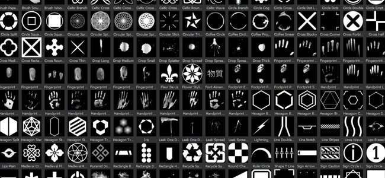

# Versión 2017.1

Substance Painter cambia su número de versión tras la nueva oferta de Substance. Para obtener más información, consulte : <https://www.allegorithmic.com/welcome-to-substance>\
En esta nueva versión queríamos centrarnos en el contenido aportando un nuevo plugin que permitiera navegar por el Substance Source e importar los materiales directamente al estante. También hemos añadido muchos activos nuevos para ampliar tus posibilidades creativas.

Fecha de lanzamiento : *20 de junio de 2017*

## Funciones principales

### Nuevo complemento : Substance Source

Con este nuevo plugin, ahora es posible **examinar** directamente nuestra base de datos de materiales llamada **Substance Source** y descargarlos **directamente en el estante**, listos para usar y listos para trabajar en tus proyectos.\
Para abrir Substance Source, simplemente haga clic en el logotipo de Substance Source **en la barra de herramientas principal** de la aplicación. Esto debería abrir una nueva ventana que permita explorar la biblioteca.

{width="650px"}

### Nuevo contenido : Alpha, procedimientos, filtros y mucho más

En esta nueva versión estamos agregando **más de 300 activos nuevos**. Hemos añadido contenido temático de **ciencia ficción**, **geometría**, **medieval** o incluso **celta** en los alfas. También incluye **nuevos pinceles** y **huellas digitales/huellas digitales digitalizadas**. También proporcionamos algunos filtros nuevos y prácticos, como el **Edge Wear de detalles MatFX**, que permiten generar **arañazos** directamente **a partir de la información normal** pintada en tu malla.

Esta es la lista del nuevo contenido:

* **4 Fuentes Nuevas** (Japonés, Chino Simplificado, Typewriter, Segmento)
* **230 Alpha nuevos** (combinación de patrones e imágenes digitalizadas)
* **50 Nuevos Procedimientos** (Patrón de tela principalmente para ropa medieval y contemporánea)
* **2 Nuevos mapas del ambiente** (Mondarrain y Villa Nova Street)
* **9 filtros nuevos** (Edge Wear de detalles MatFX, abrazadera, HBAO, etc.)

También hemos actualizado algunos de los activos existentes para que funcionen mejor, como el **mapa de entorno predeterminado**, que ahora tiene un aspecto **menos amarillo:**

## Tutorial

El nuevo contenido se describe en nuestro último tutorial de vídeo :

## Notas de la versión

### 2017.1

(Publicado el 20 de junio de 2017)

**Agregado :**

* [Plugin] Nuevo plugin de Substance Source (permite descargar recursos en el estante)
* [Estante] 4 Fuentes Nuevas (Japonés + Chino Simplificado, Typewriter, Segmento)
* [Estante] 230 nuevos Alpha (Mezcla de patrones, pinceles y digitalizaciones de huellas digitales)
* [Estante] 50 Nuevos Procedurales (Patrones de tela de ropa medieval y contemporánea)
* [Estantería] 2 Nuevos mapas ambientales (Mondarrain y Villa Nova Street)
* [Estante] 9 filtros nuevos (Edge Wear de detalle MatFx, abrazadera, HBAO, etc.)
* [Estante] Se ha mejorado el mapa de entorno de panorama predeterminado
* [Shelf] Nuevos ajustes preestablecidos de exportación de Arnold 5
* [Scripting] Permite importar recursos en la estantería

**Problema conocido:**

* [Exportar] La edición de un ajuste preestablecido de exportación es muy lenta
