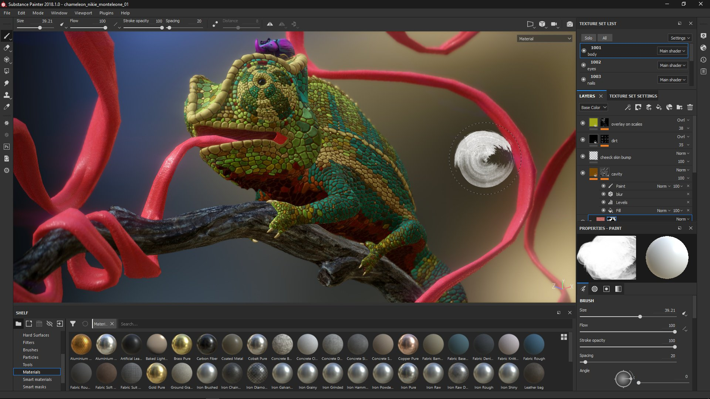
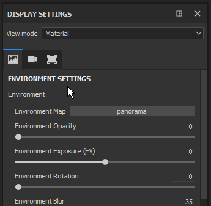
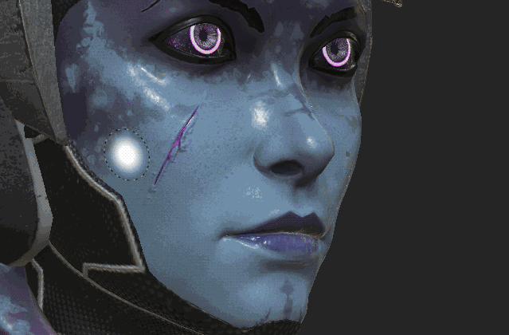
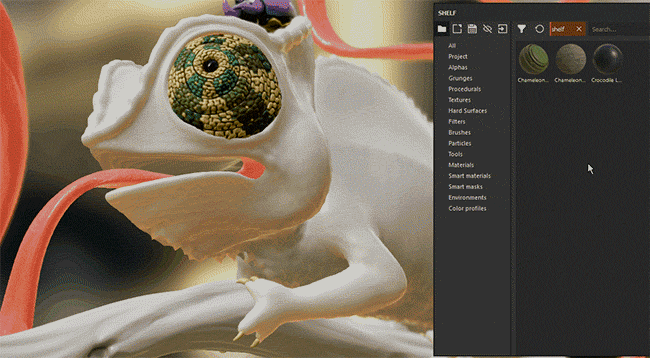
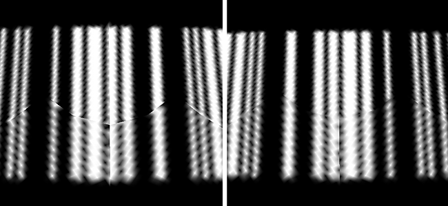

# Versión 2018.1

**Substance Painter 2018.1** presenta una nueva interfaz con muchos comportamientos mejorados. Los resultados también se han mejorado en muchas áreas.

Fecha de publicación : *15 de marzo de 2018*

## Funciones principales

### Nueva interfaz y comportamientos

{width="650px"}

Substance Painter 2018.1 presenta una **revisión completa de la interfaz**, que va desde el color y los iconos hasta los comportamientos de los widgets.

* La **nueva interfaz** se centra en ofrecer un diseño completamente nuevo, lo que facilita la lectura y facilita la navegación.\
  Rediseñamos todos nuestros iconos para ser más explícitos. También hemos reelaborado nuestro esquema de colores, que ahora debería ser más coherente.\
  
* Hemos mejorado muchos widgets, especialmente nuestros **reguladores**, para que sean más **fáciles de usar** con un **lápiz de Tablet PC**.\
  Puede hacer clic en la barra para mover el regulador o utilizar el campo de valor para editar los números de forma más precisa.\
   
* Tenemos una **nueva barra de herramientas** que permite abrir **Docks** sobre la marcha.\
  Al hacer clic en uno de los botones de la barra de herramientas se mostrará el Dock junto a su botón y flotando sobre el resto de la interfaz, al volver a hacer clic en el botón se cerrará.\
  Si el dock se aleja de su botón, se convierte en una ventana flotante normal que se puede acoplar en la interfaz. Si se cierra, el botón estará disponible de nuevo en la barra de herramientas del Dock.\
  Este nuevo sistema de conexión funciona más fácilmente con pantalla completa. Ya no es necesario que todos los dock estén siempre presentes en la interfaz.\
  
* Los Docks ahora usan nuestro nuevo **diseño de pestaña**, que organiza los elementos en secciones mientras puedes desplazarte rápidamente dentro de ellas.\
  Este diseño de pestaña permite **ventanas grandes** y puede presentar **toda la información** al mismo tiempo, a diferencia de los sistemas de pestaña normales que ocultan la información.\
    
* Ahora hay un **menú rápido**, que hace que **propiedades de herramienta** estén disponibles **directamente en el área de visualización**.\
  Para abrir el menú rápido, solo **haga clic con el botón derecho en la ventana gráfica**. Para **cerrar** el menú rápido, **haz clic de nuevo en la ventana gráfica**.\
  El menú solo se cerrará al hacer clic en la ventana gráfica, lo que permite arrastrar y soltar recursos desde la estantería directamente en el menú rápido.\
  
* Ahora hay una nueva **Barra de herramientas contextual** en la parte superior del área de visualización.\
  Esta barra de herramientas cambia sus parámetros en función de la herramienta que se esté utilizando en ese momento. Es una forma de acceder rápidamente a las funciones básicas de la herramienta (como el tamaño de pincel).\
  
* Ahora es posible **reordenar efectos** con **arrastrar y soltar** en la **pila de capas**.\
  
* Aunque los accesos directos &quot;**C**&quot; y &quot;**B**&quot; te permiten visualizar rápidamente las **texturas Hechas un bake** y **Channel** en el **puerto de visualización**, ahora es posible usar el menú desplegable unificado **para cambiar la visualización del puerto de visualización.**\
  En la **parte superior derecha** del **puerto de visualización** hay ahora una lista desplegable con **todos los canales y mapas de malla** (anteriormente mapas adicionales). Este menú desplegable unificado también está disponible en el conjunto acoplado **Display Settings**.\
  
* **Configuración de pantalla** y **Configuración del visor** se han **combinado** en un solo Dock.\
  La configuración de **Entorno**, **Cámara** y **Ventana gráfica** está ahora **agrupada**, mientras que los parámetros de **sombreadores** se han **movido** a un **Dock dedicado**.\
  La configuración de visualización ahora aprovecha el nuevo **diseño de pestaña** para navegar rápidamente por la ventana.\
  

### Arrastrar y soltar materiales y materiales inteligentes en la ventana gráfica

{width="650px"}

Ahora puedes **arrastrar y soltar** materiales y Materiales inteligentes **directamente en el área de visualización**.\
Esta nueva acción **resaltará la geometría** del objeto del **conjunto de texturas de destino** al mismo tiempo. Esta acción creará las nuevas capas en la parte superior de la pila de capas del conjunto de texturas.

### Comportamiento mejorado del lápiz de Tablet PC

En esta versión hemos mejorado la forma en que manejamos los movimientos y las entradas del lápiz de la tableta gráfica, especialmente cuando el Substance Painter está bajo una carga pesada.\
Ya no perdemos las entradas mientras realizamos cálculos consecutivos. Esto debería permitir trazos de pincel precisos en cualquier situación.

### Mejoras en el relleno de costura

Hemos rediseñado la forma en que generamos nuestro relleno fuera de las Islas de UV. En lugar de tomar el píxel actual y dilatarlo en una cierta distancia, ahora buscamos el píxel vecino del otro lado de la costura UV e interpolamos los dos valores.\
Esto proporciona un resultado final mucho mejor y reduce la visibilidad de la división entre Islas de UV incluso cuando las proporciones de texto no coinciden.

<table>
<tr style="border: 0;">
<td style="border: 0;" valign="top">

{width="200px"}

</td>
<td style="border: 0;" valign="top">

{width="200px"}

</td>
</tr>
</table>

Este nuevo relleno se genera automáticamente después de cada trazo de pincel, cambio de resolución o modificación de capa.

### Rendimiento mejorado

{width="650px"}

También hemos mejorado las prestaciones en esta versión en varios niveles:

* Abrir y guardar el proyecto debe ser un poco más rápido que antes.\
  Hemos modificado la forma en que codificamos/descodificamos nuestros **datos de pintura**. Esto afecta especialmente a los proyectos con mucha información de pintura (pinceladas).
* Ahora se admiten muchos **subobjetos** con mallas.\
  Ya no es obligatorio combinar una malla en una sola pieza antes de cargarla en Substance Painter. El rendimiento debe ser bueno incluso con **8000 subobjetos** en un proyecto.
* Hemos cambiado la forma en que **viewport** se **actualizó** para reducir la carga en la GPU al pintar.\
  Esto significa que ya no actualizamos toda la imagen, sino que actualicemos una pequeña región en la que esté trabajando actualmente.\
  Se nota la diferencia en las GPU menos potentes o cuando se utiliza un recuento de muestras alto en el sombreador.
* El sistema **shelf** ahora es **más rápido de descubrir** recursos al iniciar la aplicación.\
  Los materiales de Substance con mapas de bits incrustados son **dos veces más rápidos** de descubrir (si se cocinan como no sólidos). **Ajustes preestablecidos** también debería ver mejoras.

### Baker global de posición de escena

Ahora tenemos una nueva configuración que permite hacer un bake un mapa de posición por conjunto de texturas que tenga en cuenta el tamaño completo de la escena.\
Este nuevo comportamiento permite utilizar proyecciones triplanares en Generadores de máscaras que coincidirán en toda la escena en lugar de crear costuras como antes. Esto resulta muy útil con proyectos que tienen muchos conjuntos de texturas (como los proyectos basados en UDIM).

En la configuración del baker de posición, cambie el parámetro &quot;**Normalization Scale**&quot; de &quot;**Per Material**&quot; a &quot;**Full Scene**&quot; para habilitar este nuevo comportamiento.

### Nuevo contenido

También hemos añadido contenido nuevo en esta versión:

* Nuevos **ruidos 3D.**\
  Importado directamente desde Substance Designer, 4 nuevos sonidos 3D y totalmente inconsútiles se han añadido a la estantería por defecto.\
  Estos nuevos ruidos se basan en el mapa de posición del proyecto para generar un resultado sin costuras.
* **Ruidos no cuadrados**\
  Los ruidos base se han actualizado a la última versión desde Substance Designer.\
  Esto significa que la función de expansión no cuadrada ahora está disponible en los parámetros de ruido.
* Nuevo generador de máscaras **3D linear gradient.** Este nuevo generador de máscaras le permite crear un degradado lineal en cualquier dirección en el espacio 3D.\
  La dirección se puede definir con dos posiciones 3D, que se pueden seleccionar directamente en el mapa de posición.\
  Ejemplo :

1. &#x200B;
   1. Cree el generador de máscaras **3D linear gradient** en una de sus capas
   1. Cambie la visualización de la ventana gráfica a &quot;**Posición**&quot; (mediante el menú desplegable de la ventana gráfica o usando la clave &quot;**B**&quot;)
   1. Haga clic en el parámetro &quot;**Inicio de posición 3D**&quot; para abrir el elemento emergente **Selector de color**
   1. **Selecciona un color** en tu malla **en la ventana gráfica**
   1. Repita el proceso para el segundo parámetro &quot;**3D Position End**&quot;

      

* Nueva plantilla **Lens-studio** (aplicación Snap Chat 3D).\
  Disponemos de una nueva plantilla para crear fácilmente proyectos dirigidos a la aplicación Lens-Studio creada por Snap.\
  También dispone de un sombreador específico y un ajuste preestablecido de exportación. Para obtener más información sobre Lens Studio, consulte : <https://lensstudio.snapchat.com/>
* **Materiales inteligentes** y **Máscaras inteligentes** se han actualizado con la última versión de nuestros Generadores de máscaras.\
  Nuestros ajustes preestablecidos inteligentes ahora admiten la función **micro details**, que se puede usar con **puntos de ancla**.

### Nuevo proyecto de muestra

{width="650px"}

Ahora hay un nuevo proyecto de muestra llamado &quot;**TilingMaterial**&quot; que puede abrir mediante la acción de menú &quot;**Archivo > Abrir muestra**&quot;.\
Este proyecto usa una simple malla de plano con UV superpuestos que permite **pintura sin problemas** materiales y pinceladas para **crear materiales de mosaico**.

{width="400px"}

## Tutorial

Se ha añadido un nuevo curso tutorial a Substance Academy para que abarque nuestra nueva interfaz: [Introducción a substance painter 2018](https://academy.allegorithmic.com/courses/a97b433a5997fd800b5ed300d783cc41/youtube-e-zpEL0Wcqg)

## Notas de la versión

### 2018.1.3

(Publicado El 28 De Junio De 2018)

**Agregado:**

* Resumen: Revisión
* [Preferencias] Propuesta de guardar el proyecto cuando se reinicie Painter

**Corregido:**

* [Plugin] El Substance Source de búsqueda no funciona
* [Smart Materials] La importación de materiales inteligentes provoca bloqueos en algunos casos
* [Materiales inteligentes] Al eliminar materiales inteligentes, en algunos casos se produce un bloqueo
* [Guardar] Guardar conduce a un bloqueo en algunos casos raros
* [Estante] Invertir no funciona en las Celdas 2 y 3
* [Estante] Error tipográfico en algunos Alpha
* [Estante] Algunos materiales de Substance no se procesan correctamente

**Problemas conocidos:**

* Bloqueo de cálculos en GPU AMD VEGA

### 2018.1.2

(Publicado el 6 de junio de 2018)

**Agregado:**

* Resumen: Velocidad de Haga un bake mejorada, Sistema de guardado mejorado, Reguladores actualizados, Plugin API actualizado, Traducción al chino, Relleno mejorado ahora Opcional
* [Bakers] Mejora del rendimiento con la nueva versión de baker
* Cuadro de diálogo Forzar visualización con GPU no compatible
* [Guardar] Exponer nueva funcionalidad de proyecto compacto (modo de guardado completo/compacto)
* [Guardar] Informar al usuario en caso de error de guardado
* [Limpiar] A continuación, guarde en modo completo/compacto
* [Reguladores] Mejora de la precisión de las barras y los reguladores de color/escala de grises
* [Reguladores] Adición de controles de flecha arriba/abajo
* [Reguladores] Misma zona de detección para los reguladores de barras de color y escala de grises
* [Plugin] Autoguardar siempre en modo incremental
* [Plugin] Opción para cambiar los complementos al nuevo estilo de interfaz
* [Idioma] Añadir traducción al chino
* [Padding] Opción para cambiar entre el relleno UV y el relleno contiguo de espacio 3D por conjunto de texturas en Ajustes de conjunto de texturas
* [Script] Exponer modo de guardado: completo/compacto o incremental
* [Script] Actualizar documentación de scripts/QML
* [Log] Indicar modo de guardado en log (completo/compacto o incremental)

**Corregido:**

* [Herramienta] La ranura de canal se transforma en una ranura de material en rellenos de un solo canal
* Bloqueo al cargar una malla (FBX) con algunas caras no asignadas por un material
* Bloqueo en Irán con NVIDIA GRID 5.2 en una máquina virtual
* Bloqueo al deshacer la eliminación de un ajuste preestablecido de material
* Bloqueo al cargar algunos proyectos
* [Línea de comandos] Nueva línea de comandos para las mallas UDIM divididas por udim
* [Barra de herramientas] Reducción de la barra de herramientas
* [Instanciación] No se pueden crear instancias de mapas de bits en varios conjuntos de texturas
* [Ventana gráfica] La actualización no se completa al pintar en malla con UV en mosaico
* [Iray] El mapa normal se aplica dos veces para los dieléctricos
* [Shelf] Errores tipográficos en algunos parámetros del Substance (alfas, procedimientos y matfx)
* [Shelf] Error tipográfico para el mapa de bits &quot;Solo personal autorizado&quot;
* [Script] La función alg.shaders.materials() ya no funciona

**Problemas conocidos:**

* Bloqueo de cálculos en GPU AMD VEGA

### 2018.1.1

(Publicado el 3 de abril de 2018)

**Corregido:**

* [Tablet] Problema al cambiar las opciones de interacción predeterminadas
* [Bakers] Bloqueo con la biblioteca de Assimp
* [Bakers] Regresión en el rendimiento con mapa A.O.
* [Iray] La Distorsión de lente no se aplica al canal del Alpha
* [Controladores] Actualización de los requisitos mínimos de controladores
* [3Dview] Las normales no se generan correctamente en mallas UDIM sin información de normales
* [Intel] Bloqueo con Substance Painter 2018.1.0
* [Intel]&#x200B;[Viewport] Problema con relleno (defectos negros)

**Problemas conocidos:**

* Bloqueo de cálculos en GPU AMD VEGA

### 2018.1

(Publicado El 15 De Marzo De 2018)

**Agregado:**

* Nuevo estilo general (iconos, color, comportamiento)
* Nuevo diseño predeterminado
* [Tablet] Mejora de la experiencia del usuario al pintar
* [Menú principal] Ordenar primero los elementos nativos de las vistas y barras de herramientas
* [Menú principal] Sección Mover acciones rápidas de máscara en la ventana gráfica
* [Menú principal] Sección Mover las acciones del botón derecho al área de visualización
* [Menú principal] Cambiar el nombre del menú &quot;Ver&quot; por &quot;Ventana&quot;
* [Menú rápido] Nuevas propiedades de la herramienta haciendo clic con el botón derecho en la ventana gráfica
* [Widget de Dock] Nueva barra de herramientas de Dock para reducir/recuperar rápidamente
* [Configuración de la pantalla] Ventana de configuración de la cámara y del visor combinada
* [Pila de capas] Menú contextual del botón derecho
* [Pila de capas] Arrastra y suelta para mover cualquier efecto dentro de la misma capa
* [Barra de herramientas] Reorganización de la barra de herramientas y nueva barra de herramientas contextual
* [Barra de herramientas Herramientas] Dividir la herramienta Clonar en dos herramientas independientes
* [Herramientas, propiedades] Valor de escala de grises de fondo más claro en la previsualización
* [Herramientas propiedades] Organización en fichas (rellenar y herramientas)
* [Herramienta] El resultado de la pintura coincide con la galería de símbolos
* [Ventana gráfica] Nuevo cursor para la capa de relleno
* [Ventana gráfica] Navegación y pintura más fluidas (velocidad de fotogramas más alta)
* [Ventana gráfica] Cuadro combinado de selección de material/canal/mapa en la ventana gráfica
* [Ventana gráfica] Reducción del parpadeo durante la rotación (sombra activada)
* [Shelf] Mostrar materiales de forma predeterminada al abrir Painter
* [Estante] Mejora del tiempo de carga de texturas y materiales Substance (2 a 6 veces más rápido)
* [Estante] Reorganizar las carpetas de materiales para que se ajusten a la estructura del Substance Source
* [Estante] Arrastre y suelte los materiales directamente en la malla en la ventana gráfica
* [Shelf] Nuevos ruidos 3D (Perlin, Perlin Fractal, Simplex y Worley)
* [Shelf] Nuevo generador de máscara de 3D linear gradient usando posición de malla
* [Estante] Ruidos básicos actualizados para admitir la expansión no cuadrada
* [Estante] Se ha añadido una nueva plantilla y un ajuste preestablecido de exportación para Lens Studio (aplicación Snap)
* [Estante] Se han actualizado los materiales y las máscaras inteligentes para utilizar la última versión del editor de máscaras (microdetalles).
* [Estante] Nuevo proyecto de muestra &quot;TilingMaterial&quot; para crear materiales de mosaico sin costuras
* [Estante] Nuevos ajustes preestablecidos de pincel (caligrafía, mojado, sombreado, etc.)
* [Reguladores] Nuevos reguladores y estilo y comportamiento de las barras de escala de grises y de color
* [Bakers] Permite el uso del cuadro delimitador de escena completo para calcular el mapa de posición
* [Shader] Se elimina el parámetro de fuerza de height de los parámetros de sombreado predeterminados.
* [Motor] Motor del Substance actualizado
* [Motor] No hay o menos discontinuidades en los trozos UV (nuevo relleno de costura)
* [Complementos] Importa materiales descargados de Substance Source con mayor rapidez
* [Plugins] Actualice todos los plugins para que coincidan con el nuevo estilo general
* [Preferencias] La vista previa del color de fondo cambia automáticamente
* [Limpio] Menor riesgo de corrupción de proyectos
* [Abrir] Mejora del tiempo de apertura del proyecto
* [Nuevo proyecto] Nuevo proyecto: mejora del tiempo de actualización de la malla
* [Guardar] Ahorro de tiempo del proyecto
* [Log] Tipo de licencia registrado en el registro
* [TextureSet] Cambie el nombre del botón &quot;Hacer un bake Texturas&quot; por &quot;Hacer un bake mapas de malla&quot;
* Cambie el nombre de &quot;Mapas adicionales&quot; por &quot;Mapas de malla&quot;

**Corregido:**

* [Viewport] Mal rendimiento con mallas que contienen muchos subobjetos
* [Herramientas > Propiedades] Canal desactivado al arrastrar y soltar una imagen en la ranura de material
* [Herramientas, propiedades] La vista previa del pincel se rompe con las herramientas de difuminado y clonado
* [Conjunto de texturas] El orden de los canales es incorrecto al utilizar plantillas
* [Shelf] Falta icono para el generador de Conversión de escala de grises
* [Estante] El número de círculo de Sign alfa está roto (falta fuente)
* Detección incorrecta de GPU integradas al iniciarse
* [Bloqueo] Arrastrar y colocar un recurso importado cuyo nombre tenga el carácter #
* [Motor] Problema de detección de Vram en la GPU integrada
* [Motor] Se han solucionado numerosos bloqueos en Substance Engine Linker
* [Motor] Artefactos cuadrados al cambiar la resolución
* [Efectos de posprocesamiento] El cambio de tamaño de la interfaz es lento cuando los efectos de posprocesamiento están activados
* [Bakeres] La unidad de escena no se respeta correctamente para los valores de distancia de rayos
* [Bakeres] El AO de la distancia del Mesh Occluder se fija en 1 independientemente del valor de entrada
* [Bakeres] La coincidencia por nombre ignora algunas mallas con nombres específicos
* [Bakeres] El color de la configuración de Polygroup de malla e ID de submalla siempre devuelve una imagen en negro
* [Bakeres] La Hace un bake de ID falla con mallas de FBX binarias de Blender
* [Sombreador] Ruido en el vista 2D con dota-2 y non-pbr-spec-gloss
* [Linux] Sólo se utiliza un subproceso de CPU al hacer un bake
* [MacOS] Bloqueo con el cursor del pincel moviéndose por la ventana gráfica

**Problemas conocidos:**

* Bloqueo de cálculos en GPU AMD VEGA
* El proceso posterior de distorsión no se tiene en cuenta al exportar en IRay (canal alfa)
