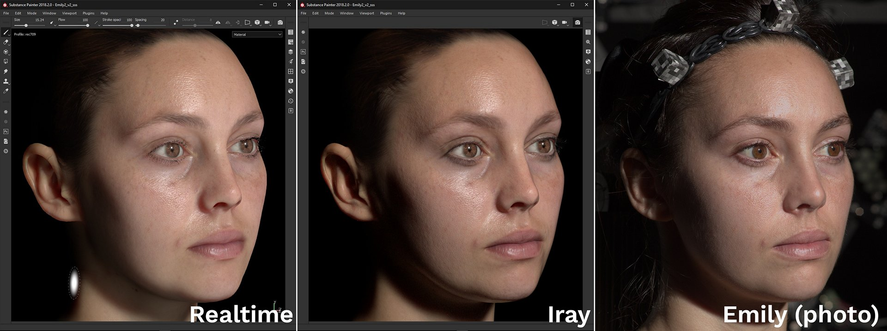
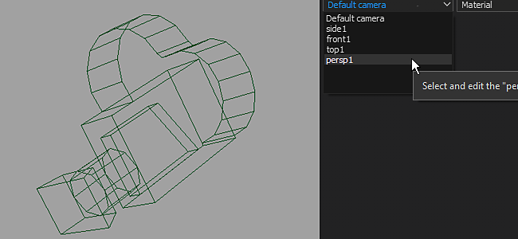
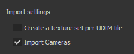

# Versión 2018.2

**Substance Painter 2018.2** añade funciones tan esperadas como la pintura Subsurface Scattering, que hacen que la creación de texturas sea aún más fácil que antes.

Fecha de publicación : *2 de agosto de 2018*

## Funciones principales

### Dispersión de subsuperficie

La dispersión subsuperficial **Subsurface** ahora es compatible con el puerto de visualización **realtime** y con el procesador de **Iray**.\
La dispersión subsuperficial es un mecanismo de la luz cuando se penetra en un objeto o una superficie. En lugar de reflejarse, como en las superficies metálicas, el material absorbe una parte de la luz y luego la **dispersa dentro**. Muchos materiales en la vida real tienen dispersión subsuperficial como la piel o la cera.

Nuestra implementación del efecto Subsurface coincide muy estrechamente con las implementaciones en tiempo real de otros motores de juegos, así como con otros procesadores sin conexión. Facilita el diseño de texturas de dispersión para su uso en otras aplicaciones.

{width="650px"}

Arriba se muestra un ejemplo con el bien conocido activo Digital Emily 2. Gracias al Instituto de Tecnologías Creativas de la USC y a los miembros del proyecto Wikihuman por permitirnos demostrar nuestros renders con los activos de Digital Emily 2.\
(Tenga en cuenta que esta comparación se realizó en condiciones de iluminación similares, pero no exactas, lo que puede explicar las diferencias visuales.)

Para añadir la dispersión subsuperficial a un proyecto, siga estos pasos:

1. Ve a la ventana **Configuración de visualización** y **activa** la configuración de **Dispersión subsuperficial**.
1. Agregar un canal &quot;**Dispersión**&quot; en el conjunto de texturas actual
1. Usa una capa de relleno o **pinta en blanco** en el nuevo canal para **mostrar** el efecto subsuperficial en la ventana gráfica.

Puede encontrar un procedimiento más detallado en la [documentación sobre dispersión subsuperficial](../../features/subsurface-scattering/subsurface-scattering.md).

>[!NOTE]
>
> Para admitir la dispersión subsuperficial en la ventana gráfica en tiempo real, los **sombreadores** de los proyectos deben **actualizarse**.\
> Para obtener sombreadores personalizados, consulta la documentación disponible en el **menú de ayuda** para saber qué ha cambiado en el **API del sombreador**.

### Manipuladores para capas de relleno

Los controles de las capas de relleno se han mejorado para ofrecer funciones a los manipuladores. Ahora es más fácil colocar y controlar con precisión las proyecciones de relleno.

Al usar la **Proyección de UV**, aparecerá un manipulador en la **vista 2D** :

* Al hacer clic **fuera**, el manipulador lo **rotará**.
* Al hacer clic en el **cuadrado** en los **bordes**, se **escalará/redimensionará**.
* Al hacer clic en **dentro**, el manipulador lo **traducirá**.
* Use **CTRL** para cambiar varias esquinas en **simetría**.
* Use **SHIFT** para **restringir** una transformación (traducir, rotar o escalar).\
  

Al usar la **proyección Tri-Plana**, aparecerá un manipulador en la **Vista 3D** :

* El cubo de puntos representa la proyección global
* Usa el método abreviado de teclado **W**, **E** o **R** para cambiar entre el modo **Traducir**, **Rotar** y **Escalar**.
* Use el método abreviado **T** para cambiar entre la orientación Local y World para el manipulador.
* Use **SHIFT** para **restringir** la transformación.
* La proyección del cubo triplano también se puede modificar en las propiedades avanzadas de la capa de relleno :\
  \
  

La barra de herramientas contextual en la parte superior de la ventana gráfica también se adaptará en función del modo de proyección actual, lo que ofrece herramientas y controles adicionales :

Para obtener más información, consulte la [documentación de la capa de relleno](../../painting/fill-projections/fill-projections.md).

### Compatibilidad de no cuadrados y no de segmentación con la herramienta Galería de símbolos y Proyección

El parámetro de galería de símbolos y la herramienta de proyección se han mejorado para admitir resoluciones no cuadradas y comportamientos de no segmentación.\
El parámetro predeterminado ahora está establecido en no segmentación de forma predeterminada. Este parámetro se puede cambiar en las propiedades de la herramienta :

El modo de segmentación se puede configurar de la siguiente manera:

* **Sin mosaico** (predeterminado)
* **Mosaico horizontal**
* **Mosaico vertical**
* **Mosaico H y V** (comportamiento antiguo)

Este nuevo parámetro se puede guardar en una herramienta o un ajuste preestablecido de pincel, lo que facilita compartirlo con contenido personalizado.

>[!NOTE]
>
> * La proporción de proyección también se adaptará a los archivos Substance que generen resoluciones no cuadradas. La proporción se calculará directamente desde el nodo de salida.
> * Con la herramienta de proyección, si varios canales tienen proporciones diferentes, la primera proporción encontrada se aplicará a todos los demás canales.

### Importación y gestión de cámaras

Ahora es posible **importar cámaras personalizadas** dentro de Substance Painter junto con la importación de malla.\
Las cámaras se pueden seleccionar **para examinar** en el **puerto de visualización 3D** y se pueden usar **para representarlas en Iray**.

Para obtener más información, consulte la [documentación de administración de cámaras](../../interface/viewport/camera-management.md).

Para **importar cámaras** a un proyecto:

1. Exporte la malla del proyecto con cámaras en el mismo archivo (con un formato compatible como FBX, Alembic o glTF)
1. Seleccione la configuración de &quot;importar cámaras&quot; en la [ventana de nuevo proyecto](../../getting-started/project-creation.md) (o en la [configuración del proyecto](../../interface/project-configuration.md)).\
   
1. Cambie a la cámara deseada con el menú desplegable en la ventana gráfica o usando la configuración de [Configuración de pantalla](../../interface/display-settings/camera-settings.md).\
   

Los Ajustes de cámara de la ventana Ajustes de visualización se han ampliado para controlar las propiedades de la cámara.\
Es posible **cambiar** entre cámaras; consulte sus propiedades **ratio** y **lock** para evitar modificarlas. Se puede utilizar un botón de restauración para revertir la cámara a sus valores iniciales.

También se tiene en cuenta el marco de la cámara (y su puerta), lo que permite ver y pintar a través de un punto de vista muy específico. El marco y la puerta se muestran sobre la ventana gráfica 3D y su opacidad se puede controlar en **Configuración de la ventana** desde la ventana [Configuración de pantalla](../../interface/display-settings/camera-settings.md) :

### Mejoras en el comportamiento de pila de capas

* **Arrastra y suelta materiales y materiales inteligentes en el mapa de ID:**\
  Se ha mejorado la función de arrastrar y soltar contenido desde el estante al área de visualización. Al presionar **CTRL** mientras arrastras y sueltas un material, ahora es posible elegir el color de ID que se usará como máscara.\
  Se añadirá una máscara negra con un efecto de selección de color a la nueva capa creada en la pila de capas. Si se arrastra el mismo material y se coloca en otro color de ID, se actualizará la capa ya existente y se combinarán los colores de ID.\
  
* **Desplazamiento al arrastrar y soltar Pilas de capas :**\
  Ahora, al arrastrar capas alrededor de la pila de capas, se abre una pequeña ventana.\
  Cuando se arrastra un recurso o una capa cerca de los bordes de la ventana de la pila de capas, automáticamente comienza a desplazarse por su contenido.\
  

### importación de mallas glTF y Alembic

Ahora se admiten nuevos formatos de archivo para importar mallas y crear nuevos proyectos :

* **glTF** : Este formato ya estaba disponible al exportar texturas y ahora se puede utilizar durante la importación. Si un archivo glTF contiene texturas, se importarán y se colocarán dentro de la pila de capas (para el flujo de trabajo de rugosidad/metálico).
* **Alembic**: Este formato es ampliamente utilizado en la industria de VFX / Animación para transferir mallas.

>[!NOTE]
>
> Substance Painter no ofrece una forma de controlar qué fotograma de animación se debe importar en ese momento.\
> Esto significa que, al exportar un archivo Alembic, el marco de referencia que se vaya a utilizar para pintar en el activo ya debe estar configurado.

### Mejoras en la integración de Substance

La integración de Substance dentro de Substance Painter se ha mejorado con las solicitudes que se esperan desde hace tiempo :

* <b>Visible Si :</b>\
  El &quot;Visible if&quot; es una gran característica del formato de archivo de Substance que permite ocultar parámetros basados en condiciones.\
  Esta función proporciona una lista más clara de parámetros y ajustes contextuales, lo que facilita en general el uso de materiales y filtros.\
  Para obtener más información, consulte la [documentación del Substance Designer](https://experienceleague.adobe.com/en/docs/substance-3d-designer/home).\
  
* **Ajustes preestablecidos del Substance** Los ajustes preestablecidos del Substance son una forma fácil de proporcionar ajustes avanzados y variaciones de materiales. Muchos materiales de [Substance Source](https://source.allegorithmic.com) tienen ajustes preestablecidos, así que pruébalo.\
  Si un archivo de Substance contiene uno o más ajustes preestablecidos, estará disponible un nuevo menú desplegable en la lista de parámetros. Seleccione el ajuste preestablecido que desea aplicar para actualizar los parámetros.\
  
* **Atributos de Substance**\
  Los atributos de Substance ahora se muestran en la interfaz, lo que facilita la recuperación de información sobre un archivo específico.\
  Los atributos se pueden ver en dos ubicaciones diferentes: sobre los parámetros en la ventana de propiedades o haciendo clic con el botón derecho en un activo del estante.\
   

### Nuevo proyecto de muestra &quot;Jade Toad&quot;

Ahora se incluye con Substance Painter un nuevo proyecto de muestra denominado &quot;**JadeToad**&quot;. Este proyecto de ejemplo tiene habilitado de forma predeterminada el efecto **Dispersión subsuperficial**.\
Para encontrar el proyecto, use **Archivo** > **Abrir ejemplo...Entrada de menú**.

## Notas de la versión

### 2018.2.3

(Publicado el 25 de septiembre de 2018)

**&#x200B;**&#x200B;Corregido:**&#x200B;**

* [vista 2D] La vista 2D se rompe con algunas mallas al crear un nuevo proyecto
* [Bloqueo] El cambio de la Proyección de UV a la proyección triplanar produce un bloqueo
* [RayCollider] Varios bloqueos debido a &quot;RayCollider&quot;
* [Herramienta] Al cambiar las capas, se pierden las propiedades de pincel modificadas
* La configuración del pincel se restablece al cambiar al borrador

**Problemas conocidos:**

* Bloqueo de cálculos en GPU AMD VEGA
* Problema de la tableta Huion con métodos abreviados en el sistema operativo Windows

### 2018.2.2

(Lanzamiento 11 de septiembre de 2018)

**Agregado:**

* Resumen: Revisión con actualización de contenido, nuevas funcionalidades de scripts y poder deshabilitar la actualización automática
* [Contenido]&#x200B;[Estante] Añadir un ajuste preestablecido de Estante de piel
* [Contenido] [estante] Conversión de 19 normales de piel en materiales para dispersión subsuperficial
* [Scripting] Crear una plantilla de proyecto a partir de un proyecto abierto
* [Scripts] Obtener o establecer la configuración de exportación de un proyecto abierto
* [Actualizaciones] Puede desactivar la ventana emergente de actualización automática de la variable de entorno y configuración
* [Actualizaciones] No se muestra hasta la próxima versión en la ventana emergente de mantenimiento obsoleta

**Corregido:**

* [Cámara] Zoom incorrecto al cambiar de perspectiva ortográfica
* [Display] Algunos mapas se muestran en línea en lugar de sRGB
* [Ventanas] El enfoque de malla no se comporta correctamente
* [Vista 2D] El proyecto con la cámara rota tiene UV que desaparecen Carcasas
* [SSS] [Información sobre herramienta] aparece información sobre herramientas de dispersión subsuperficial en el registro
* Algunos proyectos no se pueden abrir en 2018.2 y el mensaje de error no puede guardar un paquete de substance nulo
* [Máscara] El color de la herramienta de pintura se puede bloquear en algunos casos al trabajar en una máscara
* [Material] Mapas que no aparecen en situaciones específicas
* [Proj]&#x200B;[Tools] Manipulador activo con un generador
* [Substance] Faltan grupos de parámetros de Substance
* [Scripting] Nombre de software incorrecto en la documentación
* [UDIMs] No hay información en el registro acerca de los proyectiles de UVs en múltiples mosaicos de UVs

**Problemas conocidos:**

* Bloqueo de cálculos en GPU AMD VEGA
* Problema de la tableta Huion con métodos abreviados en el sistema operativo Windows

### 2018.2.1

(Lanzamiento: 3 de agosto de 2018)

**Corregido:**

* Faltan parámetros de sombreado de dispersión subsuperficial en los proyectos de actualización

**Problemas conocidos:**

* Bloqueo de cálculos en GPU AMD VEGA
* Problema de la tableta Huion con métodos abreviados en el sistema operativo Windows

### 2018.2

(Publicado el 2 de agosto de 2018)

**Agregado:**

* Resumen: Versión de verano, compatibilidad con dispersión subsuperficial, mejoras de proyección y relleno, importación y selección de cámara, compatibilidad con Alembic/glTF, arrastrar y soltar en mapa de ID, compatibilidad de formato de Substance mejorada y nuevo contenido
* [SSS]&#x200B;[Viewport]&#x200B;[Iray] Dispersión subsuperficial genérica
* [SSS] Sincronización de MDL y parámetros de dispersión subsuperficial
* [SSS] Se ha añadido un nuevo canal de escala de grises denominado &quot;Dispersión&quot;.
* [SSS]&#x200B;[Configuración del sombreador] Parámetro de tipo de dispersión para dispersión subsuperficial (piel o translúcido)
* [SSS]&#x200B;[Configuración de sombreado] Parámetro de escala de dispersión para dispersión subsuperficial
* [SSS]&#x200B;[Configuración de sombreado] Parámetro de color de dispersión para dispersión subsuperficial
* [SSS]&#x200B;[Configuración de pantalla] Dispersión Recuento de muestras para dispersión subsuperficial
* [Shader] [Iray] Integrar MDL de dispersión subsuperficial para Iray
* [Shader] Actualización del sombreado mediante el actualizador de recursos
* [Shader] Actualizar la API y la documentación del registro de cambios
* [Tool Properties]&#x200B;[Proj] Nuevos parámetros para la proyección triplanar
* [Ventana gráfica]&#x200B;[Proyecto] Controle las propiedades de la capa de relleno en la vista 3D directamente con los manipuladores (proyección triplanar)
* [Atajos]&#x200B;[Proj] Nuevos atajos Q, W, E, R, T para manipuladores de proyección triplanar
* [Viewport]&#x200B;[Proj] Controle las propiedades de la capa de relleno en la vista 2D directamente con los manipuladores (Proyección de UV)
* [Atajos]&#x200B;[Proj] Nuevo atajo Q para manipuladores de Proyección de UV
* [Barra de herramientas contextual]&#x200B;[Proj] Controlar manipuladores de proyección triplanar
* [Barra De Herramientas Contextual]&#x200B;[Proj] Controlar Manipuladores De Proyección de UV
* [Propiedades de la herramienta] Desactivar el mosaico de texturas con las herramientas Proyección y Galería de símbolos
* [Galería de símbolos] Usar imágenes no cuadradas con la herramienta o galería de símbolos Proyección
* [Stencil] Permitir el control del modo de mosaico en la ventana Propiedades
* [Stencil] El zoom no está centrado en una galería de símbolos que no sea de mosaico
* [Cámaras] Importar cámaras de Maya, Max, Blender, Modo, DAE
* [Cámaras] [Ventana gráfica] Seleccione y controle las cámaras importadas en la ventana gráfica
* [Cámaras] [Israel] Seleccione y controle las cámaras importadas en Irán
* [Cámaras]&#x200B;[IU]&#x200B;[Nuevo proyecto]&#x200B;[Configuración del proyecto] La opción &quot;Importar cámaras&quot; está activada de forma predeterminada
* [Cámaras] [Accesos directos] Añada los métodos abreviados &quot;&lt;&quot; y &quot;>&quot; para cambiar de una cámara a otra
* [Cámaras]&#x200B;[Ventana gráfica] Añadir fotograma en la ventana gráfica
* [Cámaras] [Configuración de la ventana gráfica] Control de la opacidad de los fotogramas
* [Cámaras]&#x200B;[Configuración de la cámara] distancia focal máxima de 500 mm
* [Cámaras]&#x200B;[Configuración de la cámara] Relación de exposición
* [Cámaras]&#x200B;[Configuración de la cámara] Añadir una opción de bloqueo
* [Cámaras]&#x200B;[Configuración de la cámara] Añadir una opción de restauración
* [Cámaras]&#x200B;[Configuración de la cámara] Añadir el atributo de distancia de enfoque
* [glTF] Importación de un archivo glTF
* [glTF] Importar mapa de oclusión ambiental
* [Alembic] Importar Alembic 1 fotograma con geometría estática
* [Estante] Arrastre y suelte materiales directamente en la malla mediante mapas de ID con un modificador (CTRL/Comando)
* [Pila de capas] Creación automática de máscaras de ID con arrastrar y soltar materiales en la malla con mapas de ID
* [Pila de capas] Desplazamiento automático de capas con arrastrar y soltar por la pila de capas
* [UI]&#x200B;[Propiedades de la herramienta] Exponer el ajuste preestablecido de Substance
* [UI]&#x200B;[menú Ayuda] Mejora del menú Ayuda
* [UI]&#x200B;[Nuevo proyecto]&#x200B;[Configuración del proyecto] Reorganización de la ventana
* [UI]&#x200B;[Nuevo proyecto]&#x200B;[Configuración del proyecto] Reemplazar &quot;Malla&quot; por &quot;Archivo&quot;
* [UI]&#x200B;[Substance] Visualización de atributos de Substance en IU
* [Métodos abreviados] &quot;F4&quot; cambia entre la vista 2D y 3D
* [Accesos directos] Nuevos accesos directos para la galería de símbolos de alternancia &quot;N&quot; y la máscara rápida &quot;U&quot;
* [Substance integration] Tenga en cuenta las sentencias &#39;visible if&#39; en los parámetros del Substance
* [Ventana gráfica] Las sombras no se ven forzadas a computarse después de mover la cámara
* [Contenido] Actualizar MeetMat con cámaras importadas
* [Contenido] Añadir una muestra con la dispersión subsuperficial activada - JadeToad
* [Contenido] Añade una nueva plantilla de proyecto PBR con la dispersión subsuperficial activada
* [Contenido] Se han actualizado los ajustes preestablecidos de exportación para añadir un nuevo canal de dispersión
* [Content]&#x200B;[Shelf] Se ha añadido compatibilidad de dispersión subsuperficial para: pbr-metal-rough, pbr-metal-rough-alpha-test, recubierto de pbr, pbr-spec-gloss
* [Contenido] [Estante] Se ha añadido el canal de dispersión a 5 materiales inteligentes (mármoles y pieles)
* [Contenido]&#x200B;[Estante] 1 nuevo material de jade
* [Contenido]&#x200B;[Estante] 1 nuevo material de cera

**Corregido:**

* [CMD] Diferentes resultados usando la misma línea de comandos con diferentes versiones
* [TDR] Si se configura TdrLevel, no hay errores en el registro
* [Baker] El mapa de oclusión ambiental está volteado
* [Mapa de ID] Bloqueo al seleccionar fuera del rango 0-1
* [Iray] Bloqueo al cambiar de conjunto de texturas y volver al modo de pintura
* [Ventana gráfica] Sincronizar áreas de colocación entre ventanas gráficas para arrastrar y soltar
* [Motor] Artefacto de moiré al aplicar mosaico a capas de relleno o pintar pinceles pequeños
* [Licencia] Comprobación de versión de software errónea del servicio de licencias
* [Licencia] Cambiar la forma de gestionar la autenticación
* [API] Llame al evento de API de scripts de `onNewProjectCreated` incluso al crear con una plantilla
* [Shader] El sombreado compilado no se carga desde la caché cuando el archivo de sombreado no se compila
* [Estante] Al exportar un archivo HDR desde la estantería, se genera un archivo con valores de sujeción
* [Export] Exr exporta los valores de color del RGB de las abrazaderas entre 0 y 1
* [Contenido] El ruido Procedimiento &quot;Fractal de ruido de Perlin en 3D&quot; se pixelaba

**Problemas conocidos:**

* Bloqueo de cálculos en GPU AMD VEGA
* Problema de la tableta Huion con métodos abreviados en el sistema operativo Windows
