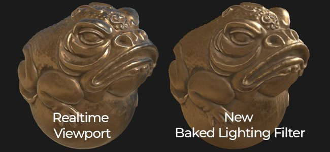
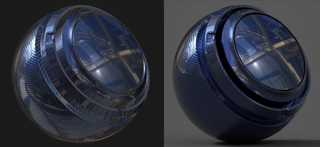
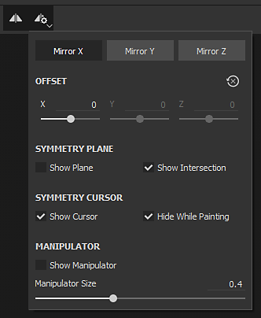
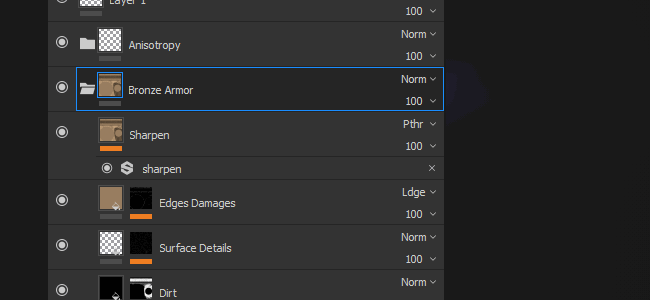
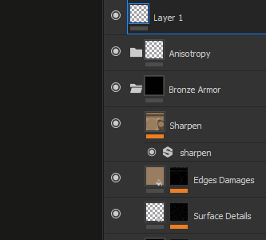

# Versión 2018.3

**Substance Painter 2018.3** ya está aquí y ofrece muchos flujos de trabajo y funciones de representación nuevos.

Fecha de publicación : *20 de noviembre de 2018*

## Funciones principales

### Exportación de vista 2D

Ahora es posible **exportar la representación de Vista 2D** **como una textura**. Esta función ha sido solicitada por muchas personas y finalmente la hemos puesto a su disposición. El proceso de exportación tomará el estado actual de **Vista 2D** para procesar una textura con la configuración de exportación normal (relleno, formato de archivo, profundidad de bits). Esto significa que si el modo de vista está establecido en **Solo** en lugar del modo **Material**, la Vista 2D se exportará tal cual.

Dirígete a la **ventana de exportación** y elige la nueva configuración llamada &quot;**vista 2D**&quot; :\

Un nuevo **mapa convertido** llamado &quot;**vista 2D**&quot; también está disponible en la pestaña **Configuración** de la ventana de exportación en caso de que quieras crear tu propio **ajuste preestablecido de exportación**.

### Filtro de iluminación Hecho un bake mejorado

El filtro **Entorno de iluminación generado** se ha mejorado mucho y ahora admite correctamente **HDR. mapas de entorno**.\
Ahora puede replicar la iluminación de la ventana gráfica (como se ve en el Vista 2D) y hacer un bake hacia abajo en el canal de Color base. El nuevo filtro proporciona más controles, como **rotar** el mapa **entorno** **verticalmente** y cambiar la **exposición**.

### Reflexiones de Speculares anisotrópicos en tiempo real

En esta nueva versión presentamos un nuevo sombreador llamado &quot;**pbr-metal-rough-anisotropía-angle**&quot;. Este sombreador admite dos canales denominados &quot;**Ángulo de anisotropía**&quot; y &quot;**Nivel de anisotropía**&quot; que se pueden usar para crear reflejos de speculares anisotrópicos. Este sombreador también se traducirá a Irak tal cual, sin necesidad de conversión alguna.

Se puede acceder a este nuevo sombreador a través de la [Ventana del Sombreador](../../interface/shader-settings/shader-settings.md) haciendo clic en el botón del sombreador y abriendo la mini-estantería:

El proyecto de muestra predeterminado &quot;**Esfera de vista previa**&quot; se ha actualizado para aprovechar ese nuevo sombreador y mostrar cómo configurar los diferentes canales.

>[!NOTE]
>
> Si aparecen **artefactos de línea** de aspecto extraño al usar degradados dentro del canal **Ángulo de anisotropía**, prueba a cambiar el modo de filtro a &quot;**Más cercano**&quot; en caso de que aparezca una capa de relleno, ya que esto podría mejorar el muestreo del sombreador y eliminar el problema.

### Sombreador de abrigo claro actualizado

El sombreador **Clear Coat** (**con revestimiento de pbr**) se ha mejorado para ofrecer más controles y posibilidades de representación. También aprovechamos la oportunidad para hacerlo compatible con **Iray** con un **MDL** dedicado.

A continuación se muestra una lista de los cambios :

* **Controlar** la capa de **rugosidad** secundaria (a través del canal **Usuario0**).
* **Enmascarar** la capa secundaria (a través del canal **Usuario1**).
* Elija el comportamiento que desea aplicar a la capa de superficie : **Mantener detalles normales** (original) o **Suavizar superficie** (nuevo, omitir mapa normal de malla)

Por comodidad, también hemos añadido una nueva plantilla de proyecto lista para aplicar texturas a este nuevo sombreador denominada : **PBR - Recubierto de Rugosidad metálica**.

### Nuevo suavizado de ventana

El proceso posterior de suavizado Web del Substance Painter se ha rediseñado y se ha cambiado a un nuevo método denominado &quot;**Suavizado temporal**&quot; (**TAA**).\
Esta nueva técnica ofrece resultados mucho mejores en todos los casos por un costo muy mínimo. **TAA** funciona acumulando información en varios marcos, lo que permite producir bordes muy suaves sin perder detalles.

Como ya no es un efecto posterior, la configuración se ha movido un poco dentro de la ventana **Configuración de visualización** y ahora está **debajo** de la sección **Efectos posteriores**.

Este nuevo suavizado también ofrece nuevas posibilidades cuando se combina con la transparencia. Si un proyecto utiliza el sombreador **Alpha-Test**, intente habilitar la configuración &quot;**Interpolado alfa**&quot;:

El nuevo **TAA** también filtrará bien el patrón de Blue Noise visible en las **reflexiones de Specular**, así como en las muestras de **Dispersión subsuperficial**.

### Texturizado virtual disperso (SVT)

Un gran cambio en esta nueva versión es la introducción de las **Texturas virtuales dispersas** o **SVT**.

Este nuevo sistema cambia algunos fundamentos de Substance Painter y la forma en que funciona la aplicación. Substance Painter ahora utiliza el SVT como una forma de mantener un espacio de memoria específico para el puerto de visualización que permite **transmitir texturas de entrada y salida**. La principal ventaja es la capacidad de cargar proyectos más grandes con mayor facilidad y reducir la presión sobre la GPU para **mejorar el rendimiento**. Esto significa que si las cosas empiezan a ser demasiado grandes se descargan algunas texturas en el disco y recuperarlos más tarde si es necesario). Esta es una **caché volátil** que se elimina cuando se cierra la aplicación.

Otra ventaja del sistema es la introducción de **mipmaps** dentro del **puerto de visualización**, lo que mejorará la calidad de la textura y reducirá el efecto Moiré, especialmente visible con patrones de tela.

Hemos expuesto algunos controles relativos a este nuevo sistema que se pueden editar en las preferencias principales (**Editar > Configuración**) :

* **Directorio de caché** : esta configuración controla dónde escribirá el Substance Painter sus archivos temporales, incluida la caché SVT.
* **Aceleración de soporte de hardware** : Si se habilita, Substance Painter utilizará la compatibilidad nativa de Texturas dispersas de la GPU (si se deshabilita, se utilizará una implementación de software)

Para obtener más información sobre el SVT, consulte nuestra página de documentación : [Texturas virtuales dispersas](../../features/sparse-virtual-textures.md)

>[!NOTE]
>
> Se recomienda establecer el **directorio de caché** en una **unidad de estado sólido (SSD)** para garantizar el mejor rendimiento al trabajar con Substance Painter.
> 
> Estos ajustes se pueden anular mediante la variable de entorno : [Variables de entorno](../../pipeline-and-integration/configuration/environment-variables.md).

### Nueva y mejorada herramienta de Simetría

La herramienta de simetría se ha retrabajado y ahora permite desplazar el punto de origen. Cuando un proyecto es parcialmente simétrico o descentralizado, el plan ahora se puede ajustar. El desplazamiento se guardará dentro del proyecto por eje.

También aprovechamos la oportunidad para darle un poco de cariño a esa función y ahora tener nuevos comentarios visuales :

* Ahora **la línea de intersección** está dibujada de forma **predeterminada** en la malla para mostrar dónde está el plano de simetría.
* Ahora aparece un **punto reflejado** al mover el **cursor** para mostrar dónde se aplicará el trazo de pincel reflejado.

Todos los nuevos elementos visuales se pueden modificar a través del nuevo menú de Simetría en la barra de herramientas contextual :

* **Espejo X, Espejo Y, Espejo Z** : Definir qué dirección se utiliza para la simetría
* **Desplazamiento** : Controla el valor de desplazamiento por eje. El icono de flecha cruzada permite restablecer todos los desplazamientos a 0.
* **Plano de simetría** : Mostrar plano permite dibujar un plano que corta la malla. Mostrar intersección dibuja una línea en la malla donde el plano corta la malla.
* **Cursor de Simetría** El cursor :Show dibujará un cursor de pincel secundario donde se aplique la simetría. Ocultar al pintar solo mostrará el cursor cuando no se pinte.
* **Manipulador** : Mostrar Manipulador mostrará un manipulador en la ventana gráfica para desplazar el plano de simetría. **Tamaño del manipulador** controla el tamaño del controlador en la ventana gráfica.

Se pueden usar los mismos **métodos abreviados** que para el manipulador Tri-Planar y UV para ocultar o mostrar el manipulador de simetría :

* **P**: Mostrar/Ocultar Manipulador
* **Mayús** : Traducción de ajuste (desplazamiento discreto)
* **+ / -** : Cambiar el tamaño del Manipulador

### Manipulador Tri-Plano mejorado

Además de los 3 ejes originales para controlar la rotación, también agregamos una nueva esfera de rotación al controlar el manipulador Tri-plana. La esfera facilita probar rápidamente diferentes ángulos al proyectar patrones de ruido, por ejemplo.

### Exportar Texturas tramadas de 8 bits

Al exportar texturas de mapa Normal y Altura a formatos de archivo en modo de 8 bits, el Substance Painter aplicará automáticamente **tramado** para reducir **bandas** **problemas**.

>[!NOTE]
>
> En el caso de que un ajuste preestablecido de exportación utilice un mapa de normales pero otra cosa en el alfa (como RGB = Normal, A = Rugosidad), solo se tramará lo normal.

### Mejoras en el comportamiento de pila de capas

Se han realizado algunas mejoras en el flujo de trabajo de la administración de pilas de capas y capas :

* Asigna **color** a **capas** y **carpetas** dentro de la Pila de capas mediante el menú **clic con el botón derecho** para organizar las capas.\
  Sin embargo, los colores de capa de Substance Painter se comportan de forma un poco diferente que en otros paquetes de software :
  * Las capas dentro de una carpeta heredarán el color de la carpeta (pero aparecerán atenuadas).
  * Si mueve una capa sin un color asignado dentro de una carpeta que tiene un color, heredará el color de la carpeta.
  * Si una capa tiene un color dedicado, la carpeta no la sobrescribirá.Este original comportamiento facilita la coloración y organización de la pila de capas sin tener que asignar demasiados colores a mano.

* **ocultar y mostrar** varias **capas** rápidamente **haciendo clic y deslizando** el mouse.\
  También aprovechamos esta oportunidad para perfeccionar un poco el comportamiento de dejar de ocultar las capas dentro de las carpetas ocultas, que ahora también dejarán de ocultar la carpeta.

* **Cambia rápidamente entre los modos de fusión** con los **métodos abreviados** del teclado **Arrow**.\
  Después de **cerrar** el menú emergente de fusión, el **enfoque** **permanecerá** en la capa y podrá seguir cambiándose con el mismo método abreviado anterior.

### Nuevas entradas de Substance para filtros y generadores

Se han expuesto nuevas entradas de Substance para generadores y filtros personalizados. Estas nuevas entradas de textura permiten crear efectos más avanzados gracias a la nueva información relacionada con la malla.

Las nuevas entradas disponibles son:

* Posición de malla
* Malla Espacio Mundial Normal
* Mesh World Space Tangent
* Mesh World Space Bitangent
* Tamaño de texel de malla
* Máscara UV de malla

Para obtener más información, consulte la nueva documentación : [Entrada basada en malla](../../content/creating-custom-effects/mesh-based-input.md)

Como ejemplo, ahora proporcionamos un nuevo **generador de máscaras** denominado &quot;**Distancia de borde UV**&quot; que crea una máscara en blanco y negro a partir del borde de las Islas de UV del conjunto de texturas actual.

>[!NOTE]
>
> Estas entradas se proporcionan directamente desde el motor de Substance Painter basado en el proyecto Mesh y no utilizan [Baker](../../baking/baking.md).

### Contenido nuevo y actualizado

En esta nueva versión incluimos nuevo contenido :

* Nuevos patrones procedimientos de **degradado** que se usarán con el nuevo sombreador **Anisotrópico** :

  * Radial anisotrópico
  * Degradado circular
  * Superposición de disco de degradado
  * Disco de degradado desplazado
  * Copos de degradado
  * Degradado alternativo
  * Comprobador de degradado
  * Comprobador de degradado doble
  * Tejido de degradado
  * Tejido de degradado girado
  * Ángulo de trama de degradado
  * Ángulo de trama de degradado girado\
    
* Nueva asignación de **entorno** :

  * Studio Automotive Neutral\
    
* Nuevo **proyecto** **plantillas** :

  * PBR - Ángulo de anisotropía de Rugosidad metálica
  * PBR - Revestimiento de rugosidad metálica
* Nuevo **material**:

  * Human Female 30s Face 06 (se puede encontrar rápidamente a través del ajuste preestablecido de la piel en el estante)\
    Este nuevo material de piel lo ha proporcionado **Texturing.XYZ** y proporciona excelentes detalles de la superficie para pintura de piel realista.\
    

También actualizamos parte del contenido existente para perfeccionarlo :

* Filtro del actualizador &quot;**Entorno de iluminación generado**&quot; : Véase más arriba.
* Filtro actualizado &quot;**MatFx Shutline**&quot;: Ahora permite ocultar el efecto de material y solo mantener el resultado height/normal.
* **Proyecto de muestra** actualizado: La esfera de previsualización ahora se puede utilizar con simetría y tiene un nuevo ángulo de cámara para los procesamientos personalizados. Su sombreador predeterminado es ahora &quot;Ángulo de anisotropía&quot;.

## Notas de la versión

### 2018.3.3

(Publicado El 7 De Marzo De 2019)

**Agregado:**

* [Contenido] Integrar nueva plantilla de proyecto: &quot;PBR - Mezcla Alpha de rugosidad metálica&quot;
* El orden de búsqueda de la biblioteca dinámica de Linux ha cambiado para priorizar las bibliotecas en el directorio de instalación antes de lo que está instalado en el sistema

**Corregido:**

* La malla desaparece a veces de la ventana gráfica 3D (presione F para restablecer la cámara)
* [glTF] Actualizar el cargador de Substance Painter Sketchfab con los nuevos tipos de licencia de Sketchfab
* [Import]&#x200B;[glTF] Modulación incorrecta de la textura de entrada definida en los archivos glTF
* [Import]&#x200B;[glTF] El plano de tierra se muestra incorrectamente con la importación de glTF en algunos casos
* [Export]&#x200B;[USD] La opacidad no funciona en Arkit
* [Export]&#x200B;[USD] La exportación de USDz se bloquea en algunos casos
* [Export]&#x200B;[USD] Exportar a USD sin guardar provoca un bloqueo
* [Export]&#x200B;[USD] Modo de mosaico incorrecto para texturas, modo de subdivisión para mallas y tipos de salida para sombreadores
* [Export]&#x200B;[USD] Exportaciones dispersas de solo algunos conjuntos de texturas con toda la geometría
* [Instancia] Bloqueo al intentar eliminar una capa de instancia rota
* [Regresión]&#x200B;[Exportar] Algunos mapas no exportados en la profundidad de bits elegida
* [Linux] Problema con library libtbb.so.2

**Problemas conocidos:**

* Bloqueo de cálculos en algunos casos en GPU AMD VEGA
* Problema de la tableta Huion con métodos abreviados en el sistema operativo Windows

### 2018.3.2

(Publicado El 24 De Enero De 2019)

**Agregado:**

* Resumen: revisión con nuevas funciones
* [Exportar] Permitir exportación a USDZ
* [Ventana gráfica] Permite controlar la calidad de la textura en los Ajustes de visualización
* [Viewport] Se ha añadido el ajuste de sesgo mip en la configuración de visualización
* [Ventana gráfica] Se ha añadido un filtrado anisotrópico en la configuración de visualización
* [complementos] Actualizar los complementos oficiales para usar el estilo de Substance Painter 2018
* [Licencia] Instalar la licencia de forma predeterminada en una carpeta de usuario

**Corregido:**

* Bloqueo vinculado a la descompresión
* Añadir TAA en material solo
* Ruido con sombra, TAA y sombreador de prueba alfa con tramado
* Eliminar el tramado de specular para todos los sombreadores PBR clásicos
* Bloqueo en la configuración del sombreador en algunos casos
* La activación de la dispersión no está sincronizada entre los procesamientos de OpenGL e Iray
* Las herramientas de difuminado y clonación ya no funcionan en mallas específicas
* Algunos conjuntos de texturas no pueden aparecer en el procesamiento de Iray
* Los conjuntos de texturas renombrados no se guardan después de cerrar el proyecto
* Artefactos de malla metálica al arrastrar y soltar materiales en mapas de ID
* [Scripting] La creación de la ruta de archivo no se fuerza al guardar un proyecto
* [Scripting] La devolución de llamada &quot;onProjectAboutToSave()&quot; ya no funciona
* Vínculos de foro rotos en la ventana de informe de errores

**Problemas conocidos:**

* Bloqueo de cálculos en algunos casos en GPU AMD VEGA
* Problema de la tableta Huion con métodos abreviados en el sistema operativo Windows

### 2018.3.1

(Publicado el 6 de diciembre de 2018)

**Agregado:**

* Resumen: revisión
* [Simetría] [Ventana gráfica] El dibujo de la Simetría en la Vista 2D ha vuelto y ahora se ha corregido una previsualización del pincel clónico

**Corregido:**

* La exportación de Vista 2D genera una textura negra en algunos casos
* [Iray] La información normal se vuelve incorrecta en Iray después de crear instancias de una capa de material
* Los conjuntos de texturas no cuadrados pueden provocar en algunos casos bloqueos
* [Deshacer] Varias teclas Ctrl+Z pueden llevar al bloqueo de forma aleatoria en algunos casos
* [QML] AlgScrollView puede crear una advertencia en el registro en algunos casos (bucles de enlace)

**Problemas conocidos:**

* Bloqueo de cálculos en algunos casos en GPU AMD VEGA
* Problema de la tableta Huion con métodos abreviados en el sistema operativo Windows
* El suavizado y las sombras cuando están activos juntos pueden dar resultados inesperados

### 2018.3.0

(Publicado El 20 De Noviembre De 2018)

<b><b>Agregado:</b></b>

* Resumen: actualizaciones de la ventana gráfica, exportación de Vista 2D adecuada, nuevos ayudantes de interfaz de usuario, una herramienta de simetría mejorada, nuevo contenido y un gran aumento en el rendimiento
* [Suavizado] [Ventana gráfica] Nuevo filtrado de suavizado temporal para la ventana gráfica 3D (mediante Configuración de visualización)
* [Exportar] Exporte el contenido de la ventana gráfica 2D como una sola textura
* [Exportar] [Tramado] Exponer tramado en la exportación
* [Pila de capas] Colores en capas y carpetas
* [Pila de capas] Activación y desactivación rápidas de varias capas y efectos
* [Pila de capas] Navegación más sencilla para los modos de fusión con las teclas de flecha arriba y desplazamiento del ratón
* [Proj]&#x200B;[UI] manipulador de rotación adicional en los tres ejes para triplanar
* [Proj]&#x200B;[Atajos] : y + para cambiar el tamaño del manipulador de Proyección de UV
* [Sombreador] Controlar los parámetros de las capas recubiertas con canales en el sombreador recubierto de PBR
* [Substance] Expone nuevas entradas de textura basadas en malla para filtros y generadores
* [Simetría]&#x200B;[Ventana gráfica]&#x200B;[IU] Control de desplazamiento de simetría con manipuladores
* [Simetría]&#x200B;[Barra de herramientas contextual]&#x200B;[IU] Nuevo panel simetría con opciones
* [Simetría] Nuevo modo de intersección de línea de simetría
* [Simetría] Nuevo cursor de clonación de simetría
* [Simetría] [Métodos abreviados] Q para ocultar y -, + para cambiar el tamaño y cambiar para ajustar
* [Registro] Mejore los mensajes de error cuando no se pueden exportar texturas
* [Scripting] Permite cambiar o actualizar los recursos en Configuración de visualización
* [Scripting] Permite crear o quitar canales en conjuntos de texturas
* [Contenido]&#x200B;[Shaders] Añadir compatibilidad para la anisotropía con un sombreador específico (pbr-metal-rough-anisotropía-angle)
* [Contenido] Actualización de la esfera de previsualización con anisotropía y ángulo modificado
* [Contenido] Se ha actualizado el obturador de matFx
* [Contenido] Nueva digitalización de caras sin problemas Texturing.XYZ
* [Contenido] Nuevos procedimientos anisotrópicos
* [Content] Nuevo filtro: entorno de iluminación generado
* [Contenido] Nuevo mapa de entorno: studio automotive neutral
* [Contenido] Nueva plantilla de proyecto: PBR - Ángulo de anisotropía de rugosidad metálica (con canales de anisotropía)
* [Contenido] Nueva plantilla de proyecto: PBR - rugosidad metálica recubierta
* [SVT]&#x200B;[Motor] Texturas virtuales dispersas (SVT)
* [SVT]&#x200B;[Preferencias]&#x200B;[IU] Opción de aceleración de compatibilidad de hardware SVT
* [SVT]&#x200B;[Log] Información adicional para la función de texturas virtuales dispersas (p. ej., disco de tamaño)
* [SVT]&#x200B;[UI] Ventana de mensaje al inicio si el tamaño del disco es demasiado bajo para la caché
* [SVT]&#x200B;[Preferencias]&#x200B;[IU] Ubicación de caché global del Substance Painter
* [SVT] Nueva variable de entorno para especificar la ruta de acceso de la caché del Substance Painter
* [SVT] Nueva variable de entorno para activar la aceleración de compatibilidad de hardware SVT
* [SVT] Detectar compatibilidad dispersa por hardware
* [SVT]&#x200B;[Hardware disperso] Aumentar la versión mínima del controlador para la GPU Nvidia
* [SVT]&#x200B;[Shader]&#x200B;[Viewport]&#x200B;[UI] Advertencia al usuario si hay artefactos con texturas virtuales dispersas al abrir el proyecto

<b><b>Corregido:</b>\
</b>

* [Selector de color] Cursor de pintura que aparece al intentar seleccionar un color
* Bloqueo al seleccionar o anular la selección de capas en un orden específico puede producir un bloqueo
* Bloqueo al pegar como instancia una capa con una máscara
* [Canal de usuario]&#x200B;[Regresión] Bloqueo al cambiar el nombre del canal de usuario
* [Canal de usuario] Vista previa de pincel atenuado
* [Alembic] Solo un conjunto de texturas de varios materiales tras la importación
* [Motor] La textura exportada difiere de la ventana gráfica para los sellos de pincel
* [Motor] La inversión con un efecto de nivel no afecta por completo a una textura
* El selector de material está aplicando un trazo de pincel al seleccionar
* Cambiar la resolución a 128x128px provoca un bloqueo
* Los vínculos de mapa de malla no se actualizan correctamente al rehornear o crear instancias de capas
* [Substance] UserData ColorSpace no funciona en Baked Mesh Normal solicitada como entrada
* No coincide la asociación MDL al utilizar varias instancias de sombreado
* [Simetría] [Capa de relleno] Plano de simetría y su manipulador activos en Capa de relleno
* [Ventana gráfica] El punto de tabla dinámica para la traducción no siempre se actualiza después de hacer clic
* [UI] Se han corregido los iconos y la eliminación de marcadores de posición para los monitores HDPI

<b><b>Problemas conocidos:</b>\
</b>

* Bloqueo de cálculos en GPU AMD VEGA
* Problema de la tableta Huion con métodos abreviados en el sistema operativo Windows
* El suavizado y las sombras cuando están activos juntos pueden dar resultados inesperados

<b>  
</b>
