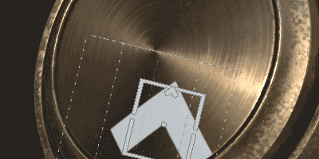
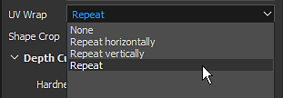
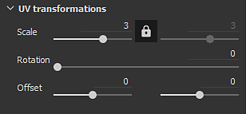

# Versión 2019.1

**Substance Painter 2019.1** amplía sus características existentes y también presenta nuevas herramientas artísticas. Esta versión se centra también en distribuir una gran cantidad de contenido nuevo.

Fecha de publicación : *23 de abril de 2019*

## Funciones principales

### Trazos dinámicos

Con esta versión, nuestro motor de pinceles ahora es compatible con lo que llamamos Trazos dinámicos. Este tipo de trazos crean variaciones y nuevos efectos gracias a la generación de nuevas versiones de Substance sobre la marcha. Ahora es posible tener un nuevo material de Substance o alfa para cada nuevo trazo de pincel pintado en el recurso.

Cuando se carga un recurso compatible con Trazo dinámico en la herramienta de pintura (Pintar, Borrador, Difuminar o Clonar), aparece un nuevo grupo de parámetros:

Trazos dinámicos admite las siguientes propiedades (si se muestran en el gráfico de Substance):

* **Índice de sello** : ID / Número de un sello dentro de un trazo.
* **Raíz aleatoria** : Puede cambiar por sello o por trazo.
* **Hora**: El tiempo de pintura transcurrido de un trazo de pincel, pintar de forma rápida o lenta, produce resultados diferentes.

El índice de sello incluye otros dos parámetros:

* **Inicio de sello** : *Desde el principio* (siempre inicia el índice desde 0) o *Desde índice aleatorio* (elige una posición aleatoria entre 0 y el máximo definido por **Recuento de ciclos de sello**).
* **Recuento de ciclos de sello** : Este parámetro define la cantidad total de variaciones de Substance que se generarán. Para optimizar las prestaciones, este parámetro funciona como un límite. El Substance Painter lo utiliza para reciclar lo que ya se ha generado en lugar de crear algo nuevo.

Puedes encontrar recursos compatibles con esta nueva función simplemente navegando por la estantería y mirando los nuevos iconos que ahora están junto a ellos:

Los recursos compatibles con la función también obtienen automáticamente una nueva etiqueta denominada &quot;**dynamicstroke**&quot; para que se puedan filtrar fácilmente por palabras clave de la bandeja.

También hemos añadido varios **ajustes preestablecidos de herramientas** nuevos con los que jugar:

{width="450px"}

>[!NOTE]
>
> Para obtener más información sobre esta característica (y su impacto en el rendimiento), consulta la [documentación dedicada](../../painting/dynamic-strokes/dynamic-strokes.md).

### Desplazamiento Y Mosaico

Substance Painter ahora admite **Desplazamiento** y **teselación de malla** en su puerto de visualización en tiempo real y en Irak. Ambos se pueden controlar en la ventana **Shader Settings** debajo de los parámetros del sombreado.

* **Canal de origen** : Canal en el que se basa la deformación de la malla. El valor predeterminado es Height, pero también se puede establecer en Desplazamiento.
* **Escala** : Controla la cantidad de deformación aplicada a la malla del proyecto.

* **Modo de subdivisión** : Uniforme o Longitud de borde. Determina cómo se calcula la cantidad de subdivisión.
* **Recuento de subdivisiones** : (Modo Uniforme) De 1 a 32. Un valor alto produce más polígonos, lo que proporciona más detalles, pero puede introducir problemas de rendimiento.
* **Longitud máxima** : (Longitud de borde de modo) 1 / Valor. Cada borde del polígono se divide hasta que cada segmento sea igual o menor que este número, siendo 1/1 el tamaño de la escena.

Cargue el proyecto de muestra &quot;**Tiling Material**&quot; (mediante **Archivo > Cargar muestra**) para probar rápidamente esta nueva función:

{width="450px"}{width="450px"}

>[!NOTE]
>
> Se ha agregado un nuevo filtro denominado &quot;**Height a normal**&quot; en la bandeja y se puede usar para obtener la asignación normal final (en caso de que la conversión nativa por parte del Substance Painter no sea lo suficientemente fuerte).

### Comparar efecto de máscara

Crear y mezclar materiales puede ser un poco difícil a veces, por eso creamos un nuevo efecto llamado &quot;**Comparar máscara**&quot;. Este efecto permite comparar de forma rápida y sencilla dos canales y, como resultado, producir una máscara.

El efecto Comparar máscara tiene las siguientes propiedades:

* **Canal**: El canal que se va a comparar entre el origen y el destino desde el que se va a crear una máscara.
* **Comparar**: Hay tres parámetros disponibles aquí para elegir cómo se debe calcular la máscara. El menú desplegable del centro define la operación de comparación (menor que, dentro de la tolerancia, mayor que).
* **Constante**: Valor con el que comparar cuando el ajuste de comparación se establece en &quot;constante&quot;.
* **Dureza**: Controle el smoothness/dureza de la comparación de máscara resultante.
* **Histograma**: Proporcione una vista de histograma del origen y el destino. Útil para saber si se superponen un poco o no se superponen en absoluto (si no se superponen, la máscara estará vacía).

Para facilitar aún más la configuración, puedes hacer clic con el botón derecho en una capa y elegir el método abreviado &quot;**Añadir máscara con combinación de heightes**&quot; para añadir rápidamente esta nueva máscara a tu capa. Este método abreviado también cambiará el modo de fusión de canal de Height a &quot;Normal&quot; en lugar de &quot;Sobreexposición lineal (añadir)&quot; predeterminado.\

### Simetría radial

Ampliamos las capacidades de nuestra herramienta de simetría para manejar la simetría radial. Ahora hay un nuevo modo en el menú de ajustes de simetría para activarlo (disponible en la barra de herramientas contextual).

Están disponibles los siguientes ajustes:

* **X / Y / Z** : Controla la dirección del eje de simetría utilizado por la simetría radial.
* **Recuento** : Número de puntos duplicados.
* **Ángulo** : La ubicación de los puntos duplicados del original. Este ajuste se puede utilizar para hacer un círculo completo o un cuarto de él, etc.

También hemos añadido una pequeña vista previa para que sea más fácil ajustar la configuración antes de empezar a pintar :

### Nuevos modos de proyección de capa de relleno

Se han añadido dos nuevos modos de proyección con capas de relleno y efectos de relleno : **Planar** y **Esférica**. También hemos añadido muchos parámetros nuevos para controlar aún más los comportamientos de las proyecciones 3D.

* **Nuevo modo de proyección plana**\
  Ahora es posible proyectar un plano con este nuevo modo. Puede ser útil para crear franjas en los vehículos o colocar pegatinas en un lugar específico.

  
* **Herramienta Superficie para proyección plana**\
  Para facilitar la manipulación de la proyección plana, también hemos añadido un nuevo control para el manipulador 3D, que llamamos **Surface Tool**, al que se puede acceder con el método abreviado &quot;**Shift+W**&quot;. También se puede acceder desde la barra de herramientas contextual. Tenga en cuenta que este nuevo modo solo está disponible con la proyección plana.

  

  
* **Eliminación/atenuación de proyección plana**\
  Hay varios ajustes disponibles para que la proyección plana sea continua o finita. Cuando se activa un ajuste de sacrificio, el cuadro de puntos alrededor del manipulador indica el cuadro delimitador de la proyección y la línea central es donde comienza la proyección. La escala de la proyección permite controlar hasta dónde llega y cuándo comienza a desvanecerse.

  {width="500px"}

  
* **Nuevo modo de Proyección esférica**\
  Ahora se pueden realizar proyecciones esféricas con este nuevo modo. Con él puedes conseguir patrones avanzados o seguir superficies más fácilmente curvadas.

  {width="350px"}
* **Nueva configuración de recorte de forma**\
  Las proyecciones 3D ahora tienen un ajuste que controla la repetición de la proyección. Muy útil por ejemplo para que una pegatina se repita solo en un área específica sin tener que enmascararla manualmente.

  {width="500px"}
* **Se movió y se cambió el nombre de la configuración existente**\
  Debido a estas nuevas proyecciones retrabajamos un poco cómo funcionan algunos ajustes. Por ejemplo, se ha cambiado el nombre de &quot;**Mosaico**&quot; por &quot;**Envolvimiento de UV**&quot;. El mosaico ahora solo se puede establecer vertical u horizontalmente. La escala, la rotación y el desplazamiento ahora forman parte de un nuevo grupo de parámetros denominado &quot;**Transformaciones UV**&quot; para que sean más coherentes en los distintos modos de proyección.

  

  
* **Modo mejorado de todo el eje del manipulador de rotación** En lugar de dibujar una esfera explícita, ahora está oculta para evitar ocultar las texturas que aparecen debajo. Al hacer clic entre los ejes, se seleccionará la esfera que permite rotar todos los ejes a la vez.\
  

### Varias mejoras

* **Selección múltiple para conjunto de texturas**\
  Ahora es posible seleccionar varios conjuntos de texturas para cambiar su resolución a la vez mediante los ajustes de Conjunto de texturas.\
  En el modo de selección múltiple sigue existiendo la noción de un conjunto de texturas &quot;principal&quot;, por lo que se seleccionan elementos adicionales en gris. Si necesita cambiar a otro conjunto de texturas manteniendo la selección actual, puede utilizar el botón central del ratón para hacerlo.
* **Mostrar u ocultar rápidamente en la lista de conjuntos de texturas**\
  Ahora puede hacer clic y arrastrar (como en la pila de capas) para ocultar o mostrar conjuntos de texturas.
* **Interfaz de usuario mejorada para la pila de capas**\
  Hemos cambiado el icono para que el estado oculto/visible de una capa sea más coherente y fácil de entender. También hemos cambiado la forma en que se muestran las capas seleccionadas para que sean más fáciles de comparar con la selección de sus efectos y otras capas.\
  
* **Nueva posición del efecto basada en la selección actual** Ahora cualquier efecto nuevo agregado en una capa se colocará justo encima del seleccionado actualmente.\
  
* **Conmutador rápido de botones de canal de material**\
  Ahora puede presionar ALT y hacer clic en un botón de canal para aislarlo. Si vuelve a hacer clic, se volverán a activar todos los canales.\
  
* **Tramado al exportar** El tramado se puede deshabilitar ahora mediante una configuración específica en la ventana de exportación, junto al formato de archivo y la profundidad de bits. Para obtener más información sobre cómo y cuándo se aplica el tramado [consulte la documentación de exportación](../../export/export-window/export-window.md).\
  
* **Histogramas Mejores**\
  Rediseñamos nuestro generador de histograma. Los histogramas ahora deben mostrar información más precisa y actualizarse correctamente después de un cambio en la pila de capas.\
  
* **Mejor creación de instancias de capas**\
  Las capas instanciadas ahora tienen su modo de fusión establecido en &quot;Pass Through&quot; en lugar del modo de fusión predeterminado. Este modo de fusión mejorará la compatibilidad de algunos efectos cuando se crean instancias de capas en los conjuntos de texturas.

### Nuevo contenido

En esta versión también hemos añadido mucho contenido nuevo : desde ajustes preestablecidos hasta alfas e incluso nuevos y potentes filtros.

* **Nuevos ajustes preestablecidos de pincel y herramientas**\
  Esta versión presenta la nueva función Trazos dinámicos y, con ella, hemos añadido algunos ajustes preestablecidos de Pincel y Herramienta listos para su uso.

  * 10 nuevos ajustes preestablecidos de pincel :
    * Tinta sucia
    * Tinta aleatoria
    * Hoja curva pesada
    * Curva de hojas
    * Hoja desordenada
    * Hoja simple
    * Remolino de hojas
    * Zigzag largo
    * Zigzag corto
    * Paso en zigzag
  * 11 nuevos ajustes preestablecidos de herramientas :
    * Hojas de otoño
    * Grietas
    * Huellas
    * Tono de degradado
    * Clavo
    * Guijarros
    * Rayones
    * Pulverizar de color
    * Spray Skin Light
    * Spray Piel Rojo
    * Cremallera
* **93 nuevos Alpha**\
  Hay demasiados para enumerarlos todos, así que echa un vistazo a la sección &quot;Alpha&quot; de la Estantería y verás muchas flechas nuevas, triángulos, signos y otro tipo de formas.
* **13 filtros nuevos**\
  Tenemos muchos filtros nuevos en esta nueva versión que pueden ser muy prácticos para una serie de situaciones perdidas:

  * **Pendiente de desenfoque** : Se ha añadido un nuevo filtro de desenfoque a la familia. Este filtro funciona de forma similar al filtro de deformación : utilice la entrada existente o una personalizada para desenfocar el canal de destino.
  * **Bisel**: Crea un borde degradado alrededor de una forma, útil si desea expandir la máscara, por ejemplo.
  * **Coincidencia de color** : Este filtro intenta hacer coincidir un color de origen con un color de destino. Práctico para ajustar colores en un material.
  * **Curva de degradado** : Este filtro proporciona una lista de ajustes preestablecidos de curva que se pueden aplicar en cualquier entrada de escala de grises para cambiar su aspecto.
  * **Degradado dinámico** : Reasigna una entrada de escala de grises mediante una nueva imagen de entrada (escala de grises o color).
  * **Ajuste de Height** : Este filtro proporciona dos ajustes para manipular fácilmente el canal de height : Desplazamiento y Multiplicación.
  * **Height a Normal** : Este filtro convierte el canal de Height en Normal y lo alimenta con el canal Normal. Tiene diferentes controles de intensidad dependiendo de las necesidades.
  * **Esquema de máscara** : Este filtro crea un borde blanco sobre negro alrededor de una entrada de escala de grises. Esto resulta muy útil en Máscara para crear bordes alrededor de las formas.
  * **Validación PBR**: Hemos añadido este filtro para comprobar que los colores del material PBR se encuentran en los rangos correctos. Para obtener más información, consulte la [Guía de PBR](https://www.allegorithmic.com/pbr-guide) !
  * **Pintura descascarillada MatFX** : Simula que la pintura antigua empieza a despegarse. Este filtro emite alfa, lo que facilita la mezcla con materiales por debajo de él.
  * **Gotas de agua MatFx** : Simula gotas de agua en la superficie de un objeto. Como agua en un auto después de la lluvia.
* **7 nuevos generadores**\
  Con esta versión hemos añadido algunos generadores nuevos:

  * **Oclusión de ambiente**: Generador de máscaras que ofrece controles sobre el mapa de malla de Oclusión ambiental. Basado en el Editor de máscaras.
  * **Normales espaciales mundiales**: Generador de máscaras que ofrece controles sobre el mapa de malla de World Space Normals. Basado en el Editor de máscaras.
  * **Posición** : Generador de máscaras que ofrece controles sobre el mapa de malla de posición. Basado en el Editor de máscaras.
  * **Curvatura**: Generador de máscaras que ofrece controles sobre el mapa de malla de curvatura. Basado en el Editor de máscaras.
  * **Costura automática** : Generador de máscaras que crea puntos cerca de los bordes UV, la curvatura de malla o alrededor de una entrada de máscara personalizada.
  * **Densidad de texto UV**: Ayudante que genera un degradado de color basado en la densidad de texel de los polígonos de la malla.
  * **Color aleatorio UV**: Genere un color aleatorio por Isla de UV (o basándose en una entrada de degradado personalizada).
* **2 nuevos mapas de entorno**

  * Bosque de otoño
  * Canopus Ground

    
* **5 nuevos procedimientos**

  * Tono de degradado
  * Generador de degradados
  * Variación del color por índice
  * Variación Del Color Por Semilla
  * Pluma estilizada

    

## Tutoriales

Echa un vistazo a nuestro tutorial que trata sobre nuestras últimas funciones :

También tenemos un tutorial en Substance Academy que trata sobre cómo crear un trazo dinámico : [Creando un trazo dinámico personalizado para el Substance Painter](https://academy.allegorithmic.com/courses/Creating-a-custom-Dynamic-Stroke-for-Substance-Painter)

## Notas de la versión

### 2019.1.3

*(Publicado El 1 De Julio De 2019)*\
Resumen : **Corrección de error con 2 nuevas características**

**Corregido:**

* &quot;Seguir ruta&quot; no funciona todo el tiempo
* La asignación de canales no funciona con SBSAR utilizado en ranuras de un solo canal
* [Pila de capas] Bajo rendimiento al desplazarse con capas ocultas
* [TextureSet] Bloqueo al hacer clic entre máscaras
* [SVT] El Desplazamiento no se muestra correctamente y parpadea en algunos casos
* [Alembic] Bloqueo con la malla utilizando normales de punto en lugar de normales de vértice
* [Alembic][Log] Informar de un error en Log si no se admite el archivo Alembic durante la importación

### 2019.1.2

*(Publicado El 21 De Mayo De 2019)*\
Resumen : **Corrección urgente**

**Corregido:**

* Bloqueo al seleccionar dos recursos con una entrada de imagen

### 2019.1.1

*(Publicado El 20 De Mayo De 2019)*\
Resumen : **Corrección urgente**

**Agregado:**

* Actualización a la versión más reciente de Substance Engine con la última versión de Substance Designer 2019.1

**Corregido:**

* [Substance] Visible Si no se tiene en cuenta para las imágenes de entrada
* [SVT] [Motor] El cambio de la resolución del conjunto de texturas provoca bloqueos en algunos casos
* [Motor] En algunos casos aparecen texturas negras aleatorias
* [Pila de capas] [IU] Al alternar una máscara con MAYÚS, se pueden seleccionar varias capas al mismo tiempo
* [Pila de capas] La opacidad no afecta al efecto Pintura con el modo de fusión PassThrough
* [Pila de capas] La entrada de Height a filtro normal no se actualiza correctamente con el trazo del pincel del borrador
* [LayersStack] Bloqueo al deshacer el soltar una máscara inteligente
* Malla metálica parpadeando con sombras y anti-aliasing temporal activado
* [Desplazamiento] Retraso en AMD con algunas mallas pesadas
* [Windows] Bloqueo al abrir algunos proyectos mediante el explorador de archivos
* [Histograma] Bloqueo al eliminar la máscara con el punto de anclaje en algunos casos
* Bloqueo en la generación de vistas previas en algunos casos excepcionales
* [Bloqueo] No se puede volver a abrir un proyecto con demasiadas herramientas de clonación y difuminado
* No se muestra ninguna malla en el modo de material después de guardarla en algunos casos
* [Scripting] alg.mapexport.documentStructure() devuelve valores incorrectos para las carpetas

**Problemas conocidos:**

* Al hacer doble clic en el nombre del conjunto de texturas, se seleccionará antes de entrar en el modo de cambio de nombre

### 2019.1

*(Publicado El 23 De Abril De 2019)*\
Resumen : **Trazo dinámico con contenido nuevo dedicado, Desplazamiento y teselación en tiempo real e Iray, efecto Máscara de comparación, simetría radial, Plano y Proyección esférica**

**Agregado:**

* [Herramienta] Trazo dinámico: Variación Substance junto a un trazo de pincel
* [Trazo dinámico] Exponer nuevo parámetro de índice de sello con opciones
* [Trazo dinámico] Tenga en cuenta el parámetro $time
* [Trazo dinámico] Generar un nuevo parámetro $randomseed por trazo y por sello
* [Trazo dinámico] Iniciar un índice de trazo dinámico a partir de un número aleatorio
* [Trazo dinámico] [Estante] Ayuda para buscar un recurso de trazo dinámico con un icono nuevo dedicado
* Desplazamiento y teselación en la ventana gráfica en tiempo real
* Desplazamiento y teselado en Iray
* [Configuración de sombreado][IU] Nueva ficha para controlar el desplazamiento y la teselación
* [Pila de capas] Nuevo efecto CompararMáscara: generar una máscara comparando dos canales
* [Pila de capas][IU] Nueva entrada en el menú contextual &quot;Añadir máscara con combinación de heightes&quot; para insertar un efecto Comparar máscara
* [Simetría] Nuevo modo de simetría: pintura radial
* [Configuración de simetría] Expanda las secciones &quot;Configuración&quot; y &quot;Pantalla&quot;
* [Ajustes de simetría] [IU] Vista previa para pintura radial
* Exponga dos nuevos modos de proyección: planar y esférico
* [Proj] Nuevo modo de recorte de forma para todas las proyecciones
* [Proj] Modo plano con nuevo manipulador: Herramienta Superficie
* [Proj][Acceso directo] Método abreviado MAYÚS+W para la herramienta Superficie
* [Proj] Enmascaramiento de proyección plana con selección de profundidad y sacrificio de la cara posterior
* [Manipulador] Mejora del manipulador de rotación en los tres ejes para triplanar
* [Herramienta] [Experiencia de usuario] Al pulsar Alt y hacer clic en un canal, se selecciona ese canal (lo activa o desactiva todos los demás).
* [Motor] Actualizar a la versión más reciente de Substance Engine
* [Conjunto de texturas] Selección múltiple y resolución de cambios
* [Conjunto de texturas] Activación y desactivación rápidas de los conjuntos de texturas
* [Conjunto de texturas] Combina solo y todas las opciones en un nuevo menú
* [Conjunto de texturas] [Pila de capas] Nuevo icono para activación y desactivación
* [Pila de capas][UX] Inserta efectos por encima de los que ya están seleccionados
* [Pila de capas][IU] Reprocesamiento de la vista de la pila de capas
* [Pila de capas] El modo de fusión para capas con instancias ahora está en modo Pass Through de forma predeterminada
* [Exportar] Opción para activar y desactivar el tramado
* [Plugin] Compatibilidad con el modificador de precisión para reguladores (MAYÚS)
* [Plugin][UI] Nuevo icono para autoguardar
* [Scripting] Enumera el contenido de una carpeta
* [Scripting] Permitir la eliminación de archivos
* [Scripting] Lea toda la información de la pila, incluidos los recursos utilizados
* [Contenido][Trazo dinámico] Nuevas herramientas y ajustes preestablecidos de pincel
* [Content][Dynamic stroke] Dos nuevos degradados de procedimiento: Tono de degradado y Generador de degradado
* [Contenido] 11 nuevos filtros: Pintura descascarillada MatFx, gotas de agua MatFx y más
* [Contenido] 7 nuevos generadores: Stitcher automático, UV Random Color, UV Texel Density y más
* [Contenido] 93 alfas nuevas: nuevos textos, flechas y otras formas
* [Contenido] 2 nuevos procedimientos: Tono de degradado, Generador de degradados y mucho más
* [Contenido] 21 nuevos ajustes preestablecidos de herramienta y pincel para Trazos dinámicos : Guijarros, Huellas, Spray y más
* [Contenido] 2 HDR nuevos: Canopus Ground y Autumn Forest
* [Contenido] Actualizar el contenido con la selección aleatoria de semillas en el estante
* [Contenido] Nuevo icono con parámetro de semilla aleatoria expuesto en la estantería

**Corregido:**

* [Pila de capas] La pila de capas se sigue arrastrando para siempre
* [Mac] La opción &quot;Mostrar en Finder&quot; puede provocar la congelación
* [Scripting] La configuración guardada mediante la interfaz de usuario personalizada se pierde si se mueve el archivo de sombreado
* El número de versión de la API [Scripting] es incorrecto y no está actualizado
* [Efecto] El contenido del histograma no se muestra correctamente
* [Efecto] El efecto del histograma no se actualiza en algunos casos
* [Estante] Los puntos no se alinean correctamente en el material &quot;Pirámide de tela plástica&quot;

**Problemas conocidos:**

* Al hacer doble clic en el nombre del conjunto de texturas, se seleccionará antes de entrar en el modo de cambio de nombre
* [Pila de capas] [IU] Al alternar una máscara con MAYÚS, se pueden seleccionar varias capas al mismo tiempo
