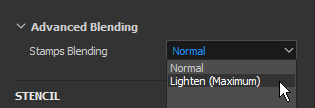
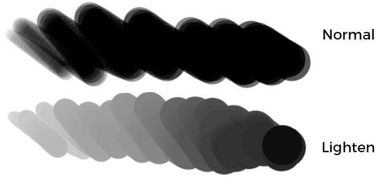
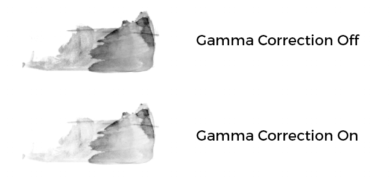
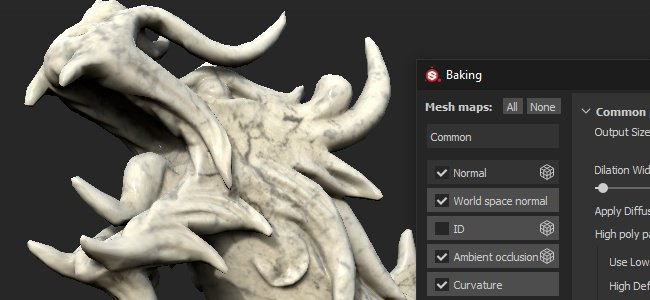
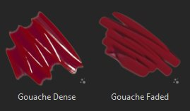
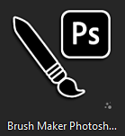

# Versión 2019.3

**Substance Painter 2019.3** incorpora la compatibilidad con los ajustes preestablecidos de los pinceles de Photoshop y el desempaquetado automático de UV para las mallas, así como varias mejoras en la calidad de vida, como una mejor gestión de las tabletas gráficas.

Fecha de publicación: *17 de diciembre de 2019*

## Funciones principales

### Compatibilidad con los ajustes preestablecidos de pincel (ABR) de Photoshop

Ahora puede usar sus pinceles de Photoshop en Substance Painter. Con solo exportar los ajustes preestablecidos como un archivo ABR, ahora puede importarlos como ajustes preestablecidos de pincel normal. Los ajustes preestablecidos incluidos en los archivos ABR aparecerán en la estantería como ajustes preestablecidos de pincel individuales.

Si no tiene archivos ABR para importar, puede encontrar muchos de ellos en línea:

* [Pinceles preestablecidos de Kyle en el Adobe](https://www.adobe.com/es/products/photoshop/brushes.html)
* [Ajustes preestablecidos de pincel en ArtStation](https://www.artstation.com/marketplace?q=photoshop%20brush&sort_by=trending)
* [Ajustes preestablecidos de pincel en DeviantArt](https://www.deviantart.com/search?q=photoshop%20brush)
* [Ajustes preestablecidos de pincel en pincel de cubo](https://cubebrush.co/marketplace?categories=354,57)

Para que sean compatibles con los pinceles de Photoshop, se han añadido varias funciones nuevas a las propiedades de la herramienta de pintura:

* **Nuevos parámetros Tamaño y Mínimo de flujo**\
  Ahora puede especificar el tamaño mínimo y el flujo mínimo de la herramienta cuando la presión de la pluma está activada. Este parámetro funciona como un porcentaje basado en el tamaño/flujo máximo actual definido. Estos ajustes se calibran automáticamente al utilizar un ajuste preestablecido de pincel de Photoshop.\
  
* **Nuevos parámetros de variación de posición**\
  Para que coincida con el comportamiento de los pinceles de Photoshop, hemos añadido algunos ajustes nuevos. Ahora es posible definir a qué eje se aplica la variación y cómo se distribuyen las posiciones aleatorias (elige **Uniforme** para que coincida con Photoshop).\
  \
  
* **Nuevo modo de fusión alfa**\
  Photoshop no compone sus trazos de pincel del mismo modo que Substance Painter, por lo que hemos añadido un nuevo modo de fusión (aclarar) para que coincida mejor con el resultado de la pintura. Este modo de fusión no se acumula en exceso cuando los sellos se superponen, lo que puede mejorar la sensación de presión al pintar con un valor bajo de Flujo/Opacidad.\
  \
  
* **Compatibilidad con redondez y volteo**\
  Se ha añadido un nuevo Alpha de Substance llamado **Brush Maker Photoshop** para admitir parámetros como Redondez (escalar el height del Alpha) y Voltear (reflejar una imagen en ambos ejes). Este Alpha de Substance se carga automáticamente al hacer clic en un ajuste preestablecido de pincel procedente de un archivo ABR.\
  \
  
* **Nueva corrección de gamma para el canal alfa de las capas**\
  Photoshop no fusiona sus trazos de pincel en el espacio Gamma lineal, lo que significa que la fusión y la opacidad pueden verse mal al pintar con un ajuste preestablecido de pincel de Photoshop. Se puede activar un nuevo ajuste en las capas para que coincida con ese comportamiento y aplicar una corrección de gamma. Esto afectará al alfa utilizado para pintar trazos de pincel, así como al modo en que se utiliza la máscara de la capa para fusionarse con otras capas; sin embargo, los modos de fusión de la capa seguirán funcionando en el espacio de gamma lineal.\
  Para **activar esta configuración**, simplemente haz clic con el botón derecho en una capa y elige **Alfa/máscara corregida por gamma**. Aparecerá un nuevo icono junto a la capa para indicar cuándo está activada esta configuración.\
   \
  
* **Aumento del valor máximo de Espaciado y Variación de posición**\
  Para que los parámetros de los ajustes preestablecidos de pincel de Photoshop coincidan correctamente, se ha aumentado el valor máximo de los siguientes parámetros:

  * **Espaciado**: el máximo ahora se puede establecer en 1000.
  * **Variación de posición**: el máximo ahora se puede establecer en 1000.

Para obtener más información, como cómo exportar e importar archivos ABR, consulta la documentación de [Ajustes preestablecidos de pincel de Photoshop](../../painting/presets/photoshop-brush-presets/photoshop-brush-presets-abr.md).

>[!NOTE]
>
> No todos los parámetros de pincel de Photoshop son compatibles actualmente. Consulte la [lista de compatibilidad](../../painting/presets/photoshop-brush-presets/photoshop-brush-parameters-compatibility.md) para obtener más información.

### Mejoras en la compatibilidad de la pintura y la tableta gráfica

Además de la compatibilidad con los ajustes preestablecidos de pincel de Photoshop, se han realizado numerosas mejoras y correcciones relacionadas con el uso de tabletas gráficas.

* El primer sello de **Línea recta ya no se dobla**\
  Al pintar una línea recta, el primer sello ya no se duplica (no es necesario deshacer el sello solo para colocar la línea recta en su posición).\
  
* **Interpolación recta de presión de línea**\
  Las líneas rectas ahora admiten presión. El valor de presión se interpolará entre el primer sello y el último sello.\
  
* **Nuevos modos de vista previa del pincel**\
  La vista previa del pincel en la ventana gráfica ahora se puede cambiar a diferentes modos de visualización. Para cambiar el modo, simplemente haga clic en el nuevo botón desplegable en la barra de herramientas contextual.

  
* **Curvas de presión del lápiz**\
  En la barra de herramientas contextual ahora es posible definir cómo debe interpretarse la presión del lápiz. Estos nuevos ajustes controlan la velocidad de la acumulación de presión, que permite diferentes estilos de pintura.

  * **Lineal**: Sin transformación, la presión que recuperó según lo indicado por el lápiz de la tableta gráfica. Utilice este ajuste si ya se ha definido una curva de presión del lápiz en la configuración de controladores de tableta.
  * **Entrada lenta** (predeterminado): Ralentiza el comienzo de la presión, lo que facilita pintar trazos finos o tenues.
  * **Entrada lenta**: Ralentiza el comienzo de la presión y acelera su final, lo que facilita pintar trazos suaves o fuertes.

  
* **El botón de presión ya no es un menú desplegable**\
  Hemos cambiado los controles de presión del lápiz para que sean botones de encendido y apagado sencillos. Esto hace que activar y desactivar la presión sea mucho más fácil y rápido.

  
* **Se ha mejorado la compatibilidad con tabletas gráficas y se ha cambiado a Windows Ink**\
  Hemos rediseñado la forma en que manejamos las tabletas gráficas. Esto debería mejorar la compatibilidad en general con los modelos recientes de tabletas gráficas y reducir el número de problemas que teníamos en el pasado. En Windows también cambiamos a Windows Ink en lugar de WinTab para mejorar la compatibilidad.

  >[!NOTE]
  >
  > Asegúrese de que los controladores de Wacom estén actualizados y de que &quot;Windows Ink&quot; esté habilitado en la configuración de la tableta.

### Desempaquetado automático de UV (beta)

Substance Painter ahora desenvolverá automáticamente las mallas que tengan coordenadas UV que falten. Esto permite importar cualquier tipo de geometría y comenzar inmediatamente a pintar. Nuestro sistema de desempaquetado UV generará una Isla de UV por submalla mientras sigue la asignación de materiales para crear conjuntos de texturas. Esta función se encuentra actualmente en fase beta y evolucionará en futuras versiones. El desajuste automático solo se aplicará a proyectos que **no utilicen el flujo de trabajo UDIM**.

* **Desempaquetado automático de UV**\
  De forma predeterminada, el Substance Painter generará automáticamente las coordenadas UV de las mallas a las que les faltan. Esto se aplica tanto a la creación de proyectos como a la reimportación de mallas. Sin embargo, es posible deshabilitar este comportamiento entrando en la [configuración principal](https://helpx.adobe.com/es/substance-3d/unlisted/documentation/spdoc/general-71008262.html) y deshabilitando **Habilitar desajuste automático de UV** en **Opciones de importación**.

  
* **Barra de progreso de desempaquetado de UV**\
  Al importar una malla, ahora hay una barra de progreso para indicar el estado actual del proceso. Esto también incluye el proceso de desempaquetado de UV.

  
* **Problemas conocidos**\
  Dado que esta nueva función se encuentra actualmente en versión beta, se esperan algunos problemas. Consulte las notas de la versión que aparecen a continuación para obtener una lista de los problemas conocidos actualmente. Si la aplicación se bloquea y produce resultados incorrectos, le sugerimos que nos envíe un informe de bloqueo o error a través de la aplicación para ayudarnos a investigar el problema y mejorar el proceso.

>[!NOTE]
>
> Se ha agregado un nuevo **generador** en la estantería para ayudar a visualizar el desempaquetado automático. Para usarlo, solo tienes que crear una nueva capa, añadir un efecto generador y cargar el nuevo recurso **Comprobador UV** en ella.

### Mejoras en la integración de Substance

Seguimos mejorando la integración del formato de Substance al admitir algunas funciones tan esperadas, pero también al mejorar el sistema existente, como la función de trazo dinámico.

* **Reguladores de rangos suaves sin sujeción**\
  Hasta ahora, los reguladores expuestos del gráfico Substance siempre se comportaban como si estuvieran sujetos. Lo que significa que los valores que se pueden introducir no pueden superar los valores mínimos y máximos predeterminados definidos por el parámetro.

  
* **Compatibilidad con el paso definido en parámetros**\
  Los gráficos de Substance que tienen parámetros con un paso definido ahora se tendrán en cuenta al ajustar el regulador.
* **Mayor precisión de dígitos para los reguladores de flotación**\
  El regulador de flotador ahora puede tener valores de entrada que bajan a 6 decimales. Sin embargo, esto se ve limitado por la precisión de punto flotante, lo que significa que el valor introducido puede redondearse en algunos casos.
* **Nuevo control Raíz aleatoria con Trazos dinámicos**\
  Ahora es posible solicitar varios valores de inicialización aleatorios con un rango definido. Esto permite crear variaciones de Substance únicas y aleatorias, al tiempo que se obtienen buenos resultados al beneficiarse del reciclaje de la memoria caché.\
  En el grupo de trazos dinámicos, cambie el parámetro **Random Seed Type** por **Random Per Stroke** o **Random Per Stamp** para obtener acceso al nuevo parámetro. La **Cantidad de muestra aleatoria** define cuántas variaciones de Substance se generarán en total. Se seleccionarán variaciones aleatorias dentro del conjunto una vez que se haya generado la cantidad seleccionada.

  
* **Nuevos datos de usuario Trazos dinámicos estáticos**\
  Se ha añadido una nueva optimización que permite especificar cuándo un Substance puede considerarse un trazo dinámico. De forma similar a la opción Visible si, ahora es posible añadir condiciones en el campo de datos de usuario para especificar bajo qué condición debe generar el Substance Painter nuevas variaciones de Substance con la función Trazo dinámico. Consulte la [documentación de datos de usuario](../../content/creating-custom-effects/user-data.md) para obtener más información.
* **Nuevos datos de usuario para designar un nodo de salida como máscara para todos los canales**\
  Ahora se pueden agregar nuevos datos de usuario en un nodo de salida para utilizarlo como máscara alfa para todos los demás canales. Esto es similar al sistema **channels\_Alpha** existente, pero sin necesidad de crear una nueva salida dedicada en el gráfico del Substance. Consulte la [documentación de datos de usuario](../../content/creating-custom-effects/user-data.md) para obtener más información.

### Mejoras diversas

Se han realizado varias mejoras en el resto de la aplicación que deberían ayudar para el trabajo diario dentro de Substance Painter.

* **Enfoque de ventanas gráficas independientes**\
  El enfoque 2D y 3D (método abreviado F) se ha modificado con el siguiente comportamiento:

  * **Pase el ratón por la vista 2D**: al pulsar F, solo se centrará la vista 2D.
  * **Pase el ratón sobre la vista 3D**: al pulsar F, solo se centrará la vista 3D.
  * **Ratón fuera de los puntos de visión**: al pulsar F, se centrará la vista 2D y 3D.

  {width="400px"}
* **Método abreviado de teclado y menú de la ventana de cocción**\
  La ventana para hornear se puede abrir de dos nuevas formas diferentes:

  * Pulsando **Ctrl+Mayús+B**.
  * Entra en el menú Editar y haz clic en **Mapas de malla de cocción**.

  
* **Desplazar Docks y Windows con Ctrl+Alt+Clic en el botón izquierdo**\
  Se ha añadido un nuevo método abreviado que permite desplazarse por las ventanas y los muelles sin necesidad de utilizar la rueda del ratón. El método abreviado que ahora se puede desplazar con el lápiz de la tableta gráfica.

  
* **Mejoras de rendimiento**\
  En el fondo se han puesto en marcha muchas optimizaciones que deberían mejorar las prestaciones generales del Substance Painter (desde las aperturas de proyectos a la pintura).

### Nuevo contenido

En esta versión se ha añadido mucho contenido nuevo:

* **Proyecto de ejemplo &quot;Meet Mat&quot; actualizado**\
  Mat se ha actualizado con una nueva topología, lo que hace que sea más fácil de usar con el desplazamiento. El mapa de identificación se ha rediseñado para ofrecer más posibilidades de enmascaramiento y un nuevo conjunto de cámaras está disponible en el proyecto para ofrecer nuevos ángulos de visión.

  {width="500px"}
* **Nuevos filtros**\
  Se han añadido tres nuevos filtros para facilitar el contenido estilizado:

  * **Libro de historietas de MatFx**\
    Este filtro simula las líneas de rayado y de borde en función de la entrada proporcionada (desde el color base/difuso hasta la curvatura).

    
  * **Color diluido MatFx**\
    Este filtro simula la acuarela con sangrado de color y absorción de papel leyendo el color de entrada.

    
  * **Pintura al óleo MatFx**\
    Inspirado por el trabajo de [Emrecan Cubukcu](https://www.artstation.com/emrecancubukcu), este filtro lee la información de color de la entrada y la traduce en trazos de pincel basados en diversos parámetros. Hay varios ajustes preestablecidos disponibles para probar fácilmente las variaciones. Se recomienda combinarlo con el filtro **Entorno de iluminación generado** o hornear o pintar manualmente las sombras en las texturas para maximizar su efecto.

    

    

    >[!NOTE]
    >
    > Este es un filtro muy costoso que puede tardar algún tiempo en computar. Al iterar, se recomienda desactivar la capa que contiene el efecto antes de ajustar las capas que están por debajo de él.
* **Nuevos ajustes preestablecidos de pincel**

  * **102 pinceles preestablecidos de Photoshop**\
    Con la introducción de la compatibilidad con el pincel de Photoshop, se ha incluido un nuevo conjunto de ajustes preestablecidos para mostrarlo. Estos ajustes preestablecidos se han seleccionado entre los paquetes de Kyle T. Webster disponibles en el [sitio web de Adobe](https://www.adobe.com/es/products/photoshop/brushes.html).

    {width="500px"}
  * **18 nuevos ajustes preestablecidos de pincel**\
    Además de los ajustes preestablecidos de pincel de Photoshop, se han añadido nuevos ajustes preestablecidos más habituales:

    * Presión fuerte básica
    * Fina De Carboncillo
    * Marco completo de carboncillo
    * Luz de carboncillo
    * Carboncillo medio
    * Carboncillo Natural
    * Rampa de carboncillo
    * Ondulación de trazo denso
    * Puntos de ondulación
    * Trazo ondulado con división
    * Trazos ondulados
    * Flecha de rodillo de pintura
    * Grapas de rodillo de pintura ancho
    * Grapas de rodillos de pintura
    * Pintar puntos de rodillo
    * Stripe de rodillos de pintura
    * Pintura de vena de rodillo largo estrecho
    * Texto de advertencia del rodillo de pintura

    {width="500px"}
* **Nuevos ajustes preestablecidos de herramientas**\
  Se han añadido 2 nuevos ajustes preestablecidos de herramientas que simulan la pintura gouache.

  * Denso Gouache.
  * Gouache Descolorido.

  
* **Nuevos alfa**\
  Además de los alfa utilizados para crear los nuevos ajustes preestablecidos de pincel (véase más arriba), se han integrado dos nuevos Alpha importantes:

  * **Brush Maker Photoshop**\
    Este nuevo gráfico de Substance replica algunos parámetros de pincel específicos disponibles en Photoshop mediante la función Trazo dinámico. Con él es posible controlar la redondez y el Voltear o una imagen de entrada. Algunos parámetros de variación también están disponibles para crear más variaciones. Este gráfico del Substance se inserta automáticamente en la sección del Alpha al hacer clic en un ajuste preestablecido de pincel de Photoshop procedente de un archivo ABR.

    
  * **Rodillo de pintura del fabricante de pinceles**\
    Esta nueva gráfica de Substance simula un rodillo de pintura (o una simple herramienta de cinta de opciones) para pintar patrones continuos con giros sin romperse. Para facilitar la configuración, eche un vistazo a los ajustes preestablecidos existentes o consulte la descripción del gráfico. Se recomienda habilitar el [ratón perezoso](../../painting/lazy-mouse.md) para que el pincel de desplazamiento se dibuje correctamente sin crear interrupciones.

    

    {width="290px"}
* **Nuevo generador de &quot;Comprobador UV&quot;**\
  Se ha integrado un nuevo generador denominado &quot;UV checker&quot; para ayudar a analizar las coordenadas UV de la malla. Esto hace que los UV generados por nuestro desenvolver UV automático sea más fácil de entender.

  
* **Nuevos ajustes preestablecidos de plantilla y exportación**

  * **Fotograma clave 9+**\
    Este ajuste preestablecido de exportación hace que las texturas exportadas sean compatibles con la nueva función Keyshot 9, que simplifica la carga y asignación de texturas y materiales. Para obtener más información, consulte la [documentación de imágenes principales](https://luxion.atlassian.net/wiki/spaces/K9M/pages/1124335675/Material+Importer).
  * **Spark AR Studio**\
    Esta nueva plantilla de proyecto y el ajuste preestablecido de exportación facilitan el trabajo con [Spark AR Studio](https://sparkar.facebook.com/ar-studio/).

>[!WARNING]
>
> * Esta versión ya no es compatible con MacOS 10.11 (El Capitan).
> * Esta versión ya no es compatible con CentOS 6.x.
> * En CentOS 7.5 (o versiones anteriores), es posible que la aplicación no se inicie debido a algunos problemas de dependencias. Para corregir el problema, actualice el sistema o copie la [siguiente biblioteca](https://centos.pkgs.org/7/centos-x86_64/freetype-2.8-12.el7.x86_64.rpm.html) en la carpeta de instalación.

## Notas de la versión

### 2019.3.3

*(Publicado el 6 de febrero de 2020)*\
Resumen : **Error con actualización a Iray 2019.3**

**Agregado:**

* Actualización a Irak 2019.3
* [Log] Indicar bios obsoletos para la CPU Ryzen que conduce a un bloqueo durante el procesamiento
* [ABR] Extraer alfa de ABR al estante

**Corregido:**

* [Baker] La cocción falla si la malla High-poly no tiene UV
* [Linux] Los métodos abreviados de ratón personalizados no se guardan
* [Pincel] El contorno desaparece con algunas formas alfa
* [Tablet] Detección incorrecta al mover los reguladores
* [Accesos directos] No se puede configurar ningún acceso directo con &quot;Ctrl+Alt+Clic del ratón&quot;
* [Estante] No se ve información sobre herramientas de recursos al utilizar una tableta con lápiz
* [Vista 2D] [Exportar] El ajuste preestablecido de vista 2D no tiene en cuenta la información normal
* Bloqueo al pintar en alineación UV con determinados pinceles
* Pintar bajo un filtro crea artefactos en el trazo en curso
* [Ventana gráfica] Caché de textura incorrecta en la ventana gráfica después de volver a importar una malla
* [Bloqueo] Error al guardar después de exportar a Photoshop
* [Bloqueo] Escribir símbolos especiales en el prefijo al importar recursos
* [Bloqueo] Haga clic en la referencia en Propiedades de punto de anclaje
* [Puntos de anclaje] El canal no se actualiza cuando hay un filtro entre el punto de anclaje y la referencia
* El vínculo de la URL de Iray en el menú Ayuda no funciona

**Problemas conocidos:**

* [Desempaquetado de UV] El procesamiento de mallas de alto contenido de polietileno puede tardar mucho tiempo
* [Desempaquetado UV] Se combinan vértices en las mismas coordenadas exactas
* La generación de UV puede fallar en algunas partes de la malla en algunos casos raros
* [Desempaquetado UV] Relación de textil no uniforme o muy distorsionada en una sola Isla de UV en algunos casos
* [Desempaquetado UV] Relación de textura no uniforme entre conjuntos de texturas
* [Desempaquetado UV] La Isla de UV generada puede ser muy alargada y, en algunos casos, no cabe en el espacio UV
* [Desempaquetado de UV] Las caras degeneradas o las caras de malla no triangular con bordes pequeños o superpuestos no pueden desenvolverse con UV

### 2019.3.2

*(Publicado El 21 De Enero De 2020)*\
Resumen : **Corrección de error**

**Corregido:**

* Al abrir un proyecto guardado en el modo de canal solo, no se muestra la malla
* La ventana gráfica no siempre se actualiza al pintar en una capa con la herramienta de clonación

**Problemas conocidos:**

* [Bakers] Bloqueo relacionado con subprocesos múltiples en CPU Ryzen
* [Desempaquetado de UV] El procesamiento de mallas de alto contenido de polietileno puede tardar mucho tiempo
* [Desempaquetado UV] Se combinan vértices en las mismas coordenadas exactas
* La generación de UV puede fallar en algunas partes de la malla en algunos casos raros
* [Desempaquetado UV] Relación de textil no uniforme o muy distorsionada en una sola Isla de UV en algunos casos
* [Desempaquetado UV] Relación de textura no uniforme entre conjuntos de texturas
* [Desempaquetado UV] La Isla de UV generada puede ser muy alargada y, en algunos casos, no cabe en el espacio UV
* [Desempaquetado de UV] Las caras degeneradas o las caras de malla no triangular con bordes pequeños o superpuestos no pueden desenvolverse con UV

### 2019.3.1

*(Publicado El 20 De Diciembre De 2019)*\
Resumen : **Revisión**

**Corregido:**

* Bloqueo al trabajar en mallas con Proyecciones de UV específicas
* [ABR] Bloqueo al cambiar entre ajustes preestablecidos de Photoshop
* [Linux] No se puede iniciar Substance Painter en CentOS 7.4 debido a un problema de dependencia libGLX
* [Bakers] Bloqueo al realizar el procesamiento después de utilizar Archivo > Limpiar
* [Panaderos] El cuadro de diálogo Progreso de panificación se bloquea después de cancelar
* [Panaderos] La cocción de mallas después de exportar texturas no funciona
* [Panaderos] El uso de resultados de &quot;Coincidir por nombre&quot; con mapas de malla negros
* [Panaderos] No se tiene en cuenta la jaula
* [Shelf] La importación de archivos de PSD genera imágenes rotas
* [Muestra] El proyecto de muestra &quot;Mat&quot; tiene cámaras rotas y un ajuste preestablecido de exportación incorrecto

**Problemas conocidos:**

* [Bakers] Bloqueo relacionado con subprocesos múltiples en CPU Ryzen
* [Desempaquetado de UV] El procesamiento de mallas de alto contenido de polietileno puede tardar mucho tiempo
* [Desempaquetado UV] Se combinan vértices en las mismas coordenadas exactas
* La generación de UV puede fallar en algunas partes de la malla en algunos casos raros
* [Desempaquetado UV] Relación de textil no uniforme o muy distorsionada en una sola Isla de UV en algunos casos
* [Desempaquetado UV] Relación de textura no uniforme entre conjuntos de texturas
* [Desempaquetado UV] La Isla de UV generada puede ser muy alargada y, en algunos casos, no cabe en el espacio UV
* [Desempaquetado de UV] Las caras degeneradas o las caras de malla no triangular con bordes pequeños o superpuestos no pueden desenvolverse con UV

### 2019.3.0

*(Publicado El 17 De Diciembre De 2019)*\
Resumen : **Versión principal con mejora de la experiencia del usuario al pintar a mano, uso de tabletas, desempaquetado automático de UV en versión beta (0.3.0) y nuevo contenido diverso para pintar a mano**

**Agregado:**

* Integrar la versión 0.3.0 del desempaquetado automático de UV en Substance Painter
* [Desempaquetado de UV] Desempaquetado automático de UV en el Substance Painter cuando no hay UV o UV parciales
* [Desempaquetado UV] Una configuración global para activarla y desactivarla
* [Desempaquetado UV] Versión registrada en el archivo de registro
* [Desempaquetado UV]&#x200B;[IU] Indicar el progreso del desempaquetado UV
* [UI] Nuevos ajustes en la barra de herramientas contextual para seleccionar la vista previa del pincel: Vista previa completa, contorno de pincel y forma de cruz
* [Herramienta] Nuevo modo de fusión avanzado en la sección alfa: Aclarar (máximo) además de Normal
* [Pila de capas] Opción de corrección de gamma por capa para alfa o máscara (menú del botón derecho)
* [Pila de capas]&#x200B;[IU] Se añade el icono &quot;i&quot; cuando se corrige la gamma de una capa alfa
* [Tablet] [Herramienta] Exponer presión mínima para tamaño y flujo
* [Tablet]&#x200B;[UI] Nueva configuración en la barra de herramientas contextual para seleccionar la presión de curva: lineal, fácil de entrar, fácil de salir
* [Tablet]&#x200B;[UX] Pulse Ctrl+Alt y haga clic para desplazarse
* Importar ajustes preestablecidos de pincel de Photoshop (formato ABR)
* [ABR] Compatibilidad con parámetros de forma
* [ABR] Compatibilidad con parámetros de dinámica de forma
* [ABR] Parámetros de transferencia de soporte
* [ABR] Compatibilidad con parámetros de dispersión
* [ABR]&#x200B;[Trazos dinámicos] Compatibilidad con redondez y volteo
* [ABR]&#x200B;[Estante] Se muestra la estructura de carpetas del pincel en el Editor de filtros.
* [ABR]&#x200B;[Estante] Añadir icono de Photoshop en miniaturas
* [ABR]&#x200B;[Shelf] Añadir una lista de parámetros no admitidos en la miniatura detallada de ABR
* [Herramienta]&#x200B;[Trazos dinámicos] Nuevo ajuste de trazo dinámico para controlar cuántas semillas aleatorias se van a generar
* [Herramienta]&#x200B;[IU] Añadir nuevos ajustes de distribución y eje para la variación de dispersión
* [Acceso directo] Añada Ctrl+Mayús+B para abrir la ventana Hornear
* [UI]&#x200B;[Menu] Añadir entrada en el menú &quot;Editar&quot; para abrir la ventana Hornear
* [UI]&#x200B;[Configuración] Mejora de la alineación de la lista de métodos abreviados
* [UI] Reemplazar los controles de presión (tamaño y flujo) por botones de activación/desactivación
* [Ventana gráfica] Permite enfocar la ventana gráfica 2D y 3D por separado
* Actualización a QT 5.12.5
* [UI] Indicar el progreso de carga de malla
* [Substance] Añade compatibilidad con rangos suaves y no sujetos con reguladores
* [Substance] Aumentar la precisión de los parámetros del Substance hasta 6 decimales
* [Substance] Tenga en cuenta el paso definido por un parámetro
* [Substance] Optimizar la generación de trazos dinámicos con compatibilidad con condiciones en los datos de usuario
* [Substance] Permite designar una salida de gráfico como una máscara para todos los canales a través de los datos de usuario.
* [Contenido] Actualizar proyecto de muestra &quot;Mat&quot; con topología compatible con desplazamientos, nuevo mapa de ID y nuevas cámaras
* [Content] Integra 3 filtros nuevos (MatFx): Cómic, Acuarela, Pintura al óleo (inspirado en el trabajo de Cubukcu emrecano)
* [Contenido] Integrar 102 ajustes preestablecidos de pinceles de Photoshop de los paquetes de Kyle T. Webster
* [Contenido] Integrar 18 nuevos ajustes preestablecidos de pincel: Flecha de rodillo de pintura, texto de advertencia de rodillo de pintura, carboncillo fino y más
* [Contenido] Integrar 9 nuevos alfa: Rodillo de pintura del creador de pinceles, Photoshop del creador de pinceles, patrones de pinceles y más
* [Contenido] Integra 2 nuevos ajustes preestablecidos de herramientas: Gouache denso y Gouache descolorido
* [Content] Integrar 1 nuevo generador: Comprobador UV (Islas de UV de realce y costuras)
* [Contenido] Integrar 2 nuevos ajustes preestablecidos de exportación: Keyshot 9+ y Spark AR Studio
* [Contenido] Integra 1 nueva plantilla de proyecto : Spark AR Studio (Facebook)

**Corregido:**

* [Tablet] Al deshacer trazos de lápiz (Ctrl+Z) se produce un retraso mayor que al deshacer trazos del ratón
* [Tablet] La presión inicial y final no se tiene en cuenta al dibujar una línea recta
* [Tablet] El primer sello se dibuja dos veces cuando se usa una línea recta
* [Tablet] Mejorar la compatibilidad con los métodos abreviados de la tableta Huion
* [Tablet] Mejorar la compatibilidad con los botones del lápiz Huion
* [Tablet] Desplazamiento entre la vista previa del pincel y el sello dibujado
* [Tablet] Los métodos abreviados para modificar pinceles con lápiz suelen dar lugar a un rendimiento bajo en casos excepcionales
* [Tablet] Retraso al pintar en una capa específica
* En raras ocasiones, pueden producirse texturas borrosas al cambiar la ventana gráfica
* [UI]&#x200B;[Substance] No siempre se muestran las entradas de imagen
* Limpiar no elimina los ajustes preestablecidos del estante que se hayan importado en un proyecto
* [Herramienta] [Trazo dinámico] Problema de rendimiento al ajustar el recuento cíclico de sello
* Problemas de actualización al pintar en modo de ventanilla 3D/2D en casos excepcionales
* Pintar un trazo muy largo puede provocar un congelamiento
* [Herramienta] Problema de rendimiento al pintar con trazos dinámicos específicos
* [UI] La barra de herramientas contextual sigue mostrando las propiedades del pincel al seleccionar una carpeta
* Los valores del eje de simetría no se restablecen
* La importación de texturas EXR con valores de coma flotante es totalmente negra
* Pulsar Alt+clic en un canal para aislar no funciona para el filtro y el generador
* [Exportar] El proyecto específico se bloquea durante la exportación
* [Substance] Valor predeterminado incorrecto en el menú desplegable si el parámetro está oculto por Visible If
* [Shader] Los canales definidos mediante capas de material no se ordenan del mismo modo en la interfaz de usuario
* [Shelf] Los metadatos de ajustes preestablecidos no se guardan en el disco

**Problemas conocidos:**

* [Desempaquetado de UV] El procesamiento de mallas de alto contenido de polietileno puede tardar mucho tiempo
* [Desempaquetado UV] Se combinan vértices en las mismas coordenadas exactas
* La generación de UV puede fallar en algunas partes de la malla en algunos casos raros
* [Desempaquetado UV] Relación de textil no uniforme o muy distorsionada en una sola Isla de UV en algunos casos
* [Desempaquetado UV] Relación de textura no uniforme entre conjuntos de texturas
* [Desempaquetado UV] La Isla de UV generada puede ser muy alargada y, en algunos casos, no cabe en el espacio UV
* [Desempaquetado de UV] Las caras degeneradas o las caras de malla no triangular con bordes pequeños o superpuestos no pueden desenvolverse con UV
* El ejemplo de reunión tiene algunos problemas con cámaras importadas
