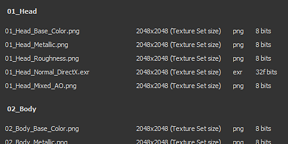

# Versión 2020.1 (6.1.0)

**Substance Painter 2020.1 (6.1.0)** ofrece un exportador totalmente nuevo, scripts de python, un nuevo procesador de curvatura, nuevo contenido y muchas otras mejoras en el flujo de trabajo.

Fecha de publicación: *22 de abril de 2020*

>[!NOTE]
>
> A partir de esta versión, el número de versión de la aplicación comenzará a cambiar su formato. **2020.1** ahora se convierte en **6.1.0**.

## Funciones principales

### Nueva ventana Exportar textura

La ventana de exportación se ha rediseñado por completo para ofrecer una forma más sencilla y sencilla de configurar y exportar texturas de un proyecto. También incorpora algunas funcionalidades nuevas que hacen que la exportación sea mucho más cómoda. La nueva ventana de exportación ahora se divide en tres pestañas:

**Configuración**

Esta pestaña controla la configuración general y específica de cada conjunto de texturas.

* **Nueva configuración global**\
  La configuración global es un conjunto de parámetros compartidos en todos los conjuntos de texturas. Se pueden utilizar para asignar o actualizar rápidamente parámetros sin tener que editar manualmente cada conjunto de texturas de forma individual. La configuración global tiene los siguientes parámetros:

  * **Directorio de salida**: define la ubicación de destino donde se generarán las texturas.
  * **Plantilla de salida**: define el ajuste preestablecido que se utilizará para configurar el nombre y el empaquetado de las texturas exportadas.
  * **Tipo de archivo**: define el formato de archivo y la profundidad de bits de las texturas exportadas.
  * **Tamaño**: define la mayor resolución de textura a la que se exportará un conjunto de texturas.
  * **Relleno**: define cómo se generará la información fuera de las Islas de UV.
  * **Exportar parámetros de sombreadores**: si está activada, exporta un archivo json que almacena la configuración del sombreado y sus asignaciones de Conjunto de texturas.

  
* **Los parámetros y la configuración del conjunto de texturas reemplazan**\
  Debajo de Configuración global se encuentra la lista de conjuntos de texturas del proyecto abierto actualmente. La sección Parámetros generales de exportación muestra los ajustes heredados de los parámetros globales. También es posible elegir otro **ajuste preestablecido de exportación por conjunto de texturas**.

  

  Al hacer clic en el icono Pluma , se puede anular un parámetro específico para cambiar su valor. Al hacer clic de nuevo en él, se deshabilita la modificación y se restablece el valor a los valores predeterminados (heredados de Configuración global).

  
* **Elegir qué texturas exportar**\
  Debajo de los parámetros de exportación de conjuntos de texturas hay una lista de texturas que se generarán. Con esta lista, es posible elegir con precisión qué archivo se debe generar marcándolos o desmarcándolos. La lista también muestra el formato de archivo y la profundidad de bits de cada textura, heredada de la configuración de exportación o de la plantilla de salida. Utilice el icono del lápiz para anular el formato de archivo y la profundidad de bits de una textura específica.
* **Guardar configuración sin exportar**\
  Ahora es posible guardar la configuración de exportación del proyecto sin tener que exportar texturas usando el nuevo botón **Guardar configuración**. Esto resulta útil si desea ajustar un proyecto sin regenerar texturas, lo que podría tardar algún tiempo.

  
* **Haga clic y arrastre para habilitar o deshabilitar exportaciones**\
  Utilice el Clic del ratón y arrastre para activar o desactivar rápidamente Conjuntos de texturas y texturas:

  

  

**Plantillas de salida**

Esta ficha permite crear ajustes preestablecidos de configuración para asignar un nombre a las texturas exportadas.

* <b>Crear ajustes preestablecidos de exportación</b>\
  La ficha <b>Plantilla de salida</b> es idéntica a la ficha <b>Configuración</b> del antiguo exportador. Se puede utilizar para crear ajustes preestablecidos de exportación para nombrar y empaquetar texturas rápidamente. Para obtener más información sobre cómo crear ajustes preestablecidos de exportación personalizados, consulte nuestra página de documentación.
* **Configurar formato y profundidad de bits de archivo en los ajustes preestablecidos de exportación**\
  Una nueva incorporación a los ajustes preestablecidos de exportación es la posibilidad de establecer el formato de archivo y la profundidad de bits por textura para que compartir una configuración sea aún más sencillo en todos los proyectos.

  
* **Controlar texturas exportadas desde la plantilla de salida**\
  Al configurar el proceso de exportación, use la nueva opción **Basado en la plantilla de salida** para definir propiedades de textura a partir del ajuste preestablecido de exportación.

  

**Lista de exportaciones**

Esta pestaña muestra el proceso de exportación en curso, así como un resumen global de toda la textura exportada.

* **Lista de texturas exportadas**\
  La ficha muestra cada textura individual que se va a exportar por conjunto de texturas, teniendo en cuenta los parámetros sustituidos y las texturas ignoradas/excluidas. Esta es una buena forma de asegurarse de que todo está bien antes de iniciar el proceso de exportación. La interfaz cambiará automáticamente a esta pestaña cuando se inicie el proceso de exportación.

  
* **Exportar proceso y registro**\
  A la derecha de la pestaña hay una consola que muestra detalles sobre el proceso de exportación en curso. Indicará qué texturas se exportaron correctamente, así como las advertencias y errores. La parte inferior de la interfaz también muestra una barra de progreso que indica el estado actual del proceso:

  

  

### Nuevo modo de capa de pegatina

Hay un nuevo modo **Decal** disponible al arrastrar y soltar un material de [Assets](../../interface/assets/assets.md). Crea una nueva capa de relleno en el modo de **proyección plana** que permite colocar patrones e imágenes con mayor facilidad. Para usarlo, basta con **arrastrar y soltar** cualquier material de la estantería mientras presionas el **método abreviado de teclado ALT** para obtener una vista previa del manipulador y soltar el ratón una vez que la pegatina esté donde quieres que esté. Al soltar el botón del ratón, se creará una nueva capa de relleno.

Para esta ocasión, también hemos incluido 5 pegatinas en el estante predeterminado seleccionado de Substance Source. Si quieres obtener más información sobre este nuevo flujo de trabajo de pegatinas, consulta [este artículo](https://magazine.substance3d.com/effortless-grunge-look-with-new-substance-source-parametric-decals/).

>[!NOTE]
>
> Para facilitar el uso de las pegatinas, hemos implementado una nueva palabra clave [user-data](../../content/creating-custom-effects/user-data.md) que permite especificar el modo de fusión predeterminado para cada canal al crear capas.

### Nuevos scripts de Python

Ahora es posible escribir y ejecutar scripts y módulos de **Python** con Substance Painter. Integramos Python 3.7 y PySide2 con Substance Painter, y también proporcionamos una API de Python personalizada a través del módulo **substance\_painter** dedicado. Además, aprovechamos la oportunidad para repensar nuestra API de la versión de JavaScript para que fuera más clara y fácil de usar. Comparten similitudes que deberían facilitar la creación de complementos de Python a los usuarios existentes.

Para obtener más información sobre la API de Python, consulte la documentación a la que puede acceder a través del menú Ayuda de la aplicación.

* **Instalando un módulo de Python**\
  Los módulos de Python se pueden instalar en la carpeta Documentos dedicada de la cuenta de usuario, pero también proporcionamos una forma de añadir ubicaciones de ruta adicionales mediante una variable de entorno dedicada para facilitar la configuración en un estudio.
* **Submódulos de Python del Substance Painter**\
  Se han expuesto los siguientes submódulos (se dispondrá de más en una fecha posterior):

  * substance\_painter.display
  * substance\_painter.event
  * substance\_painter.exception
  * substance\_painter.export
  * substance\_painter.logging
  * substance\_painter.project
  * substance\_painter.resource
  * substance\_painter.textureset
  * substance\_painter.ui
* **Intérprete de Python**\
  Hay disponible una nueva ventana de la consola de Python para probar módulos y/o ejecutar scripts de Python:

  {width="500px"}

### Panaderos mejorados

En esta versión se ha mejorado el panadero de curvatura y el panadero de Oclusión ambiental ha obtenido algunos parámetros nuevos.

* <b>Nueva curvatura del panadero de mallas</b>\
  El antiguo panadero de curvatura ha quedado obsoleto y se ha sustituido por la nueva versión &quot;de malla&quot; que se ha añadido recientemente a Substance Designer. Para obtener más información sobre la nueva configuración de panadería, consulte la página de documentación.\
  El nuevo panadero tiene las siguientes características:

  * <b>Más precisión</b>: la curvatura calculada es mucho más precisa y produce valores realistas.
  * <b>Contacto de malla</b>: la interpenetración entre mallas ahora produce información de curvatura (que no era el caso con el panadero anterior).
  * <b>Malla de alta densidad</b>: ahora los detalles se cuecen directamente desde la malla de alta densidad en lugar de convertirse desde el mapa normal.
  * <b>Funciones</b>: el nuevo panadero utiliza el trazado de rayos para calcular los detalles, lo que significa que se beneficia de la aceleración del Trazado de rayos de GPU (RTX/Optix).

  {width="500px"}

  Todavía es posible acceder al antiguo panadero de curvatura por razones de compatibilidad a través de los ajustes del panadero de curvatura. Elija la configuración **Generar a partir de mapa normal** para usar el panadero antiguo.

  
* <b>Oclusión ambiental mejorada</b>\
  El Panadero de Oclusión ambiental se ha mejorado para admitir nuevas configuraciones:

  * <b>Plano de tierra</b>: simula un plano debajo de la malla para crear sombras procedentes del suelo. Para obtener más información, consulte la documentación de Oclusión ambiental.
  * <b>Omitir cara posterior</b>: hay un nuevo sufijo de nombre de malla para ignorar un objeto específico al hornear la Oclusión Ambiente. Por ejemplo, esto permite ignorar los detalles de geometría flotante. Para obtener más información, consulte la documentación Coincidencia por nombre

  {width="500px"}

### Exportación de malla mejorada (con teselación)

La malla de exportación se ha mejorado con nuevas funciones y ajustes:

* **Exportar topología de malla original o exportar malla con teselación**\
  Al exportar la malla, ahora es posible elegir aplicar la teselación generada para los efectos de desplazamiento. Los ajustes posibles son:

  * **Sin desplazamiento/teselación**: exporte la malla base sin subdivisiones de malla. Si **Aplicar triangulación** está deshabilitado, se exportarán los triángulos, cuadrantes o n-gones de malla originales.
  * **Con desplazamiento/teselación**: exporte la malla con subdivisiones. Si **Actualizar normales de vértice está habilitado**, las normales de malla se ajustarán para que coincidan con los desplazamientos de desplazamiento.

  
* **Nombres de malla y jerarquía de escenas**\
  La jerarquía de escenas original y los nombres de objetos de la malla importada ahora se conservan y se vuelven a aplicar a la malla exportada.
* **Exportar con formato de archivo FBX**\
  La malla del proyecto ahora se puede exportar en FBX, junto con otros formatos de archivo.\
  **Nota**: Los datos incompatibles con el Substance Painter se siguen descartando durante la importación (por ejemplo: desollamiento, articulaciones).

### Desempaquetado automático de UV mejorado

El desajuste automático de UV ahora se puede controlar más fácilmente con la ayuda de los nuevos ajustes:

* **Usar el desajuste automático de UV durante la creación del proyecto**\
  Al crear un proyecto, ahora hay una nueva configuración que permite activar o desactivar el nuevo proceso de desajuste automático de UV. Esta configuración también está disponible al volver a importar una malla 3D a un proyecto existente.

  
* <b>Configuración avanzada de desajuste</b>\
  Junto a la casilla de verificación para habilitar el desajuste automático de UV hay un nuevo botón <b>Opciones</b>. Se abre una nueva ventana con ajustes avanzados para controlar el proceso de desajuste, lo que permite conservar la información de malla existente en diferentes partes del proceso en lugar de volver a calcular todo como lo hacía antes. Para obtener más información, consulte la documentación dedicada. Los ajustes actuales son:

  * <b>juntas</b>: define si se conservan o regeneran las juntas existentes.
  * <b>Islas de UV</b>: define si el desajuste UV existente se conserva o se regenera.
  * <b>Empaquetado</b>: define si el empaquetado de Isla de UV se conserva o se regenera.
  * <b>Tamaño de margen</b>: define el espaciado entre cada Isla de UV (porcentaje).

  

### Nuevo contenido

En esta versión incluimos algunos materiales nuevos y actualizamos muchos de nuestros ajustes preestablecidos de exportación para que coincidan con las nuevas versiones de software.

* **5 nuevos materiales de pegatina**\
  Hemos añadido 5 nuevos materiales que vienen directamente de Substance Source para probar la nueva función de pegatina:

  * Fugas grandes de Óxido
  * Liquen medio de Acarospora
  * Escasas fugas de sangre
  * Impactos De Bala Pequeña En Pared De Concreto
  * Etiqueta de pintura en spray

  
* <b>Nuevo sombreador Vray, plantillas de proyecto y ajustes preestablecidos de exportación</b>\
  En colaboración con [Chaos Group](https://www.chaosgroup.com/), integramos dos nuevos sombreadores que replican los comportamientos de VrayMtl. Deberían proporcionar un aspecto más preciso al intentar hacer coincidir representaciones realizadas con Vray. Utilice las plantillas de proyecto para configurar fácilmente cualquier proyecto nuevo para Vray. Eche un vistazo a la documentación para obtener más información.

  
* <b>Nuevas plantillas de proyecto de Maxwell y ajustes preestablecidos de exportación</b>\
  En colaboración con [Next Limit](http://www.nextlimit.com/), integramos nuevas plantillas de proyecto y ajustes preestablecidos de exportación para el procesador Maxwell.
* **Ajustes preestablecidos de exportación actualizados**\
  Se han actualizado muchos ajustes preestablecidos de exportación, principalmente para utilizar el nuevo formato de archivo y la nueva configuración de profundidad de bits, pero también para coincidir con las nuevas versiones de software.

## Tutoriales

Consulte nuestros nuevos tutoriales de vídeo sobre las nuevas funciones:

## Notas de la versión

### 2020.1.3

*(Publicado El 16 De Junio De 2020)*\
Resumen : **Corrección de error**

**Agregado:**

* [Exportar] Añadir ajustes de desplazamiento en el archivo json de parámetros de sombreado

**Corregido:**

* [Bloqueo]&#x200B;[Motor] Bloqueo al intentar borrar y reemplazar canales existentes
* [Bloqueo] Cambio del sombreado después de pintar una máscara en capas de material
* [Crash]&#x200B;[Engine] Se bloquea con algunos proyectos pesados
* [Bakers] La coincidencia por nombre no funciona con los OBJ exportados desde zBrush
* [Desplazamiento] [SVT] Las texturas no se muestran al abrir el proyecto cuando el desplazamiento está activado
* [Exportar] Algunas texturas se exportan en gris uniforme
* [Exportar] Los conjuntos de texturas desactivados no se deben exportar para los ajustes preestablecidos de exportación de Dimension y Sketchfab
* [Scripting]&#x200B;[JavaScript] Bloqueo al utilizar la API JavaScript para acceder a la configuración de exportación en el evento onProjectOpened
* No se llama a [Scripting]&#x200B;[Javascript] onExportFinished() después de una exportación

### 2020.1.2

*(Publicado El 28 De Mayo De 2020)*\
Resumen : **Corrección de error con la actualización de Substance Engine y Bakers**

**Agregado:**

* [Bakers] Actualice a la versión más reciente
* [Panaderos] Nuevo método de muestreo en Oclusión ambiental, curvatura, panaderos de Thickness
* Actualizar a la versión más reciente de Substance Engine
* [Scripting]&#x200B;[Python] Permite la creación de ResourceID para los recursos del proyecto
* [Scripting]&#x200B;[Python] Permitir consultar información del canal
* [Scripting] [Python] Adición de funciones de ejecución en seco y devolución de llamada para simular la exportación de texturas

**Corregido:**

* [Panaderos] Normales incorrectas en el Panadero de Normales Espaciales Mundiales usando un mapa Normal tangente en casos específicos
* [Panaderos] Error al hornear la Oclusión ambiental con Optix cuando no hay polietileno alto
* [Trazos dinámicos] Retraso al cargar un conjunto de texturas específico
* [Exportar] No se deben exportar los conjuntos de texturas desactivados para USD, glTF
* [Scripting] [JavaScript] No se puede editar la nueva configuración del panadero de curvatura
* [Scripting]&#x200B;[JavaScript] alg.texturesets.addChannel() no devuelve un error en algunos casos
* [Scripting] [JavaScript] Error tipográfico en la documentación de la API de Javascript para setProjectExportOptions()
* [Scripting] [JavaScript] Exporta siempre todos los conjuntos de texturas
* [Scripting]&#x200B;[Python] sys.ejecutable devuelve una ruta de acceso a python.exe en lugar de Substance Painter
* La caché de texturas no es compatible con el sistema operativo Mac ni con Windows/Linux
* [Livelink UE4] Solo se usa el último material para todos los conjuntos de texturas en una malla combinada

**Problemas conocidos:**

* [Export]&#x200B;[Dimension]&#x200B;[Skecthfab] No se deben exportar los conjuntos de texturas desactivados
* [Bloqueo] Cambiar sombreado después de pintar una máscara en capas de material

### 2020.1.1

*(Publicado El 5 De Mayo De 2020)*

**Agregado:**

* [Export] Comentarios visuales de estado anulado en TextureSet

**Corregido:**

* [Exportar] El tamaño de la ventana del exportador es demasiado grande en un monitor con resolución especial y no se puede cambiar de tamaño
* [Exportar] Las opciones no se guardan después de la exportación
* [Export] Bloqueo o no es posible exportar con el ajuste preestablecido de exportación &quot;desde caché&quot;
* [Exportar] Al cancelar la exportación, se genera un mapa vacío adicional inesperado
* [Exportar] Corregir ajustes preestablecidos de exportación virtual
* [Python] PYTHONPATH env var no se tiene en cuenta
* [Python] [Exportar] Si se cancela la exportación mediante Python, se devuelve un error de excepción
* [Python]&#x200B;[Export] export\_project\_textures resultado incorrecto con formato de archivo psd

**Problemas conocidos:**

* [JavaScript] No se puede editar la nueva configuración de Curvature Baker
* [JavaScript] [Exportar] Exporta siempre todos los conjuntos de texturas
* [Bakers] Bloqueo en Linux con Trazado de rayos de GPU
* [Export]&#x200B;[USD] No se deben exportar los conjuntos de texturas desactivados

### 2020.1.0

*(Publicado El 22 De Abril De 2020)*

**Agregado:**

* Nuevo exportador de texturas y mallas
* [Exportar] Nueva interfaz de exportador
* [Exportar] [ficha Exportar] Permite seleccionar qué canales de mapas se exportan por conjunto de texturas
* [Exportar] [ficha Exportar] Permite modificar el tamaño del conjunto de texturas para todos los conjuntos de texturas en una sola acción
* [Exportar] [Ficha Exportar] Permitir una plantilla diferente por conjunto de texturas (excepto USD, glTF, Sketchfab y Dimension)
* [Exportar] [Ficha Exportar] Activación y desactivación rápidas de mapas y conjuntos de texturas
* [Exportar] [Ficha Exportar] La resolución de exportación 8192x8192 ya no es experimental
* [Exportar] [ficha Exportar] Permite modificar el formato de archivo y la profundidad de bits por mapa
* [Exportar] [ficha Exportar] Permite restablecer los valores de los parámetros predeterminados
* [Exportar] [ficha Exportar] Permite guardar la configuración sin exportar
* [Exportar] [ficha Plantillas de salida] Cambie el nombre de la ficha &quot;Configuración&quot; a la ficha &quot;Plantillas de salida&quot;
* [Exportar] [ficha Plantillas de salida] Permite definir el formato de archivo y la profundidad de bits por mapa preestablecido
* [Exportar] [ficha Lista de exportaciones] Nueva ficha de vista previa para resumir y ver el proceso de exportación
* [Import/Export Mesh] Optimización del rendimiento del tiempo de importación/exportación
* [Exportar malla] Exportar malla en FBX
* [Exportar malla] Exportar malla con desplazamiento y teselación
* [Exportar malla] [IU] Nuevos ajustes para volver a calcular el vértice normal, aplicar triangulación
* [Exportar malla] Exportar topología de malla original con nuevas UV generadas por el desajuste automático
* Se ha actualizado el desajuste automático de UV con más controles
* [Desempaquetado UV]&#x200B;[UI] Añadir configuración para activar el desempaquetado UV automático en la ventana de nuevo proyecto
* [Desempaquetado UV]&#x200B;[UI] Nuevas opciones para controlar los pasos de desempaquetado (costuras, desempaquetado, empaquetado)
* [UV Unwrapping]&#x200B;[UI] Permitir la conservación de las costuras de desenvolvimiento existentes/desenvolvimiento/empaquetado
* [Desajuste UV]&#x200B;[UI] Nuevas opciones para volver a calcular completamente los pasos de desajuste
* [Desajuste UV]&#x200B;[UI] Nueva opción para controlar el tamaño del margen (ninguno, pequeño, mediano y grande)
* Nuevos panaderos
* [Panaderos] Reemplace la curvatura antigua por la nueva curvatura de la malla
* [Panaderos] Añadir la opción de coincidencia por nombre para ignorar la cara posterior en el panadero de &quot;Oclusión ambiental&quot;
* [Panaderos] Añadir la opción de plano de tierra en el panadero &quot;Oclusión ambiental&quot;
* Nueva API de Python de scripts (3.7.6)
* [Python]&#x200B;[UI] Nuevo menú de scripts para Python
* [Python]&#x200B;[UI] Nueva documentación de Python en el menú Ayuda
* [Python] Exponer módulos de Python de Substance Painter: substance\_painter, alg, display, project.setting, project, texturesets, ui
* [Python] Exponer nuevo módulo Python &quot;substance\_painter&quot;
* [Python] Exponer nuevo submódulo de Python: alg, display, log, project, resource, texturesets, ui
* [Python] Listener para cambios de proyecto
* [Python] Nuevos ejemplos en la documentación de Python
* [JavaScript] [IU] Menú de complementos reemplazado por JavaScript
* [Ventana gráfica] Permite crear una proyección de pegatinas &quot;arrastrando/soltando + ALT&quot; de un recurso desde la estantería
* Nuevo contenido
* [Contenido] 5 nuevos materiales de pegatina de Substance Source
* [Contenido] Añadir nuevas plantillas de proyecto y ajustes preestablecidos de exportación para el procesador Maxwell
* [Contenido] Añadir plantilla de proyecto para la exportación de Keyshot 9
* [Contenido] Actualice el ajuste preestablecido de exportación de Keyshot 9 para admitir desplazamientos y emisiones
* [Contenido] [Exportador] Actualización de todos los ajustes preestablecidos de exportación para que coincidan con las últimas versiones de motores de juegos y procesadores
* [Contenido] [Exportador] Actualice los archivos de ajustes preestablecidos de exportación para utilizar el nuevo formato y la nueva configuración de tramado
* [Contenido] Nuevas plantillas y sombreadores para admitir material de VRay (VRayMtl)
* [Pila de capas] Permita la eliminación de efectos de capa mediante el icono de la papelera o el método abreviado de teclado Eliminar
* Eliminar el Substance Source de plugins (utilizar el iniciador con la funcionalidad &quot;enviar a&quot;)
* [Windows] No se muestra ninguna advertencia de TDR en las GPU de gama alta

**Corregido:**

* Problemas de traducción en el cuadro de diálogo Nuevo archivo de proyecto
* [Bakers] La configuración &quot;Guardar archivo de escena preprocesado&quot; ya no funciona
* [Panaderos] Bloqueo al hornear con Optix cuando no hay polietileno alto
* [Proyección plana] La proyección no funciona en mallas con UV repetidos
* [Decal] Diferencia de comportamiento en el canal normal al utilizar distintos modos de proyección de la capa de relleno
* [Difuminado] [Clonar] El artefacto puede aparecer al pintar en una máscara
* [Motor] Bloqueo con contenido de capa específico
* [Motor] Bloqueo aleatorio al pintar en algunos casos
* [Punto de anclaje] La referencia a una máscara vacía siempre devuelve blanco
* [Exportar] Capa no tenida en cuenta en algunas configuraciones de pila concretas
* [Exportar malla] No se puede exportar con una ruta que contenga caracteres especiales
* [Export Mesh] No se pueden leer archivos glTF al exportar desde Linux o MacOS
* [Importar malla] La reimportación de DAE, PLY o glTF no funciona según lo previsto
* [Bloqueo] Cambiar sombreado después de pintar una máscara en capas de material

**Problemas conocidos:**

* [Scripting] [JavaScript] No se puede editar la nueva configuración del panadero de curvatura
* [Bakers] Bloqueo en Linux con Trazado de rayos de GPU
* [Export]&#x200B;[USD] No se deben exportar los conjuntos de texturas desactivados
