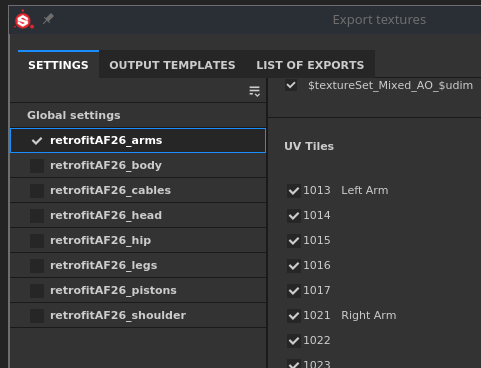

# Versión 2021.1 (7.1.0)

**Substance Painter 2021.1 (7.1.0)** presenta varias características nuevas y mejoras, como la máscara de geometría y la copia y pegado de efectos en la pila de capas.

Datos de la versión: *28 de enero de 2021*

>[!NOTE]
>
> Esta versión aumenta la versión mínima compatible de Ubuntu a 18.04 y de MacOS a 10.14. Para obtener más información, consulte los [requisitos técnicos](../../getting-started/system-requirements.md).

## Funciones principales

### Nueva máscara de geometría

La máscara de geometría es una nueva herramienta de máscara en la pila de capas que permite ocultar la geometría en función de los nombres o Mosaicos de UV de la malla. Se trata de una evolución de la máscara de Mosaico de UV, anteriormente denominada, que enmascara la geometría en función de los números UDIM.

Esta nueva herramienta es una mejor manera de enmascarar la geometría que pintar de forma regular (o al usar el [relleno polígono](../../painting/tool-list/polygon-fill.md)) porque se beneficia de varias optimizaciones del motor. Tampoco es destructivo, ya que no almacena información geométrica (como caras o vértices), sino solo el nombre de la malla o el número de Mosaico de UV, por lo que la reimportación de una malla no romperá la máscara. Otra ventaja es que, al ocultar la geometría, se permite la pintura en superficies que no eran accesibles antes dentro de un conjunto de texturas, lo que evita la necesidad de dividir un objeto en varios conjuntos de texturas, por ejemplo.

* **Nueva máscara de geometría en capas**\
  La máscara de geometría está disponible automáticamente en cualquier capa de la [pila de capas](../../interface/layer-stack/layer-stack.md). De forma predeterminada, no tiene efecto, lo que significa que la capa es totalmente visible.\
  La máscara de geometría tiene su propio menú contextual que permite seleccionar o deseleccionar rápidamente todos sus elementos, pero también copiar sus valores a otra capa.

  

  

* **Edición de las propiedades de la máscara de geometría** La máscara de geometría sigue la misma lógica que los contextos de la otra capa (como la edición de una máscara o las propiedades de instancias). Para entrar en el modo de edición de máscara de geometría, simplemente haga clic en el cuadrado punteado situado a la derecha de una capa. Para salir de la máscara de geometría, pulse en el contenido o la máscara de pintura de la misma capa.

  

* **Enmascaramiento por nombres de malla o por Mosaicos de UV**\
  En la parte superior de las propiedades Máscara de geometría hay un menú desplegable que controla el modo de enmascaramiento. Es posible elegir entre enmascarar por número de Mosaico de UV o por nombre de malla. Este menú desplegable está deshabilitado y establecido en el nombre de malla solo en caso de que un proyecto no utilice el flujo de trabajo de Mosaico de UV.

  

* **Enmascaramiento de geometría mediante las propiedades**\
  Al editar la máscara de geometría, la ventana de propiedades mostrará una lista de los nombres de malla (o mosaicos UV) basados en la geometría relacionada con el conjunto de texturas actual.

  * El número sobre la lista indica cuántas mallas/mosaicos UV se desenmascaran sobre el total disponible.
  * El menú situado junto al número proporciona controles rápidos para seleccionar todos o ninguno de los elementos e incluso invertir la selección actual.
  * La lista siguiente define qué elementos están enmascarados o no. Al igual que con otras listas de la aplicación, es posible hacer clic y arrastrar para habilitar o deshabilitar varios elementos a la vez o utilizar el evento **ALT+clic** para aislar un elemento.

   

* **Enmascaramiento de geometría a través de la ventana gráfica**\
  La selección de Máscara de geometría también se puede cambiar en las vistas 2D y 3D. Simplemente mueva el ratón sobre la parte que debe ser visible/oculta y haga clic en ella para cambiar su estado. Al editar la máscara de geometría, la geometría enmascarada se muestra con un efecto de líneas grises y diagonales. También es posible hacer selecciones rectangulares haciendo clic y arrastrando para seleccionar varios elementos a la vez.\
   

* **Pintando geometría oculta o inaccesible.**\
  Después de seleccionar la geometría para enmascarar en la máscara de geometría, es posible habilitar el botón **Ocultar/Ignorar geometría excluida** en la parte superior de la ventana gráfica (o presionando el método abreviado **ALT+H**). Cuando se activa, la geometría excluida se oculta (así como otros conjuntos de texturas) para mostrar solo la geometría incluida o puede pintarse con la capa actual. Esta opción permite realizar la pintura de áreas que anteriormente estaban bloqueadas o fuera del alcance. Esta opción también se aplica a cualquier tipo de capa.

  >[!NOTE]
  >
  > La pintura con geometría enmascarada sigue siendo dinámica: si parte de la geometría que bloquea la pintura estaba oculta inicialmente cuando se realizó el trazo de pincel y se desenmascara, volverá a bloquear el trazo de pincel creado anteriormente.

  

### Nueva copia y pegado de efectos de Pila de capas

Ahora se pueden copiar efectos entre capas y pilas de capas, del mismo modo que en las capas normales.

La selección múltiple ahora también es posible para ofrecer la posibilidad de copiar y pegar varios efectos a la vez.

Por comodidad, copiar o mover un efecto de una máscara en una capa sin uno añadirá uno automáticamente. Esto se debe a que los efectos del contenido de capa y la máscara no son compatibles entre sí. Esto significa que copiar un efecto de una máscara en el contenido de una capa cambiará automáticamente a la máscara (o creará uno).

* **Copiar y pegar a través del menú contextual**\
  Haga clic con el botón derecho en cualquier efecto de la pila de capas de un conjunto de texturas y elija la acción de cortar o copiar. A continuación, haga clic de nuevo con el botón derecho en cualquier capa y seleccione Pegar para mover o crear una copia de los efectos deseados. También aprovechamos la oportunidad para rediseñar el menú contextual y dar acceso a más funcionalidades:

  

* **Copiar y pegar con los métodos abreviados de teclado**\
  Igual que con cualquier capa, el método abreviado de teclado **CTRL+C** (copiar)/**CTRL+X** (cortar) y **CTRL+V** (pegar) se puede utilizar para copiar efectos basados en la selección actual. Al igual que con las capas, los efectos se insertan encima de la selección actual.

  

* **Efecto de duplicación rápida con métodos abreviados de teclado**\
  Use **CTRL+D** para duplicar la selección actual o presione y mantenga presionada la tecla **ALT mientras arrastra** cualquier efecto para duplicarlo en la ubicación deseada:

  

* **Mover efectos entre capas**\
  Además de la copia y la duplicación, ahora es posible mover un efecto simplemente arrastrándolo y soltándolo de una capa a otra:

  

### Nuevas funciones y mejoras generales

Se han realizado varias mejoras en esta versión:

* **Agregar una descripción por mosaico UV**\
  Ahora se puede añadir una descripción para cada Mosaico de UV a través de la Lista de conjuntos de texturas. Esto facilita la navegación por el proyecto, especialmente al exportar y hacer un bake, ya que las descripciones también se pueden ver en estos contextos.\
  Para añadir o editar una descripción, simplemente haga clic en un Mosaico de UV de la ventana Lista de conjuntos de texturas y, a continuación, vaya a la ventana Configuración de conjuntos de texturas para editarla.

  

   

* **Nuevas miniaturas de pila de capas**\
  Se han mejorado las miniaturas de pila de capas optimizadas. Ahora se muestra una esfera de material para las capas de relleno, lo que facilita la navegación y la visualización de las propiedades principales de cada capa incluso cuando se trabaja con el flujo de trabajo [Mosaicos UV](../../features/uv-tiles/uv-tiles.md). La miniatura se genera a partir de la información de la capa, pero no tiene en cuenta los efectos para evitar que se vuelva a calcular con demasiada frecuencia.

  

* **Se ha mejorado la salida de la máscara de geometría en la pila de capas**\
  La salida de la máscara de geometría (antes máscara de Mosaico de UV) se podía probar con carpetas en la pila de capas si no tenía una máscara. Esto se debe a que no había otro contexto para activar que no fuera seleccionar otra capa. Ahora es posible hacer clic en la miniatura de la carpeta para salir de la máscara de geometría. También es posible arrastrar y soltar materiales o materiales inteligentes desde la estantería a la ventana gráfica mientras se edita la máscara de geometría.

  

  

* **Nueva selección Alt+clic en la ventana Horneado**\
  La lista de mapas de malla en la ventana de hacer un bake ahora se puede aislar con **Alt + clic del ratón** para aislar un mapa específico que se va a hacer un bake, en lugar de tener que excluirlo manualmente. Se puede utilizar el mismo método abreviado para volver a activar todos los mapas de malla.

  

* **Botón Nuevo conjunto de texturas actual de horneado**\
  Se ha añadido un nuevo botón en la parte inferior de la ventana Hornear para que sea rápido y fácil volver a hornear un conjunto de texturas. El uso de este botón no afectará a la selección personalizada que se definió anteriormente y, en su lugar, hará un bake todo el conjunto de texturas (incluidos todos sus Mosaicos de UV, si los hay).

  

### Nueva actualización de Substance Engine

El Substance Engine se ha actualizado a su versión 8 para admitir el último formato de archivo de Substance y sus funcionalidades.

Para obtener más información sobre las nuevas funciones del Substance Engine, consulta [esta página de documentación](https://helpx.adobe.com/es/substance-3d/unlisted/documentation/sddoc/version-2020-2-10-2-0-200574252.html).

### Nueva compatibilidad con Nvidia RTX 3000 en Irán

El [procesador de Iray](../../features/iray-renderer/iray-renderer.md) se ha actualizado a su última versión y ahora es compatible con las nuevas GPU de Nvidia Ampere (serie RTX 3000 y serie Quadro A).

>[!NOTE]
>
> Con esta actualización, las GPU Kepler (series GeForce 600 y 700) ya no son compatibles; en su lugar, el procesamiento en Iray se realizará en la CPU.

### Nuevo contenido

En esta versión se han añadido tres nuevas herramientas de puntos que se pueden utilizar para crear patrones complejos y puntos realistas. Para encontrarlos, simplemente ve a la sección Herramienta de la Estantería y busca:

* Puntos complejos
* Costuras cruzadas
* Puntos rectos

Se recomienda activar la función [Ratón perezoso](../../painting/lazy-mouse.md) en la barra de herramientas contextual para aumentar la calidad de los puntos pintados.

A continuación se muestra un resumen de todos los ajustes preestablecidos incluidos en estas nuevas herramientas:

{width="800px"}

### Nuevas funcionalidades de Python

La API de Python recibió varias funcionalidades nuevas. La documentación también se ha reelaborado, especialmente sus ejemplos, para facilitar la comprensión y el aprendizaje de la API.

* **Administración de recursos y estantes**\
  El módulo de recursos se ha mejorado y ahora puede:
  * Creación y gestión de estantes.
  * Buscar o importar recursos en estanterías y proyectos.
  * Sepa si se está rastreando una estantería (lo que permite saber cuándo están listos los recursos para usar).
  * Asigna miniaturas personalizadas a los recursos de una estantería.

* **Información de Mosaicos de UV**\
  Ahora es posible consultar la lista de Mosaicos de UV de un conjunto de texturas. Esto abre la posibilidad de crear exportaciones personalizadas en un rango específico de mosaicos UDIM, por ejemplo.

* **Estado de edición del proyecto**\
  Se han añadido una nueva función y eventos para saber si un proyecto se puede editar. Esto resulta útil para saber si hay un cálculo en curso y no es posible modificar las propiedades de un proyecto.

>[!NOTE]
>
> Se puede acceder a la documentación de la API de Python desde el menú de ayuda de la aplicación.

## Tutoriales

A continuación, se muestran nuestros tutoriales en vídeo sobre las nuevas funciones:

## Notas de la versión

### 2021.1

*(Publicado El 28 De Enero De 2021)*\
Resumen : **Versión principal, nueva máscara de geometría que permite seleccionar y pintar partes de la geometría, copiar y pegar efectos en la pila de capas, mejorar el flujo de trabajo del azulejo UV, actualizar Iray, Bakers, Substance Engine y nuevo contenido**

**Agregado:**

* Nueva máscara de geometría y pinte las partes seleccionadas de la geometría
* [Máscara de geometría] Permite pintar las partes seleccionadas de la geometría por nombres de malla
* [Geometry Mask] Selección rectangular en ambas ventanas gráficas
* [Máscara de geometría] Permite ocultar/ignorar la geometría excluida en cualquier capa
* [Máscara de geometría]&#x200B;[Propiedades] Selección rápida de casillas de verificación al hacer clic y arrastrar
* [Geometry Mask]&#x200B;[Properties]&#x200B;[UI] Include/Exclude all con un menú desplegable en la ventana Propiedades
* [Máscara de geometría]&#x200B;[Propiedades] Permite seleccionar rápidamente un elemento de una lista con ALT+CLIC IZQUIERDO
* [Máscara de geometría]&#x200B;[Propiedades] Superposición en las ventanas gráficas al pasar el cursor por los nombres/Mosaicos de UV de malla en la ventana Propiedades
* [Máscara de geometría] [Pila de capas] Añadir opciones de Copiar/Pegar a la máscara de geometría
* [Máscara de geometría] Nuevo icono para el botón Ocultar/ignorar geometría excluida
* [Máscara de geometría] Nueva información sobre herramientas para Ocultar/ignorar geometría excluida
* [Máscara de geometría] Método abreviado de teclado ALT + H para activar o desactivar el botón &quot;Ocultar geometría excluida&quot;.
* [UV Tiles] [Layer Stack] Nueva miniatura de vista previa de la esfera de capa de relleno para UV Tiles y modo simplificado
* [Mosaicos de UV]&#x200B;[Pila de capas] Permite salir fácilmente de la máscara de Mosaico de UV
* [Mosaicos UV]&#x200B;[Lista de conjuntos de texturas] Permite proporcionar una descripción por mosaico UV
* [UV Tiles]&#x200B;[Texture Set Settings]&#x200B;[UI] Dos nuevos títulos de sección en el menú desplegable para cambiar la resolución del azulejo UV
* [Mosaicos de UV] [Ventana gráfica] Salir de la máscara de Mosaico de UV al arrastrar un material a la ventana gráfica
* [Pila de capas] Añadir opciones de Copiar/Pegar para efectos
* [Pila de capas] Permite copiar y pegar efectos de un conjunto de texturas a otro
* [Pila de capas] Permitir selección múltiple de efectos
* [Pila de capas] Añadir opciones de copiar y pegar como métodos abreviados de efectos de capa
* [Pila de capas] Cambiar automáticamente entre máscara y contenido al arrastrar efectos a otra capa
* [Pila de capas] Crea automáticamente una máscara al pegar una máscara de otra capa
* [Pila de capas] Añada acciones de mover efectos dentro del menú contextual del botón derecho de los efectos
* [Pila de capas] Permite arrastrar y soltar efectos de una capa a otra
* [Pila de capas] Al arrastrar elementos a una carpeta, se colocan en la parte superior de la carpeta
* Actualizar Iray a la versión 2020.1.0
* [Bakers] Actualice Bakers a la versión 2.5.4
* [Bakeres] Mostrar Mosaicos de UV individuales en la ventana de progreso de hacer un bake
* [Bakers]&#x200B;[UI] Permite hornear rápidamente el conjunto de texturas actual con un nuevo botón
* [Panaderos] Permite al usuario seleccionar rápidamente uno de los panaderos con ALT+CLIC IZQUIERDO
* Actualizar Substance Engine a la versión 8.0.8
* [Substance Engine] Compatibilidad con el color predeterminado en los nuevos archivos .sbsar
* [Auto Unwrap] Mejora del rendimiento
* [Exportar] Añada comentarios visuales para indicar qué resolución del azulejo UV difiere de la predeterminada del proyecto
* [Exportar] Añada el factor de tamaño de escena al archivo json de sombreado exportado
* [Idioma] Añadir traducción al japonés
* [UI] Ventana Actualización Acerca de con control de versiones de dependencias internas
* [Scripting]&#x200B;[Python] Permita administrar recursos de Shelf
* [Scripting] [Python] Permite saber cuándo un proyecto está listo para su procesamiento y exportación
* [Scripting] [Python] Permite saber cuándo un Shelf ha terminado de rastrear recursos en el disco
* [Scripting] [Python] Permite consultar la lista de mosaicos UV por conjuntos de texturas
* [Scripts] [Python] Permite asignar una vista previa personalizada a los recursos de la estantería
* [Scripting] [Python] Permita administrar estantes personalizados
* [Scripting] [Python] Agregue un índice de método en cada submódulo de la documentación
* [Scripting] [Python] Nuevo estilo para la documentación
* [Scripting] [Python] Mejora de los recursos y de la documentación de la estantería
* [Contenido] Tres nuevos ajustes preestablecidos de herramientas para realizar puntos de sutura
* [Estante] Quitar temporalmente &quot;Exportar a Substance share&quot; al realizar la transición a la nueva plataforma de Substance share

**Corregido:**

* Bloqueo al utilizar monitores con diferentes resoluciones
* Bloqueo en Substance Engine con algunos proyectos raros
* La actualización de la ventana gráfica falla con Ocultar/Ignorar geometría excluida al cambiar de capa
* [Vista 2D] Puede que falte la ventana 2D en algunos proyectos
* [Horneado] &quot;Coincidir por nombre de malla&quot; ignora partes del objeto
* [Pila de capas] Al hacer clic en un efecto de capa se abre la carpeta
* [Máscara de geometría] El azulejo UV se sigue contando en la máscara, incluso al volver a importar la malla sin ella
* [Máscara de geometría] El menú contextual de la ventana gráfica no proporciona las herramientas correctas
* [Motor] Grandes retrasos en proyectos concretos
* [Scripting] Alta latencia con solicitudes remotas de POST JSON en Windows
* [Linux] La cantidad de Vram no se detecta correctamente con GPU integradas específicas
* [Auto Unwrap] Bloqueos o desempaquetado prolongado en algunos proyectos
