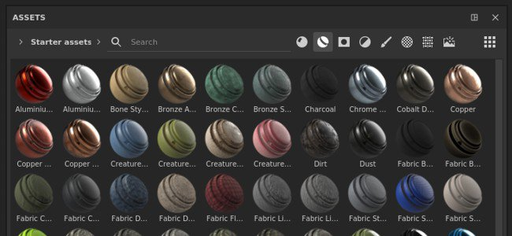

# Versión 7.2

**Substance 3D Painter 7.2** ofrece nuevas funciones de representación con el flujo de trabajo de Adobe Standard Material, nuevas formas de compartir contenido entre [aplicaciones de Substance 3D](https://www.adobe.com/products/substance3d/3d-augmented-reality.html) y una ventana de Recursos revisada.

Fecha de publicación: *23 de junio de 2021*

## Funciones principales

### Ventana Nuevos activos

Se ha mejorado la antigua ventana de estante y se le ha cambiado el nombre a la ventana Activos. Este nuevo diseño se centra en hacer que el contenido sea más accesible y fácil de filtrar con los nuevos iconos dedicados. También viene con un sistema de navegación más fácil con las migas de pan. Este rediseño también se centra en hacer que la experiencia sea similar a la de otro software de Substance 3D, de modo que la administración de contenido entre aplicaciones sea más fácil.

>[!NOTE]
>
> Esta versión introduce cambios en la forma en que administramos las preferencias de la aplicación y el contenido de estantes/activos. Para saber cómo migrar tus datos, echa un vistazo a [la página dedicada](../../pipeline-and-integration/resource-management/preferences-and-content-migration.md).

* **Nuevo diseño y diseño**\
  El nuevo diseño se centra en la simplicidad pero también en una organización más fácil de la ventana. Ahora la ventana se puede acoplar verticalmente sin malgastar espacio. Un nuevo modo de visualización de &quot;lista&quot; permite buscar activos por nombre con mucha más facilidad.

  

* **Nueva exploración de ruta de exploración**\
  El recurso de navegación puede ser difícil a veces en una interfaz de usuario pequeña. Con la ruta de exploración ahora no es más fácil saltar entre carpetas sin tener que mostrar toda la jerarquía de carpetas.

  

* **Nuevos filtros de uso**\
  Hay mucho contenido diferente en la ventana Activos y los usos son una buena forma de filtrar contenido y aislar recursos específicos. Para seleccionar un uso específico simplemente haga clic en el botón dedicado. Para agregar o quitar varios usos, presione y mantenga presionada la tecla CTRL mientras hace clic en un botón.

  

* **Representación mejorada de miniaturas**\
  Nos tomamos el tiempo de rediseñar nuestro sistema de generación de miniaturas para mejorar su calidad y lograr que parecieran más uniformes en todo el ecosistema de Substance 3D. También añadimos el apoyo del desplazamiento.

  {width="500px"}

* **Cargando miniaturas desde Archivos de Substance (sbsar)**\
  Las miniaturas personalizadas incrustadas en archivos de Substance no se cargan y se muestran en la ventana Activos. Compartir recursos personalizados ahora es más fácil, ya que no es necesario incluir los metadatos de recursos para los iconos personalizados.

* **Rendimiento mejorado** El tiempo de carga y generación de las miniaturas se ha mejorado en varios aspectos y ahora debería ser mucho más rápido.

* **Aumente el presupuesto de memoria de vista previa para cargar más miniaturas**\
  De forma predeterminada, se asigna una cantidad limitada de memoria a la visualización de miniaturas para ahorrar en las actuaciones. Sin embargo, tener una biblioteca con muchos recursos puede llevar a cargar y descargar miniaturas constantemente, lo que dificulta la navegación y la búsqueda de recursos. Ahora hay una nueva [variable de entorno](../../pipeline-and-integration/configuration/environment-variables.md) para reemplazar el valor de presupuesto predeterminado.

### Nuevo flujo de trabajo de Adobe Standard Material

Se ha agregado un nuevo sombreador, denominado **Adobe Standard Material** (ASM), que admite varias funciones a la vez, lo que permite crear materiales más complejos y precisos dentro de un único conjunto de texturas. Con este nuevo sombreador también aprovechamos la oportunidad de añadir nuevos canales para facilitar también la creación de materiales.

* **Nuevo sombreador de Adobe Standard Material**\
  El nuevo sombreador de ASM es un sombreador que reagrupa varias funcionalidades, así como una evolución de nuestro renderizado de PBR. Soporta al mismo tiempo:
  * **Anisotropía**
  * **Capa transparente**
  * **Sheen**
  * **Specular edge color**
  * **Métodos de dispersión subsuperficial adicionales**
  * Y por supuesto las otras características existentes como la Oclusión Parralax, Desplazamiento, etc.

* **Canales nuevos y canales de usuario**\
  Para dar soporte al nuevo sombreador de ASM, se han añadido nuevos canales. También hemos duplicado el número de canales de usuarios para ampliar las posibilidades de la información personalizada y los sombreadores personalizados.
  * Color de capa
  * Rugosidad de capa
  * Capa normal
  * Opacidad de capa
  * Nivel especular de capa
  * Color de dispersión
  * Color de brillo
  * Rugosidad de brillo
  * Opacidad de brillo
  * Color de borde especular
  * Canales de usuario de 8 a 15

* **Configuración mejorada del conjunto de texturas**\
  El menú de lista de canales en la configuración de Conjunto de texturas ahora agrupa los canales en función de su compatibilidad con el sombreador actual. Esto ayuda a identificar qué canales tendrán un efecto en la ventana gráfica.

  

* **Nuevas características de API del sombreador con if y recompilación visibles**\
  Con el desarrollo del sombreador de ASM se han realizado algunos cambios en la API con dos características notables:
  * **Visible Si**: Los parámetros de sombreado se pueden mostrar u ocultar según la condición para que la IU de sombreado sea más fácil de leer.
  * **Recompilación**: al declarar los parámetros de una manera específica, ahora es posible desactivar parte de un sombreador y volver a compilarlo para optimizarlo cuando cambie el parámetro. Esto permite descartar las funcionalidades no utilizadas.

### Nuevo intercambio de ecosistemas de Substance 3D

El envío de recursos y recursos entre aplicaciones de Substance 3D es ahora mucho más fácil y accesible con un solo clic gracias a este nuevo flujo de trabajo. Ahora es posible recibir archivos de Substance desde Substance 3D Designer o Substance 3D Sampler o enviar un proyecto a Substance 3D Stager muy fácilmente para iterar rápidamente en el contenido.

>[!WARNING]
>
> Estas funcionalidades de envío y recepción solo están disponibles a través de la versión de escritorio de Creative Cloud de la aplicación, ya que se basa en tecnologías específicas para hacerlo posible. Esto significa que la versión independiente de Steam o Substance 3D no admite estas funciones.

* **Painter a Stager**\
  Exporta desde Painter a Stager con el ajuste preestablecido de exportación actualizado o usa la acción **Enviar a Substance 3D Stager** para exportar e importar automáticamente el proyecto actual a Stager. No se necesita ninguna configuración manual.

* **Stager a Painter**\
  Recibe modelos de Stager a textura con una acción similar de un solo clic directamente de Stager.

* **Designer o Sampler a Painter**\
  Recibe materiales de Substance, filtros y mucho más de Designer o Sampler directamente en la ventana de activos con un solo clic.

* **Substance 3D Assets a Painter**\
  Reciba contenido, como material de Substance, desde el escritorio de Creative Cloud directamente en la ventana Activos de Painter.

* **Mostrar en Bridge**\
  Los recursos de la ventana Activos de una biblioteca administrada por Adobe Bridge se pueden abrir directamente en Bridge haciendo clic con el botón derecho del ratón en un recurso específico.

### Nuevo contenido

Se ha añadido contenido nuevo en esta versión:

* **Nuevas plantillas de proyecto para material de soporte de Adobe (ASM)**\
  Para facilitar el uso del nuevo sombreador de ASM, se han creado nuevas plantillas de proyecto para acelerar la creación de proyectos:
  * ASM: Rugosidad metálica de PBR
  * ASM: Ángulo de anisotropía de Rugosidad metálica de PBR
  * ASM: Rugosidad metálica PBR recubierta
  * ASM: SSS de Rugosidad metálica PBR
  * ASM: Brillo de Rugosidad metálica de PBR

* **Nuevos mapas de entorno**\
  Se han añadido varios mapas de entorno nuevos para iluminar sus proyectos, incluido el Studio 06 utilizado para procesar las nuevas miniaturas de Assets:
  * Interior:
    * Atelier
  * Estudio:
    * Estudio 06
    * Studio 80s Horror Flick A
    * Estudio negro suave
    * Estudio blanco suave
    * Estudio blanco paraguas

### Desempaquetado automático de UV mejorado

Se ha añadido una nueva actualización del desempaquetado automático de UV que aporta el soporte de Mosaicos de UV y un control adicional sobre la generación de UV:

* **Importe de Mosaico de UV**\
  Al generar UV, ahora es posible especificar el número máximo de Mosaicos de UV que se desea crear. Esto también permite utilizar la generación UV con el flujo de trabajo de Mosaico de UV.

* **Orientación de la Isla de UV**\
  Se ha añadido un nuevo parámetro para añadir una restricción en la orientación de la Isla de UV cuando se empaqueta. Esto permite hacer Islas de UV un poco más alineadas permitiendo textura de algunos objetos más fácilmente (ej: una puerta de madera para alinear el patrón de madera).

* **Rendimiento mejorado del empaquetado**\
  La función de empaquetado también se ha mejorado para ofrecer un buen rendimiento con la nueva compatibilidad con Mosaicos de UV.

### Mejoras generales

Esta nueva versión añade varias mejoras en la calidad de vida:

* **Rendimiento mejorado de los reguladores con el lápiz de la tableta gráfica**\
  Ahora, arrastrar los controles deslizantes con un lápiz debería ser mucho más interactivo. Los reguladores ya no deberían sentirse pegajosos.

* **Rendimiento mejorado con capas ya pintadas**\
  Pintar en capa con muchos trazos de pincel existentes ahora debería ser mucho más rápido y no provocar más desaceleración.

* **Pintura más rápida después de abrir un proyecto**\
  Pintar en una capa en la parte superior de la pila de capas justo después de abrir un proyecto ahora es inmediato. El cálculo de la caché del motor se ha pospuesto para más adelante, lo que hace que la reedición de proyectos antiguos sea un poco más rápida en este contexto.

* **Método normal de enfoque**\
  Hay un nuevo parámetro de método Height a normal en la configuración del conjunto de texturas que permite controlar cómo se convierte el canal de Height en un mapa de normales. Este nuevo parámetro es útil para mejorar la calidad de superficies con muchos detalles variables, como los materiales de tela.

  {width="450px"}

* **Nuevo estilo de interfaz**\
  La interfaz general se ha ajustado ligeramente para adaptarse mejor al ecosistema general de Substance 3D. Esto hace que saltar de una aplicación a la otra sea menos sorprendente y más fácil de navegar.

* **Nuevas traducciones**\
  Se han añadido tres nuevos idiomas para traducir la interfaz del programa:
  * francés
  * Alemán
  * Chino simplificado

## Notas de la versión

### 7.2.0

*(Publicado El 23 De Junio De 2021)*\
Resumen : **Versión principal: proporciona una actualización del panel de recursos, un nuevo sombreador con acceso a nuevos canales y parámetros, una actualización general de la interfaz de usuario, algunas mejoras de rendimiento muy solicitadas, compatibilidad con más idiomas y mucho más.**

**Agregado:**

* [Bibliotecas] Nuevo panel Activos para sustituir el estante
* [Bibliotecas][IU] Nuevo diseño del panel Activos
* [Bibliotecas][IU] Cambiar la orientación y la interfaz de usuario predeterminadas del panel Activos
* [Bibliotecas][IU] Introducir una opción de vista de lista en la biblioteca
* [Bibliotecas] [IU] Nueva navegación de rutas de navegación en el panel Activos
* [Bibliotecas][UI] Seleccione &quot;Todas las bibliotecas&quot; al seleccionar una búsqueda guardada
* [Bibliotecas] [IU] Seleccione &quot;Todas las bibliotecas&quot; cuando se anule la selección de todas las carpetas
* [Bibliotecas][IU] Nueva etiqueta para pinceles de partículas
* [Bibliotecas] [IU] Se ha sustituido &quot;estantería&quot; por &quot;Todas las bibliotecas&quot; en la aplicación.
* [Bibliotecas][IU] Permitir ocultar carpetas vacías
* [Bibliotecas][UI] La biblioteca de usuario predeterminada debe estar visible aunque esté vacía.
* [Bibliotecas][IU] Nuevo método de filtrado mediante iconos de tipos de activos
* [Bibliotecas] Método abreviado &quot;CTRL&quot; para seleccionar varios tipos de recursos
* [Bibliotecas] Nueva variable de entorno para controlar el presupuesto de memoria de previsualización de activos
* [Bibliotecas][Contenido] Nuevos mapas de entorno
* [Bibliotecas][Contenido][IU] desplazamiento de procesamiento en los materiales predeterminados
* [Bibliotecas][Contenido] Establezca sombreador de Adobe Standard Material (ASM) como predeterminado para la generación de vistas previas
* [Bibliotecas][Contenido][ASM] Nuevas plantillas de proyecto para el nuevo sombreador de ASM
* [Bibliotecas][Miniatura] Usar nuevo mapa de entorno de Studio 6
* [Bibliotecas][Miniatura] Lea la miniatura del recurso en lugar de generarla
* [Bibliotecas][Miniatura] Añadir desplazamiento a la generación de miniaturas
* [Ajustes del conjunto de texturas]
* [Ajustes del conjunto de texturas][IU] Exponer el nuevo height al método de conversión normal
* [Ajustes del conjunto de texturas] [IU] Reorganización de la IU de los canales
* [Ajustes del conjunto de texturas] El límite de canales de usuario se eleva a 16 canales
* [Ajustes del conjunto de texturas][IU] Indica qué canales son compatibles con el sombreador seleccionado actualmente
* [Shader][ASM] Nuevo sombreador de Adobe Standard Material
* [Shader] [ASM] Se ha agregado compatibilidad con Anisotropía, capa transparente, dispersión subsuperficial, Specular edge color y brillo
* [Shader][ASM] Cambiar los valores de color de los canales predeterminados
* [Shader][ASM][Export] Plantilla de exportación actualizada de Adobe Dimension a Adobe Substance 3D Stager
* [Shader] [ASM] Se han añadido etiquetas y sugerencias de herramientas para los parámetros de sombreado y MDL
* [Shader][ASM] Haga visible el color de la Dispersión en la vista 2D aunque no se admita SSS
* [Shader][ASM][Iray] Se admite el sombreado de ASM en Iray con el nuevo MDL.
* [Shader][ASM][Iray] Dispersión subsuperficial actualizada en brillo y revestimiento de especificaciones PBR heredadas
* [Shader][ASM][Content] Se ha cambiado el tipo de SSS predeterminado para las muestras.
* [Shader][ASM] Se ha añadido documentación para la API de ASM
* [Shader][ASM] Optimizar sombreadores para ignorar los canales no utilizados
* [Shader] Exponer nuevos canales de conjunto de texturas
* [Shader] Dispersión subsuperficial mejorada
* [Shader] Se han ocultado nuevos parámetros de sombreado para algunos sombreadores.
* [Shader] Visible si para parámetros de sombreado
* [Rendimiento]
* [Bibliotecas] Mejoras en el tiempo de carga y el rendimiento de cálculo de la vista previa de recursos
* [Motor] Mejoras en el rendimiento de pintura
* [Auto Unwrap] Mejoras en el rendimiento del Empaquetado
* [Auto Unwrap]
* [Auto Unwrap] Auto unwrap compatible con el flujo de trabajo de UV Tile
* [Auto-Unwrap] Nueva opción para colocar las coordenadas UV según la orientación de la malla
* [Otros]
* [Configuración] Se ha cambiado la dirección de zoom predeterminada
* [UI] Actualización general de la IU
* [UI] Repaso del menú Ayuda
* [UI] Reemplazar el icono de inversión
* [UI][Complemento] Icono Reemplazar para el vínculo de dcc del complemento
* [UI][AMD] Mensaje emergente y versión mínima requerida de actualización
* [Pila de capas] Crear una nueva capa dentro de la carpeta vacía seleccionada
* Actualizar documentación de Python
* [Marca]
* [Branding][UI] Se ha actualizado el nombre de la aplicación a Adobe Substance 3D Painter.
* [Marca][IU] Se ha actualizado la versión independiente a &#39;Edición de Substance&#39;
* [Marca][IU] Se ha actualizado el nombre del ejecutable de la aplicación, la ruta de instalación, el paquete y los iconos
* [Branding][UI] Se ha cambiado el nombre de la biblioteca y la ruta predeterminadas
* [Branding][UI] Acerca de la ventana
* [Branding][UI] Pantalla de bienvenida actualizada
* [Marca][IU] Se ha eliminado el número de versión anual
* [Localización] Nuevas traducciones en alemán, francés y chino simplificado
* [Interoperabilidad] No disponible para las ediciones Steam y Substance
* Interoperabilidad con el ecosistema de Adobe: Designer, Sampler, Stager y Bridge
* [Interoperabilidad] [IU] Recibir y actualizar recursos de Designer
* [Interoperabilidad] [IU] Recibir recursos de Sampler
* [Interoperabilidad][IU] Enviar el recurso a Stager
* [Interoperabilidad][IU] Mostrar en Adobe Bridge
* [Interoperabilidad][IU] Permitir el acceso rápido a Adobe 3D Assets
* [Interoperabilidad] Nuevas etiquetas de uso de sbsar
* [Interoperabilidad] Gestionar tipos de activos recibidos
* [Interoperabilidad] Los recursos recibidos de Adobe Substance 3D Designer o Adobe Substance 3D Sampler se almacenan en la biblioteca predeterminada elegida por el usuario
* [Interoperabilidad][UI] Nuevo icono en la barra de herramientas de la izquierda para enviar a Stager o Photoshop

**Corregido:**

* [Tablet] Bajo rendimiento al pintar con presión
* [Tablet] Problema en tabletas con controles deslizantes
* [Bloqueo] El nombre no coincide entre la lista de conjuntos de texturas y el Exportador
* [Bloqueo] [Bibliotecas] Haga doble clic en una subbiblioteca
* [Bibliotecas] Problema al rastrear directorios de bibliotecas
* [Bibliotecas] La línea de comandos de generación de vista previa forzada no funciona del modo esperado
* [Bibliotecas][Contenido] El filtro de Entorno de luz Hecho un bake es negro de forma predeterminada
* [Linux][MacOS][Export Mesh] No se puede importar glTF creado en Linux/MacOS
* [Linux] Arrastrar y soltar un archivo en el panel Recursos puede provocar un bloqueo
* [Desenvolvimiento automático] El Desenvolvimiento automático está disponible incluso si no se ha seleccionado una malla para la recarga
* Comportamiento incorrecto de las partículas con la gravedad
* [Pila de capas] El histograma de niveles solo puede utilizar Luminancia con algunos canales
* [Máscara de geometría] El menú contextual de una carpeta al editar la máscara de geometría no funciona
* [Proyección] Costura con proyección esférica y filtrado bilineal
* [Mosaicos de UV] Exportar máscara a archivo solo exporta el icono 0, 0
* [Exportar malla] FBX exportación de malla está vacía
* [Iray] El Mapa de normales no se tiene en cuenta en los nuevos proyectos al procesar
* [Guardar] Guardar problemas en unidades compartidas
* [Hacer un bake] Al volver a hornear una malla con parámetros modificados, se muestra una advertencia
* [Haciendo un bake] [Regresión] Resultado incorrecto cuando el cuadro delimitador global de mallas de poli altas no incluye el origen de la escena
* [Python] Las bibliotecas de usuarios personalizados no se tienen en cuenta

**Problemas conocidos:**

* [Bibliotecas] Las búsquedas guardadas no se guardan si no hay ningún proyecto abierto
* [NVIDIA] Mensaje para el controlador obsoleto incluso si el controlador está actualizado
