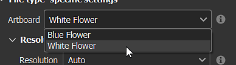
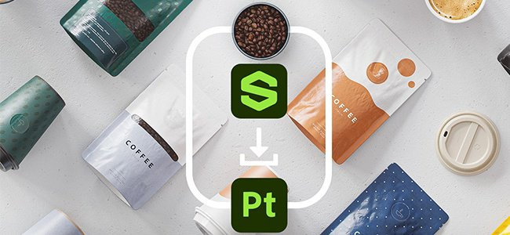
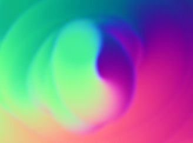
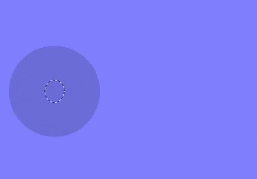
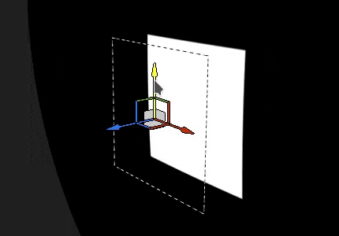

# Versión 10.0

<b>Substance 3D Painter 10.0</b> ofrece compatibilidad con archivos de Illustrator (.ai), integra Substance 3D Assets, importa fuentes a través de los recursos de texto, agrega funciones de pila de capas en la API de Python y varias mejoras en la calidad de vida.

Fecha de publicación: *16 de mayo de 2024*

## Funciones principales

### Nuevo recurso de texto

Esta nueva versión presenta el <b>recurso de texto</b>, que es una forma de cargar archivos de fuentes para escribir texto en diferentes contextos (pincel, proyección de relleno, entradas de imágenes de Substance, etc.) para embellecer tus texturas.

* <b>Examine las fuentes en la ventana Activos</b>\
  Las fuentes ahora se muestran en la ventana Activos bajo su propio filtro. Se recopilan desde diferentes ubicaciones del sistema operativo (y también desde las bibliotecas).

  
* <b>Arrastra y suelta fuentes como cualquier otro recurso</b>\
  Las fuentes se pueden utilizar como recursos de texto, como cualquier otro tipo de recurso. Arrástrelos y suéltelos para crear automáticamente una proyección de relleno. También se pueden usar en pinceles o como entrada en filtros de Substance.

  
* <b>Parámetros de recursos de texto</b>\
  Al crear un recurso de texto, puede ajustar algunos parámetros para ajustar el aspecto del texto: alineación vertical y horizontal, tamaño automático o manual, interlineado y espaciado entre caracteres, color, etc.

  
* <b>Admite una amplia variedad de caracteres y características</b>\
  El recurso Text admite escritura de derecha a izquierda, así como [ligaduras](https://en.wikipedia.org/wiki/Ligature_(writing)). (Para poder escribir caracteres no latinos se requiere una fuente compatible).

  
* <b>Importar fuentes personalizadas como un recurso normal</b>\
  Puede importar sus propios archivos de fuentes directamente en su biblioteca o proyecto, como cualquier otro recurso. Sin embargo, no se admiten algunos tipos de fuentes. Para obtener más información, consulte esta [página de documentación](../technical-support/workflow-issues/shelf-issues/font-import.md).

>[!NOTE]
>
> Para obtener más información sobre el <b>recurso de texto</b>, consulte la [página de documentación dedicada](../painting/text-resource.md).

### Nueva importación de archivos de Illustrator (.Ai)

Tras la compatibilidad con los archivos <b>.svg</b>, esta nueva versión también agrega la capacidad de importar archivos de Illustrator (<b>.ai</b>).

* <b>Compatibilidad Con Archivos De Illustrator (.Ai)</b>\
  En esta nueva versión, los archivos .ai ahora se pueden importar y procesar en Painter para usarlos como recursos en pinceles, proyecciones de relleno o como entradas de imagen de Substance.
* Los archivos <b>.svg y .ai comparten la configuración común</b>\
  Los documentos de SVG y Illustrator comparten configuraciones similares, en particular la resolución, el área de recorte y los parámetros de selección de ámbito. Esto significa que los recursos vectoriales pueden gestionarse de forma similar.

  
* <b>Selección de mesas de trabajo</b>\
  Los documentos de Illustrator admiten mesas de trabajo. Al utilizar un archivo .ai, también puede elegir entre diferentes mesas de trabajo disponibles a través de la configuración dedicada.

  
* <b>Selección de ámbito mejorada</b>\
  La ventana de selección de ámbito se ha mejorado gracias a la compatibilidad con miniaturas, lo que facilita la búsqueda y la selección de elementos específicos.\
  Por motivos de rendimiento, las miniaturas están desactivadas de forma predeterminada y se pueden habilitar con la casilla de verificación <b>Mostrar miniaturas</b>.

  

>[!NOTE]
>
> Actualmente, importar archivos de Illustrator (<b>.ai</b>) solo se admite en Windows y MacOS.

### Nueva integración de Substance 3D Assets

Hay disponible una nueva ventana que incrusta el sitio web de Substance 3D Assets directamente en Painter. Esta integración facilita la búsqueda y descarga de recursos directamente en su propia biblioteca.

* <b>Nueva ventana de Substance 3D Assets</b>\
  Hay un nuevo conjunto acoplado disponible en la interfaz para examinar los Substance 3D Assets. Si el conjunto acoplado no está visible y cerrado, se puede encontrar de nuevo en la barra de herramientas acoplado a la derecha de la interfaz.

  
* <b>Administrador de descargas</b>\
  Puede ver los activos que se están descargando actualmente a través del administrador dedicado usando el botón inferior izquierdo de la ventana. Los activos que no se puedan descargar se pueden volver a iniciar desde esta lista.

  
* <b>Encuentra tus activos descargados fácilmente</b>\
  El botón de la parte inferior derecha de la ventana abre un menú con algunas acciones para ayudar a navegar por el sitio web, pero también muestra dónde se han descargado los activos.

  

>[!NOTE]
>
> Al iniciar por primera vez, será necesario iniciar sesión en su cuenta para descargar activos. Este inicio de sesión se almacenará en caché para futuros usos.

>[!NOTE]
>
> El dock de Substance 3D Assets no está disponible en la versión de Steam.

### Nuevo módulo de pila de capas en la API de Python

En esta versión, se añade el nuevo módulo de pila de capas a nuestra API de Python. Esta API permite controlar la pila de capas de un proyecto, lo que abre la puerta a la creación de complementos de pila de capas avanzados y herramientas personalizadas.

* <b>Nueva API de pila de capas</b>\
  El nuevo módulo <b>layerstack</b> permite controlar la pila de capas de un proyecto de muchas maneras. Puede:

  * Consultar y definir la selección de capas y efectos.
  * Cree nuevas capas, carpetas y efectos (incluidos filtros, puntos de anclaje, etc.).
  * Crea instancias de capas.
  * Obtenga y establezca parámetros de capas y efectos, y cargue recursos en ellos.
  * Obtenga y establezca los parámetros del Substance.
* <b>Modificaciones de ámbito y pausa del motor</b>\
  La manipulación de la pila de capas podría llevar a cálculos largos, por lo que también exponemos la posibilidad de pausar y anular la pausa del motor desde la API (como en la interfaz de usuario). También hemos hecho posible agrupar las modificaciones, tanto por motivos de rendimiento como para deshacer varias operaciones una sola vez.
* <b>Administración de color básica</b>\
  Con la exposición de la pila de capas, necesitábamos introducir la noción de gestión de color en nuestra API. Se ha agregado un nuevo módulo <b>colormanagement</b> para crear, ajustar colores y elegir el espacio de color de los mapas de bits. (Esta parte de la API aún no está completa y se ampliará en futuras versiones).
* <b>Consultar información de ajuste preestablecido de exportación</b>\
  Los ajustes preestablecidos de exportación ahora se muestran en nuestra API, lo que permite consultar la lista de ajustes preestablecidos (predefinidos y personalizados). Su contenido también se puede recuperar en un formato similar a nuestra API de texturas de exportación existente.
* <b>Nuevas posibilidades por delante!\
  </b> Esta nueva parte de la API permite hacer muchas cosas nuevas, como guardar y restaurar una selección de capas o cambiar la velocidad aleatoria de todos los recursos de un proyecto, por ejemplo:

  

>[!NOTE]
>
> Para obtener más información sobre la API, consulte la documentación incluida con la aplicación (a través de <b>Ayuda > Documentación de scripts > API de Python</b>), que incluye muchos fragmentos de código para comenzar fácilmente.

>[!NOTE]
>
> En nuestra [documentación en línea](https://adobedocs.github.io/painter-python-api/) encontrará ejemplos de complementos de pila de capas.

### Pintura normal de mapas mejorada

En esta versión, hemos vuelto a trabajar con el flujo de trabajo normal de pintura de mapas. Hemos cambiado significativamente la forma en que acumulamos y mezclamos los sellos de pincel normales. Estos cambios se realizaron para solucionar problemas relacionados con la pintura de mapas de flujo.

* <b>Problema de acumulación corregido</b>\
  Pintar una y otra vez un área en el canal normal ya no saturará ni se agarrará y creará agujeros o artefactos. Ya no es necesario cambiar el canal normal al RGB 32F.

  
* <b>Se han corregido los trazos pintados que se rompían al deshacer</b>\
  Al deshacer un trazo de pincel, ya no se rompen otros trazos ya pintados.

  
* <b>Transparencia en alfa cero</b>\
  Los sellos de pincel realizados con una textura con un alfa en cero ahora se dibujarán como transparentes. El ejemplo siguiente muestra una marca de pincel (izquierda) frente a una proyección plana (derecha).

  

>[!NOTE]
>
> Para obtener más información sobre cómo pintar el mapa de flujo, consulte la [página de documentación](../painting/advanced-channel-painting/flow-map-painting.md).

### Manipuladores de transformación mejorados

Se han realizado varias mejoras para mejorar el uso de los manipuladores de transformación.

* <b>Modo de precisión con CTRL</b>\
  Al pulsar el control mientras se arrastra un manipulador, se entra ahora en un nuevo modo de precisión que permite operaciones más meticulosas. Este cambio se aplica a los manipuladores de translación, rotación y escala.\
  A continuación se muestra un ejemplo antes y después de presionar CTRL mientras se arrastra:

  
* <b>Nuevo comportamiento de escala</b>\
  La intensidad de la escala ahora se basa en el valor de la escala actual en sí y ya no en el tamaño de la escena. Esto facilita la realización de cambios relativos, especialmente en valores pequeños. Combinado con el modo preciso hace que escalar sea mucho más agradable.\
  Otro cambio es reducir la escala hasta que 0 ya no entre en valores negativos. Esto evita el problema de querer reducir la escala de una proyección y darle la vuelta por accidente.

  
* <b>Rotación mejorada del manipulador de superficies</b>\
  El manipulador de calcomanías de superficie ahora es mucho más estable al arrastrar alrededor de una superficie. No aumenta su rotación cuando se realizan traducciones de ida y vuelta.\
  Este es el <b>comportamiento antiguo</b> comparado con el <b>nuevo</b>:

  

  
* <b>Proyección alineada con la cámara al arrastrar y soltar</b>\
  Arrastrar y soltar un recurso en la ventana gráfica permite crear una proyección de deformación directamente en la superficie de la malla. Anteriormente, esta proyección se giraba incorrectamente y ahora está alineada con la cámara.

  

Se han añadido otras mejoras, en particular:

* <b>Tile Generator actualizado</b>\
  El parámetro de modo de fusión <b>Tile Generator</b> ahora se puede cambiar y modificará el resultado como se esperaba. El recurso también se ha actualizado a la última versión disponible en <b>Substance 3D Designer</b>.
* <b>Se han corregido problemas de bandas/calidad en algunos filtros</b>\
  Se bloquearon varios filtros con una precisión de 8 bits en lugar de 16 bits, lo que provoca bandas o defectos al usarlos (como el análisis de histograma o el desenfoque direccional). Esto se ha solucionado.
* <b>Espacio de color en la salida SBSAR</b>\
  Cuando se habilita el flujo de trabajo de administración de color heredado u OCIO, la exportación SBSAR ahora hará referencia a los nombres de espacio de color utilizados en el proyecto en los resultados respectivos.
* <b>Descubrimiento de recursos más rápido</b>\
  Con la introducción del <b>recurso de texto</b>, hemos añadido una nueva caché para agilizar el rastreo de recursos en el disco en el siguiente inicio. Esto es bastante notable cuando los recursos se instalan en un disco duro o cuando una biblioteca tiene gigabytes de recursos. Esta nueva caché se puede deshabilitar con una línea de comandos. Consulte la [página de documentación](../pipeline-and-integration/configuration/command-lines.md) dedicada para obtener más información.

Muchas gracias al sitio web [is this arabic ?](https://isthisarabic.com/) lo cual fue de gran ayuda durante el desarrollo de esta versión.

Referencia a las ilustraciones utilizadas en los medios anteriores:

* [Hombre con camisa negra](https://unsplash.com/photos/man-wearing-black-shirt-aoEwuEH7YAs) de Lucas Gouvêa
* [Rosa y verde](https://unsplash.com/photos/pink-and-green-abstract-art-ruJm3dBXCqw) de Pawel Czerwinski
* [Ilustraciones de unDraw](https://undraw.co/illustrations)
* Claude Monet

## Tutoriales

## Notas de la versión

### 10.0.0

Fecha de publicación: <b>2024/05/16</b>\
Resumen: <b>Versión principal, edición de la pila de capas con la API de Python, lectura de archivos nativos de Illustrator, integración de recursos 3D y nuevo recurso de texto</b>

<b>Agregado</b>:

* [Illustrator] Uso de archivos de Illustrator con mesas de trabajo en Painter
* [Illustrator] [SVG] Añadir vistas previas en la selección de ámbito
* [Substance 3D Assets] Busque, seleccione y descargue contenidos 3D directamente en Painter
* [Substance 3D Assets][UI] Nuevo panel
* [Substance 3D Assets] Mapas y materiales del entorno de apoyo
* [Substance 3D Assets] Permite volver a cargar, navegar y abrir la carpeta de ubicación en el nuevo panel Substance 3D Assets.
* [Substance 3D Assets] Adición de un gestor de descargas
* [Recurso de texto] Permitir el uso de fuentes incrustables
* [Recurso de texto] Permitir procesar una fuente/texto en una malla
* [Recurso de texto] Visualización de fuentes del usuario y otras rutas compartidas en el panel Activos con una nueva categoría
* [Recurso de texto][Propiedades] Añadir compatibilidad con propiedades de fuentes avanzadas
* [Recurso de texto] Permitir buscar/ver fuentes en miniestantes
* [Recurso de texto] Añadir mensaje/cuadro de diálogo de error al importar una fuente incompatible
* Miscelánea
* [Proyección de relleno] Mejora el comportamiento del manipulador Escala al utilizar valores pequeños
* [Manipuladores] Añadir nuevo modo preciso al pulsar el método abreviado de CTRL
* [Manipuladores] Mejorar la estabilidad del manipulador de superficies al traducir
* [Exportar] Añadir nombre de espacio de color en salidas SBSAR
* [Rendimiento] Mejora el tiempo de detección de activos en la biblioteca en el disco
* [Substance] Actualización al motor de Substance versión 9.1.2
* [Arrastrar y soltar] Alinear la rotación de pegatinas con la cámara al soltar en la ventana gráfica
* [Python] Edición de la pila de capas
* [Python] Permite seleccionar capa, efecto, máscara o máscara geográfica en la interfaz de usuario.
* [Python] Permitir obtener/definir modos de fusión de capas
* [Python] Permitir obtener o establecer la configuración de proyección de la capa de relleno
* [Python] Permitir consultar el color de material de Substance desde una capa de relleno
* [Python] Permite consultar y establecer colores y recursos uniformes en capas y efectos
* [Python] Permita crear y editar recursos de texto en la pila de capas
* [Python] Permite editar canales activos en capas y efectos
* [Python] Permitir que las acciones por lotes tengan una sola acción de deshacer/rehacer
* [Python] Permita cargar o editar parámetros de origen vectoriales
* [Python] Permite editar propiedades de color de capas y efectos con la gestión de color
* [Python] Permite consultar y crear capas con instancias
* [Python] Permitir la adición del efecto de selección de color
* [Python] Permite controlar la administración de color de la imagen de mapa de bits
* [Python] Permitir detener/anular la pausa del motor
* [Python] Permite navegar a nodos hermanos y principales
* [Python] Permitir la creación de un efecto de filtro/generador
* [Python] Permitir añadir un efecto de nivel
* [Python] Permitir la adición de una máscara inteligente en una capa
* [Python] Permitir crear o editar puntos de ancla
* [Python] Permitir obtener/Establecer máscara en capas
* [Python] Permitir la creación del efecto de máscara de comparación
* [Python] Permitir consultar y utilizar ajustes preestablecidos de recursos de Substance
* [Python] Permite enumerar los ajustes preestablecidos y sus valores mediante la función interna\_properties para los recursos del Substance
* [Python] Permite enumerar los ajustes preestablecidos de exportación predefinidos
* [Python] Se permite enumerar los ajustes preestablecidos de exportación disponibles en la biblioteca.
* [Python] Permite recuperar el contenido de los ajustes preestablecidos de exportación

<b>Corregido</b>:

* [Bloqueo] Deshaciendo &quot;Quitar instancia de sombreado&quot; con Ctrl-Z
* [Bloqueo] Crear una capa en una pila vacía si la última selección fue un efecto
* [SVG] Problema con el valor de área recortada personalizada
* [Auto-Unwrap] Si se vuelve a calcular solo el empaquetado sin ningún cambio en la orientación UV, se produce un bloqueo
* [Arrastrar y soltar] El retraso debido a los recursos externos se carga previamente varias veces
* [UI] Arrastrar y soltar la miniatura de un recurso puede ocultar un mensaje de advertencia en la pila de capas
* [Rendimiento] Los mosaicos UV enmascarados aún se calculan
* [USD] Resaltado incorrecto para la selección del ámbito
* [Recurso] La imagen de mapa de bits se daña después de pintar en el canal normal y guardar el proyecto
* [USD] Admite la solicitud de mallas de vértices con la mano izquierda
* [Substance] Restablecer los valores predeterminados volver siempre a cero para el widget de ángulo
* [Motor] Pintar con un SVG en una galería de símbolos no funciona
* [Motor] Los trazos normales del pincel de mapa se rompen después de deshacer una acción
* [Contenido] El filtro Gráfico a material tiene una fusión alfa y un espacio de color incorrectos
* [Contenido] Los modos de fusión del Tile Generator no funcionan
* [Contenido] El filtro de barrido de histograma produce bandas en algunos casos
* [Contenido] La iluminación al horno estilizada no tiene en cuenta el height pintado
* [Python] Error inesperado al recuperar información de capas instanciada después de cambiar el sombreador

<b>Problemas conocidos</b>:

* [Gestión de color] Las conversiones de espacio de color HDR con ACE en Linux producen colores con sujeción
* [Crash][Linux][AMD] Arrastre y colocación de recursos en la pila de capas del sistema operativo Wayland
* [Regresión][UI] El menú contextual es demasiado pequeño en pantallas HD
* [Bloqueo] [Python] Exportación de USD desencadenada por TextureStateEvent
* [Guardar] El archivo de proyecto de Spp se pierde cuando falla &quot;guardar como&quot;
* [MacOS Intel] Bloqueo al importar algunos ajustes preestablecidos
* [Illustrator] No es posible importar archivos de Ai tras un bloqueo del servidor sin reiniciar Painter
* [Importar] Los recursos con el mismo nombre pero extensiones diferentes se anulan
