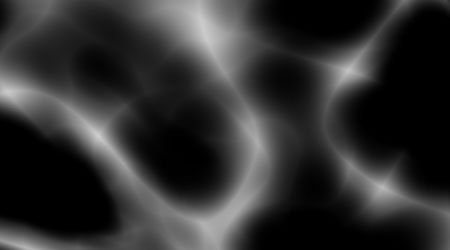

# Versión 10.1

<b>Substance 3D Painter 10.1</b> agrega nuevos y potentes filtros, funcionalidades de USD mejoradas y compatibilidad actualizada con VFX Platform y Linux.

Fecha de publicación: *17 de septiembre de 2024*

>[!NOTE]
>
> Esta versión de Painter utiliza ahora la versión 6 de Qt, que afecta a la compatibilidad de los complementos de Python y JavaScript. Consulte a continuación para obtener más información.

## Funciones principales

### Nuevos filtros predeterminados

En esta versión se han añadido varios filtros nuevos para ampliar en gran medida el proceso de texturizado:

* <b>Nuevo material para calcomanías de bordado</b>\
  Dentro de la sección de materiales de la ventana de Activos puede encontrar nuevos materiales de calcomanía de bordado. Arrástrala y suéltala en cualquier parte de tu malla, conecta cualquier recurso (como una textura o incluso una fuente) y podrás crear fácilmente nuevos detalles de tela.

  
* <b>Nuevo filtro de máscara/color de área de relleno</b>\
  Estos dos nuevos filtros permiten rellenar trazados o contornos cerrados. Esto resulta útil, por ejemplo, para rellenar rápidamente trazados 3D. Como son filtros, también se pueden utilizar para pinceladas manuales o en otras situaciones.

  
* <b>Nuevo filtro FXAA</b>\
  Este nuevo filtro puede reducir rápidamente el suavizado, especialmente en bordes duros que pueden aparecer después de un nivel, por ejemplo, o en máscaras realizadas con el efecto de selección de color.

  
* <b>Nuevo filtro de paso elevado</b>\
  Con este filtro genérico, puedes generar una textura de escala de grises para usarla con efectos más avanzados (como suavizar, desenfocar o enfocar los detalles).

  
* <b>Nuevo filtro de pixelado</b>\
  El filtro de pixelado puede simular una reducción de la resolución, lo que puede resultar útil para estilizar los colores y patrones.

  
* <b>Nuevo filtro de posterización</b>\
  Este filtro puede resultar útil para reducir el número de colores de una imagen, lo que puede ayudar a crear contrastes en las formas y crear efectos estilizados.

  
* <b>Nuevo filtro de umbral</b>\
  El filtro de umbral es una forma rápida de crear máscaras binarias nítidas en blanco y negro a partir de una entrada en escala de grises.

  
* <b>Nuevo filtro de paso suave</b>\
  El filtro paso a paso suave es otra forma de crear un nivel o contraste para perfeccionar la información de escala de grises. Este filtro también aplica una curva exponencial al resultado, lo que permite convertir degradados lineales en curvas suaves.

  
* <b>Filtros mejorados de transformación y reflejo</b>\
  El filtro de transformación se ha actualizado para admitir la escala no uniforme, la inversión horizontal o vertical y parámetros más sencillos de usar. El filtro de espejo también se ha actualizado con parámetros más sencillos.

  
* <b>Iconos mejorados</b>\
  Para que los filtros estándar sean más visibles y fáciles de encontrar, se han rehecho sus iconos. Los iconos de color amarillo están pensados para usarse en el contenido de una capa, mientras que los iconos de escala de grises son genéricos y se pueden usar tanto en el contenido de las capas como en las máscaras.

  
* <b>Correcciones menores en filtros</b>\
  Se han ajustado algunos filtros más para corregir algunos problemas:

  * El filtro de ajuste de height afectaba al alfa de una capa, lo que dificultaba su uso en algunos casos.
  * El filtro de desenfoque no utilizaba un espacio de color lineal en el modo de gestión de color heredado, lo que creaba colores incorrectos al mezclar o fusionar su entrada.

### Actualización de compatibilidad de USD y VFX Platform

En esta versión de Painter, se han mejorado y actualizado muchos componentes de terceros:

* <b>Exportar texturas con Adobe Standard Material en USD\
  </b>Al exportar texturas de Painter a un archivo en USD, ahora obtendrás las propiedades de Adobe Standard Material con ellas. Esto hace que estos archivos USD estén listos para usarse en aplicaciones que también admiten esas propiedades.
* <b>Importar texturas de archivos USD</b>\
  La importación de un archivo USD ahora también importará su textura en el proyecto que cree, lo que facilita las idas y venidas entre aplicaciones. Si el archivo USD utiliza Adobe Standard Material, esto también configurará la configuración del sombreado, haciendo que el resultado en la ventana gráfica coincida con la otra aplicación de origen.
* <b>Cambios en Gltf\
  </b>Después de la actualización de USD, se requirió algún cambio de comportamiento para el formato GLTF para garantizar la paridad. Al importar un archivo gltf, Painter supondrá que el mapa normal estará en formato OpenGL.\
  Algunos archivos gltf pueden usar el formato DirectX en su lugar. Por lo tanto, se ha añadido una nueva configuración en la nueva ventana de proyecto para tenerla en cuenta (tenga en cuenta que el formato normal también se puede reemplazar desde la pila de capas).

  
* <b>Dependencias actualizadas</b>\
  Se han actualizado varias bibliotecas utilizadas por Painter, en particular para que coincidan con la referencia de la plataforma VFX. Estas son las nuevas versiones utilizadas en Painter 10.1:

  * Qt 6.5.6 (y PySide6 6.5.6)
  * Substance Engine 9.1.3
  * OpenEXR 3.2
  * Python 3.11
  * OCIO 2.3.2
  * OpenSubdiv 3.6.0
* <b>Compatibilidad actualizada con Linux\
  </b>Esta nueva versión de Painter ahora es compatible como mínimo con Red Hat Enterprise Linux (RHEL) versión 8.6, pero también debe ser compatible con la versión 9.x.

### Rendimiento mejorado

Algunas áreas de la aplicación han recibido algunas mejoras de rendimiento:

* <b>Se ha mejorado el tiempo de apertura de los proyectos\
  </b>El proyecto que utilizaba muchos trazos de pincel ahora debería abrirse más rápido en Painter. El ahorro de tiempo de estos proyectos también debería mejorarse ligeramente.\
  En algunos de nuestros proyectos de prueba observamos una reducción de 50 a solo 6 segundos de tiempo de carga al abrir un proyecto. También se ha mejorado el consumo de memoria al abrir proyectos antiguos y convertirlos a la última versión.
* <b>Rendimiento mejorado de teselación\
  </b>Ahora empleamos una optimización automática cuando la teselación está activada en la configuración del sombreador. Los triángulos que sean más pequeños que un píxel en pantalla ya no se teselarán, lo que reduce la cantidad de triángulos que se dibujarán y, por lo tanto, acelera los tiempos de procesamiento.\
  Este cambio no produce diferencias visuales y no afecta al proceso de exportación de la malla.
* <b>Las miniaturas simplificadas ahora son las predeterminadas</b>\
  En la versión 6.2 presentamos las miniaturas simplificadas para proyectos de UV Tiles para mejorar el rendimiento, pero los proyectos normales aún podían utilizar la antigua forma de calcular miniaturas de capas. Este comportamiento se controlaba mediante una configuración de la aplicación.\
  Esta configuración ahora se establece de forma predeterminada en las miniaturas optimizadas para mejorar el rendimiento de cualquier proyecto. Si lo desea, puede revertirse en las preferencias principales.

  

### Notas de la migración a Painter 10.1

>[!NOTE]
>
> * Es posible que los complementos de Python deban actualizarse tras la actualización a Qt6. Consulte [esta página para obtener más información](https://adobedocs.github.io/painter-python-api/guides/qt6-migration/).
> * <b>Los complementos </b>de JavaScript se han trasladado a una subcarpeta dentro del directorio Documentos del usuario. Los complementos existentes ya no aparecerán en la aplicación, ya que deben moverse manualmente a esa carpeta.
> * En Steam/Ubuntu, se requiere una biblioteca del sistema para que Painter funcione correctamente. Asegúrese de que libxcb-cursor está instalado antes de iniciar la aplicación.

## Notas de la versión

### 10.1.0

Fecha de publicación: <b>17/09/2024</b>

Resumen: <b>Versión principal, nuevo contenido: Filtro de color/máscara de área de relleno, filtro de pegatinas de bordado y seis filtros de Substance genéricos, importación de USD con propiedades de materiales y sombreadores, mejora del rendimiento, compatibilidad con VFX Platform 2024 y migración a Linux RedHat</b>

<b>Agregado</b>:

* [Contenido] Añadir nuevo filtro de color/máscara de área de relleno
* [Contenido] Añadir nuevo filtro de pegatinas de bordado
* [Contenido] Añade 6 nuevos filtros de Substance genéricos (FXAA, pixelado, paso alto, posterizar, paso suave y umbral)
* [USD] Exportar capa USD con un material de ASM definido
* [USD] Importar USD con propiedades de materiales y sombreadores
* [Rendimiento] Habilitar miniaturas de pila de capas optimizadas de forma predeterminada
* [Rendimiento] Reducir el tiempo de apertura de archivos de proyecto y el consumo de memoria (descodificación de datos)
* Compatible con la plataforma VFX 2024
* [VFX Platform 2024] Actualización a Python 3.11
* [VFX Platform 2024] Actualización a OpenEXR 3.2
* [VFX Platform 2024] [USD] Actualización de OpenSubdiv 3.6.0
* [VFX Platform 2024] [Gestión de color] Actualización a OCIO 2.3.2
* [Linux] Migración a Linux RedHat
* [Linux] Actualice la versión principal del controlador Nvidia a 535.171.04
* [Importar] Añada una opción para voltear la asignación normal al importar una malla GLTF
* [UI] Usar el valor predeterminado del sistema operativo para la distancia de detección de eventos de arrastre
* [Substance Engine] Añada la función de tira de llamadas para eliminar los símbolos del ejecutable
* [Pantalla de bienvenida] Actualización al nuevo formato de pantalla de bienvenida
* Actualizar Substance Engine a la versión 9.1.3
* [Python] Mostrar vínculos a ejemplos en el menú de documentación de la pila de capas
* [JavaScript] Mover complementos de Javascript a la subcarpeta javascript/plugins

<b>Corregido</b>:

* [Illustrator] Bloqueo al exportar un azulejo UV con un gráfico .ai en casos específicos
* [Trazos dinámicos][Trazado] La opción aleatoria por trazo no funciona en un trazado
* [UI][Propiedades] El bloqueo está activado cuando el mosaico no es uniforme
* &#x200B; archivo Debug TXT se crea al hacer doble clic en el proyecto de Painter
* [USD][Exportar] Es posible que falten algunas texturas
* [ASM] El canal de color de dispersión ignora el metal
* [Contenido] El filtro de desenfoque no funciona en espacios de color &quot;operativos&quot;
* [Contenido] Height Ajustar filtro también modifica el alfa de la capa

<b>Problemas conocidos</b>:

* [Gestión de color] Las conversiones de espacio de color HDR con ACE en Linux producen colores con sujeción
* [Win] [Bloqueo] [ACE] No se utiliza el espacio de color sRGB ICE para la transformación de la pantalla
* [Regresión][IU] El menú contextual es demasiado pequeño en pantallas HD
* [Bloqueo] [Python] Exportación de USD desencadenada por TextureStateEvent
* [MacOS Intel] Bloqueo al importar algunos ajustes preestablecidos
* [Bloqueo] Reubicar recurso y guardar proyecto
* [Motor] Pintar con la herramienta Clonar en colores de cambio de canal normales incorrectamente
* [Python] El widget fantasma aparece eliminado por la secuencia de comandos y sigue funcionando
* [RedHat] Problemas con el selector de color
