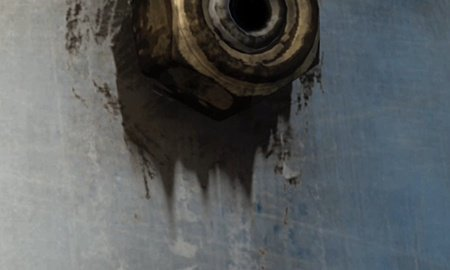

# Versión 11.0

<b>Substance 3D Painter 11.0</b> agrega un nuevo flujo de trabajo de actualización automática de recursos, una herramienta de trazado rellenado, así como mejoras generales para los trazados, una jaula automática para hornear y varios filtros nuevos para crear texturas estilizadas.

Fecha de publicación: <b>11 de marzo de 2025</b>

>[!NOTE]
>
> Esta versión de Painter elimina la compatibilidad de las configuraciones de Mac Intel. Consulte a continuación para obtener más información.
> 
> Esta versión también aumenta la versión mínima compatible de Windows 10 a 22H2.
> 
> Para obtener más información, consulta nuestra [página de requisitos del sistema](../getting-started/system-requirements.md).

## Funciones principales

### Nueva actualización automática de recursos

Con el nuevo flujo de trabajo de actualización automática, ahora es posible mantener las bibliotecas y los proyectos actualizados con las últimas versiones de sus recursos. Con este nuevo proceso, Painter puede supervisar los recursos del disco para buscar cambios y volver a cargarlos automáticamente y reemplazarlos por sus bibliotecas y proyectos.

* <b>Activación de la actualización automática en la ventana Activos</b>\
  En la parte inferior derecha de la ventana Activos ahora está disponible un botón y un menú para configurar el sistema de actualización automática (el icono de pequeñas flechas dobles). Habilite la opción <b>Panel de activos</b> para supervisar bibliotecas y volver a cargarlas.

  
* <b>Actualizando recursos en proyectos</b>\
  La recarga de un recurso no actualizará automáticamente la versión utilizada dentro de un proyecto a través de la pila de capas, la configuración de visualización, la configuración de sombreadores, etc. Para ello, asegúrese de habilitar también la opción <b>Resources used in project</b>.

  
* <b>Frecuencia de actualización </b>\
  La frecuencia con la que Painter debe buscar una actualización de recursos se puede definir en minutos mediante una configuración dedicada. El uso de 0 minutos hará que la aplicación se actualice cada pocos segundos. Tenga en cuenta, sin embargo, que un valor tan bajo puede provocar problemas de rendimiento. La aplicación también se actualizará automáticamente cuando recupere el foco.
* <b>Actualización manual de recursos</b>\
  El proceso de actualización también se puede activar manualmente mediante los botones dedicados situados en la parte inferior del menú de actualización automática. Esto puede ser más conveniente que usar y esperar a que comience el proceso automático.

  
* <b>Error de coincidencia y error en la ventana de registro</b>\
  La actualización de recursos, especialmente si la diferencia entre la versión antigua y la nueva es importante, puede provocar problemas. Por ejemplo, los resultados de texturizado pueden cambiar o romperse en gran medida debido a que faltan o cambian parámetros en un recurso de Substance. Por esta razón, <b>Omitir recursos cuando sus parámetros no coinciden</b> está habilitado de forma predeterminada. Los problemas se notificarán en la ventana de registro.\
  Para forzar una actualización, simplemente desactive esta configuración.

  

  
* <b>Disponible en la API de Python para automatizar el mantenimiento del proyecto </b>\
  El flujo de trabajo de actualización automática también se ha expuesto a Python. Se han añadido nuevas funciones para ayudar a enumerar los recursos obsoletos y reemplazarlos.\
  Para obtener más información, consulte la documentación dedicada a través del menú Ayuda de la aplicación.

>[!NOTE]
>
> Para obtener más información, consulte la [página de documentación dedicada](../features/auto-update.md).

### Nueva herramienta de trazado relleno

La herramienta de trazado relleno es un nuevo tipo de herramienta de trazado que permite crear formas en la superficie del modelo 3D rellenadas con un color uniforme. Permite la creación de patrones complejos.

* <b>Nueva herramienta para crear una ruta con un color relleno</b>\
  Hay disponible una nueva herramienta llamada <b>Ruta rellena</b> en el menú Ruta. Esta herramienta puede rellenar el área interior de un trazado cuando se cierra. El relleno se realiza con un color uniforme para cada canal del conjunto de texturas.

  
* <b>Adaptarse a la superficie automáticamente</b>\
  La herramienta Trazado relleno puede adaptarse a cualquier tipo de superficie; no se limita a las áreas planas. Puede cruzar brechas y límites de objetos.

  
* <b>Compatible con simetría reflejada y radial</b>\
  Esta nueva herramienta también admite las propiedades de simetría, lo que abre posibilidades para crear formas complejas.

  
* <b>Cambio sencillo entre herramientas de ruta</b>\
  Se ha añadido una nueva forma de cambiar entre los diferentes tipos de herramientas de trazado en la ventana Propiedades. Facilita la prueba de las herramientas y la duplicación de trazados. Por ejemplo, puede crear un contorno de trazado y después duplicarlo para convertirlo en un trazado relleno, lo que permite tener rápidamente una forma con un contorno.

  

### Herramientas de trazado mejoradas con ajuste, líneas rectas y mucho más

En esta nueva versión se han añadido muchas mejoras de comportamiento y calidad de vida para facilitar el uso de las herramientas de trazado:

* <b>Vista previa de la ruta (alternar con Mayús+P)</b>\
  Al editar un trazado, aparecerá una nueva línea de puntos para indicar cómo reaccionará el trazado al añadir un nuevo punto al final de la curva. Esto hace que los cambios sean más predecibles. Esta vista previa se puede deshabilitar a través del menú de configuración dedicado o usando el método abreviado de teclado <b>Mayús+P</b>.

  
* <b>Ajuste recto de línea y ángulo</b>\
  El modificador de teclado <b>Shift </b> ahora se puede usar para crear líneas rectas entre puntos automáticamente. El mantenimiento de <b>Ctrl </b> también se puede utilizar para aplicar ajuste de ángulo, que ayuda a crear formas geométricas.\
  Los ajustes de ajuste de ángulo se pueden modificar mediante el menú de ajustes de trazado de la barra de herramientas contextual.

  
* <b>Puntos de trazado de ajuste a polígonos de malla</b>\
  Para facilitar la colocación de puntos, se puede activar un nuevo ajuste (icono de imán). Esta opción permite colocar puntos en los vértices del modelo 3D y seguir una superficie o una arista.\
  El ajuste se puede realizar de tres maneras diferentes:

  * Ajustar a vértices
  * Ajustar a bordes
  * Ajustar al centro de los bordes

  Todos estos modos están disponibles a través del menú de configuración de ruta en la barra de herramientas contextual.

  

  
* <b>Cerrar automáticamente al hacer clic en el último vértice</b>\
  Para que la herramienta <b>Trazado relleno </b> sea más fácil de usar, al hacer clic en el primer vértice mientras se selecciona el último, ahora se cerrará automáticamente el trazado. Para seleccionar un punto en lugar de cerrar el trazado, puede utilizar la tecla <b>CTRL </b>. (Este comportamiento se invirtió en la versión anterior).

  
* <b>Copiar posiciones de vértices de ruta de contenido en máscara</b>\
  Ahora es posible hacer <b>Copiar</b> una ruta en modo material y luego usar <b>Pegar todos los vértices</b> en una ruta en una máscara. Esto permite sincronizar diferentes trazados entre materiales y máscaras.

  
* <b>Se ha mejorado el comportamiento de visualización de la IU de mostrar/ocultar</b>\
  Si presiona los métodos abreviados de teclado de los manipuladores de la ventanilla (<b>W</b>, <b>S</b> o <b>D</b>), ahora los alternará sobre la marcha. También se pueden activar o desactivar desde los botones específicos de la barra de herramientas contextual. Este cambio permite mostrarlos u ocultarlos rápidamente sin ocultar también los demás elementos visuales de la ventana gráfica (como la curva de trazado y los puntos).

  
* <b>Ahora se puede acceder a Rotar y Escalar en los vértices de la ruta</b>\
  En esta versión, la herramienta <b>Rotar </b> y <b>Escalar </b> ahora se pueden usar cuando se seleccionan varios vértices. Esto abre la posibilidad de ajustar y alinear los vértices juntos.

  
* <b>Mostrar información de ruta en la ventana Propiedades</b>\
  La ventana de propiedades ahora tiene una nueva sección cuando se selecciona una herramienta de trazado. Esta nueva sección reagrupa la información y la acción específicas de los trazados, como la longitud de un trazado, la profundidad de proyección y las acciones para cambiar de un tipo a otro.

  
* <b>Se mejoró la edición de Tangent cuando se visualizó desde un ángulo</b>\
  La edición de tangentes personalizadas puede resultar difícil en función del ángulo de vista. Esto se ha cambiado para que las tangentes se limiten a su propio plan.

  
* <b>Mantener abierta la lista de rutas en todas las capas</b>\
  Al cambiar entre diferentes capas de pintura y efectos, si el panel Trazado de la ventana gráfica estuviera cerrado, también permanecería cerrado en otras capas. El panel permanecerá abierto para que sea más conveniente ir y volver.

  
* <b>Centrarse en la ruta seleccionada actualmente </b>\
  Al presionar el método abreviado de teclado <b>F</b>, ahora se centrará en una ruta en lugar de en todo el modelo 3D al editar una ruta.
* <b>Eliminar ruta de acceso con retroceso </b>\
  Ahora se pueden eliminar rutas presionando el método abreviado de teclado <b>Retroceso </b>.

### Nuevos filtros de Substance y generadores de texturas

La nueva versión introduce algunos filtros nuevos, así como algunos patrones de procedimiento.

<b>Filtros:</b>

* <b>Estilización</b>\
  Este nuevo filtro se puede utilizar para convertir una texturización existente en una versión más estilizada. Simula los trazos de los pinceles en el espacio 3D y puede aplicar otros efectos para lograr un aspecto pictórico. Contiene varios ajustes preestablecidos para que sea fácil jugar con ellos.

  
* <b>Cuantificar</b>\
  El filtro de cuantificación se puede utilizar para reducir el número de colores de una imagen y crear áreas planas con límites definidos. También se puede utilizar para estilizar texturas.

  
* <b>Kuwahara anisotrópico</b>\
  Este filtro aplica el [filtro Kuwahara](https://en.wikipedia.org/wiki/Kuwahara_filter "https://en.wikipedia.org/wiki/Kuwahara_filter"), que también se puede usar para reducir el ruido y estilizar las texturas.

  
* <b>Distancia direccional</b>\
  Se trata de un filtro sencillo para estirar los píxeles en una dirección determinada en el espacio 2D. Se puede utilizar para difuminar trazos de pincel o crear fácilmente fugas.

  
* <b>Suavizado de bisel</b>\
  El suavizado de bisel es una nueva versión del filtro biselado, que proporciona mejores resultados y controles. Está disponible además del filtro existente.

  
* <b>Conversión en escala de grises </b>\
  Este nuevo filtro se puede utilizar para convertir cómodamente imágenes o canales a escala de grises, lo que proporciona control sobre los canales Rojo, Verde y Azul si es necesario.

<b>Generadores de texturas y ruidos</b>:

* <b>Generador de Scratches </b>\
  Generador de arañazos mejorado que simula hilos finos con varios controles de aleatoriedad.
* <b>Triangle Grid </b>\
  Ruido creado a partir de las conexiones de los triángulos, con controles de aleatoriedad y smoothness.
* <b>Mosaico aleatorio </b>\
  Un generador de texturas adaptado a los patrones de azulejos de construcción.
* <b>Ruidos fractales de Voronoi y Voronoi </b>\
  Ya disponibles como ruidos 3D, estas nuevas versiones 2D se pueden utilizar para trabajar y embaldosar en espacios 2D o UV.
* <b>Ruidos actualizados a la última versión de Designer </b>\
  La mayoría de los ruidos disponibles en Painter se han actualizado con la última versión de Substance 3D Designer. Los parámetros de ruido ya no se ocultan en un grupo para que se puedan editar más rápido.

### Nueva jaula automática para hornear (experimental)

Al hornear una malla de alta densidad sobre mallas de baja densidad, ahora puedes seleccionar una nueva opción <b>Automático </b> al especificar el modo de jaula. Este nuevo método intenta calcular una malla de jaula automática que se ajuste mejor a las mallas de alto contenido de poli para evitar artefactos.

* <b>Nueva configuración en los parámetros comunes de procesamiento </b>\
  Dentro del parámetro común de horneado, el parámetro de jaula se ha sustituido por una selección entre tres opciones:\
  <b>Basado en distancia</b>: los ajustes de distancia frontal/trasera por defecto.\
  <b>Automático (experimental)</b>: la nueva jaula automática.\
  <b>Archivo personalizado</b>: la forma anterior de cargar un archivo de malla personalizado como una jaula.

  

>[!NOTE]
>
> Esta característica se considera experimental. Tenemos previsto mejorar el algoritmo en futuras versiones. También estamos buscando comentarios sobre la calidad de los resultados y posibles errores.

### Renderizado con Metal en Mac OS

En esta versión se han realizado cambios específicos relacionados con la plataforma Mac:

* <b>Ahora se usa la API de gráficos de metal en lugar de OpenGL en Mac </b>\
  A partir de esta versión, Painter ahora utiliza la <b>API gráfica Metal </b>en Mac, tanto para procesar su ventana gráfica como para calcular texturas. Este modificador mejora enormemente el rendimiento y la estabilidad de la aplicación. También facilitará la integración de nuevas funcionalidades en el futuro, ya que OpenGL ha quedado obsoleto en MacOS.
* <b>Eliminación de la compatibilidad con la arquitectura Intel en el sistema operativo Mac </b>\
  Con esta versión, se ha eliminado la compatibilidad con las CPU Intel en MacOS. La arquitectura ARM (M1, M2, etc.) ahora es el único admitido.

### Miscelánea

En esta versión también se han añadido otras funciones:

* <b>Habilitar solo el canal de color base en la nueva capa o efecto de relleno</b>\
  Ahora, de forma predeterminada, al crear una nueva capa de relleno o un efecto, solo se habilitará el canal Color base. (Este cambio no se aplica al arrastrar y soltar un recurso que se crearía a sí mismo una capa o un efecto de relleno).\
  Basándonos en los comentarios de la comunidad, hemos realizado este cambio para mejorar el rendimiento evitando activar el cálculo de canales que se desactivan posteriormente. Esto debería ayudar a la capacidad de respuesta cuando se trabaja en alta resolución o con azulejos UV.\
  Ten en cuenta que puedes volver a habilitar rápidamente todos los canales haciendo clic en el botón Color base mientras mantienes el método abreviado de teclado <b>ALT </b>.

  
* <b>Cambiar el nombre de los mosaicos UV para exportar texturas</b>\
  En la ventana de lista Conjunto de texturas no es posible añadir un nombre personalizado a los Mosaicos UV. A diferencia de la descripción, el nombre personalizado se puede recuperar en los ajustes preestablecidos de exportación mediante la etiqueta dedicada <b>$uvTileName</b>.\
  Esta nueva funcionalidad permite sustituir números UDIM por nombres específicos durante la exportación.

  
* <b>Nuevo botón de exportación disponible en la barra de herramientas de Dock</b>\
  Las acciones <b>Enviar a</b> que permiten exportar a otras aplicaciones se han trasladado a una ventana dedicada, ahora disponible en la barra de herramientas de Dock en el lado derecho de la aplicación.

  
* <b>Mejorar la denominación de las capas y rutas de acceso copiadas/pegadas</b>\
  El esquema de nomenclatura de las capas al duplicar o copiar/pegar capas y trazados se ha mejorado para ser más coherente y predecible.

  

## Tutoriales

## Notas de la versión

### 11.0.0

Fecha de publicación: <b>2025/03/11</b>\
Resumen: <b>Versión principal, nueva función de actualización automática, herramienta de ruta rellena y otras mejoras en la ruta, así como nuevos filtros y una generación experimental de jaula automática para hornear</b>

<b>Agregado</b>:

* Actualización automática
* [Actualización automática] Actualización automática de activos modificados en el panel Activos
* [Actualización automática] Actualización automática de activos modificados en todo el proyecto
* [Actualización automática] Mantener la actualización automática desactivada de forma predeterminada
* [Actualización automática] Hacer que la actualización sea opcional si los parámetros del recurso no coinciden (.sbsar, .glsl, .ai, .svg)
* [Actualización automática] Añadir variable de entorno para desactivar la función de actualización automática
* [Actualización automática] [SBSAR] Convertir la actualización en opcional si los parámetros del recurso no coinciden
* Trazado relleno
* [Trazado][Rellenar] Añadir una nueva herramienta para crear trazados rellenos
* Mejoras de ruta
* [Path] Crear un trazado que se ajusta a polígonos
* [Path] Permitir cambiar entre tipos de ruta
* [Ruta] Permite copiar y pegar datos de vértices de ruta entre contenido y máscara
* [Trazado] Permite restringir el ángulo al crear un nuevo punto
* [Ruta] Permite crear puntos de restricción en una línea
* [Path] Cierre la forma con un solo clic
* [Path] Visualización de la información de ruta
* [Path] Permita escalar y rotar los vértices del trazado
* [Path][UX] Facilita el acceso a las herramientas de transformación
* [Path] Añadir vista previa de ruta
* [Trazado] Desactivar la previsualización de trazado con Mayús + P
* [Path] Mejora de la edición de tangentes desde la vista lateral
* [Trazado] Permitir que el enfoque se centre en un trazado 3D
* [Path] Los vértices deben conservar el estado de selección al activar o desactivar la IU de nuevo
* [Ruta] Permitir eliminar la ruta con la barra espaciadora
* [Path] Mantenga abierta la lista de rutas si el usuario la expande
* [Ruta] [Pila de capas] Cambiar el nombre de los duplicados correctamente al copiar y pegar
* [Path] Mejoras en la interfaz de usuario y la información sobre herramientas
* Rendimiento
* [Rendimiento] Mejore el rendimiento de la ventanilla al utilizar un nivel de teselación alto
* [Rendimiento] Habilite solo el primer canal en las nuevas capas/efectos de relleno
* [Rendimiento] Paralelizar el cálculo de trazos de pincel
* Baking
* [Horneado] Añadir nueva opción de generación de jaulas totalmente automática para horneado con mallas de alto contenido de polietileno (Experimental)
* Contenido
* [Contenido] Añade 6 filtros nuevos: estilización, cuantificar, anisotrópico kuwahara, suavizado de bisel, distancia direccional, conversión de escala de grises
* [Contenido] Actualización de Noises y Grunges a la versión más reciente de Designer (con el nuevo 2D Voronoi)
* [Contenido] Añada 3 nuevos generadores de texturas (Aleatorio de azulejos, Triangle Grid, Generador de Scratches)
* [Contenido] Cambiar nombre de plantilla de Unreal Engine y exportar ajustes preestablecidos
* Python
* [Shelf] [Python] Guarda material inteligente o máscara inteligente en el disco desde Python
* [Python] Adición de la jaula automática de banca a la API de Python
* [Python] Permite editar nombres y descripciones de conjuntos de texturas y mosaicos UV
* [Python] Compartir la configuración de resolución en fuentes de fuentes y vectores
* [Actualización automática] [Python] Exponer las funcionalidades de actualización automática del proyecto en Python
* Varios
* [Exportar] Facilite el acceso a las opciones de Enviar a con un nuevo panel
* [Nvidia] Añadir advertencia sobre los controladores más recientes de Nvidia (572.16)
* El ajuste de ángulo debe verse afectado por la &#x200B; de selección de espacio Objeto/Mundo
* [Lista de conjuntos de texturas] Permite añadir un nombre personalizado a los mosaicos UV y utilizarlos en la exportación
* Mac
* [Mac] Uso de Metal en lugar de OpenGL para el procesamiento de gráficos
* [Mac] Se retira la asistencia de Mac Intel

<b>Corregido</b>:

* [Nvidia] [Horneado] Los resultados del panadero de oclusión ambiental tienen defectos
* [Bloqueo] Al hacer clic Alt para cambiar la visibilidad del conjunto de texturas deshabilitado, se produce un bloqueo
* [Horneado] La jaula se tiene en cuenta con un bajo nivel de poli como un alto parámetro de poli
* [Horneado] El color del material para el panadero de mapas de ID no funciona con el formato de archivo USD
* [Rendimiento] Procesamiento lento en la ventana gráfica con mallas y muchos objetos superpuestos
* [Qt] El selector de color personalizado no tiene ajustes de Administración de color
* [Viewport] Los manipuladores 3D parpadean cuando se activa el suavizado
* Ranura de escala de grises del borrador en el estado del pincel de bloques de máscara
* [Log] No se notifican mensajes de error muy largos al importar mallas
* [Contenido] Error tipográfico en la lista de nombres de ajustes preestablecidos dentro del ajuste preestablecido de la herramienta Puntadas
* [Python] Reemplazar un archivo de SVG/Ai por otro no actualiza sus propiedades
* [Python] El ID de mesa de trabajo del recurso vectorial está vacío en algunos casos cuando se consulta en Python
* [Python] El error impreso en el registro a veces tiene muchas devoluciones de línea

<b>Problemas conocidos</b>:

* [Gestión de color] Las conversiones de espacio de color HDR con ACE en Linux producen colores con sujeción
* [Regresión][IU] El menú contextual es demasiado pequeño en pantallas HD
* [Bloqueo] [Python] Exportación de USD desencadenada por TextureStateEvent
* [Motor] Pintar con la herramienta Clonar en colores de cambio de canal normales incorrectamente
* [Python] El widget fantasma aparece eliminado por la secuencia de comandos y sigue funcionando
* [RedHat] Problemas con el selector de color
