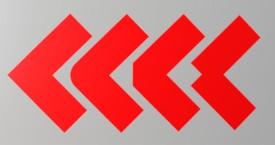
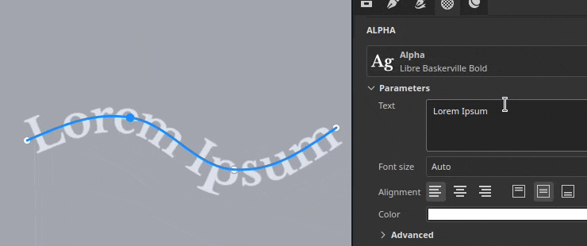
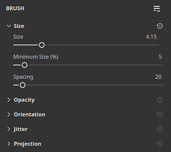
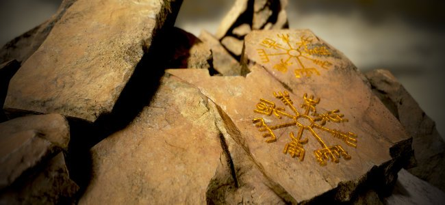

# Versión 11.1

<b>Substance 3D Painter 11.1 </b>ofrece la nueva herramienta de Ruta de lazo con contenido exclusivo, simetría de capas y efectos de relleno, tamaño de física para desplazamiento y el soporte de la API gráfica Vulkan.

Fecha de publicación: <b>18 de noviembre de 2025</b>

>[!NOTE]
>
> Esta versión de Painter cambia la API gráfica de OpenGL a Vulkan. Este cambio puede afectar a las GPU compatibles con la aplicación, especialmente para hacer un bake con trazado de rayos basado en GPU.
> 
> Para obtener más información, consulta nuestra [página de requisitos del sistema](../getting-started/system-requirements.md).

## Funciones principales

### nueva herramienta Cinta

La <b>Ruta de lazo</b> es una nueva herramienta en la familia de herramientas de ruta de acceso. Una cinta de opciones transformará y repetirá una textura a lo largo de un trazado sin cortes, con control adicional para el inicio y el final, así como opciones para esquinas nítidas.

Esta nueva herramienta abre la puerta a nuevos comportamientos, como colocar texto a lo largo de trazados, colocar un degradado perfecto a lo largo de un trazado y crear fácilmente sus propios recortes avanzados para envolver una malla.\
En resumen, la cinta de opciones es una herramienta más limpia para dibujar con trazados de forma más precisa.

* <b>Nueva herramienta de cinta de opciones disponible junto a otras herramientas similares a una ruta</b>\
  La nueva herramienta Cinta de opciones está disponible junto a la otra ruta, como las herramientas de la interfaz. Se puede seleccionar en la barra de herramientas o en los métodos abreviados de texto de trazado.

  

  
* <b>La cinta de opciones es una ruta continua que funciona en todo tipo de superficies</b>\
  La cinta de opciones es una herramienta que permite repetir o estirar una textura a lo largo de un trazado. Funciona en cualquier tipo de superficies y geometría, incluso cuando las piezas de malla no están conectadas.

  
* <b>Creación de degradados y patrones repetidos</b>\
  Esta nueva herramienta puede repetir imágenes de varias maneras sin costuras ni cortes, lo que es adecuado para degradados y patrones limpios.

  
* <b>Ampliar imágenes con inicio y fin personalizados</b>\
  El ajuste <b>estirar entre desplazamientos</b> permite aislar partes de una imagen para utilizarlas como secciones de inicio y fin en un trazado, mientras que la sección central se estira a lo largo del resto del trazado. Esto puede resultar útil para utilizar rápidamente mapas de bits sencillos y colocarlos a lo largo de un trazado sin distorsiones, como las flechas.

  
* <b>Hay diferentes tipos de esquinas disponibles</b>\
  Al romper las tangentes para crear esquinas, hay varias formas disponibles en función de las necesidades, desde la rotura clásica hasta el torneado suave.

  
* <b>Estirar y segmentar controles</b>\
  Las imágenes se pueden repetir o estirar fácilmente a lo largo de una Ruta de lazo, ya sea automática o manualmente.

  
* <b>Texto a lo largo de la ruta</b>\
  Los recursos de fuentes se pueden utilizar directamente en una Ruta de lazo. El texto se ajusta automáticamente al trazado para deformarse a lo largo de sus curvas. Las opciones de alineación se pueden utilizar para adaptar mejor el texto en cualquier situación.

  
* <b>Relación de aspecto y recursos no cuadrados</b>\
  Los recursos no cuadrados se ajustan automáticamente para ajustarse a la longitud de la Ruta de lazo, lo que la hace ideal para patrones alargados, como decoraciones y recortes repetitivos.

  
* <b>Compatible con el flujo de trabajo de trazos dinámicos de Substance</b>\
  Las rutas de lazo también son compatibles con el sistema de trazos dinámicos basado en Substance, lo que permite crear resultados complejos. Un ejemplo notable es la capacidad de tener esquinas de inicio/fin y esquinas izquierda/derecha personalizadas.\
  También se proporcionan dos nuevos ajustes preestablecidos de herramientas denominados <b>Escala de grises de cinta personalizada</b> y <b>Material de cinta personalizado</b> para que esta funcionalidad sea fácilmente accesible.

  
* <b>Compatible con la simetría</b>\
  Al igual que otros tipos de herramientas, la Ruta de lazo también es compatible con la función de simetría.

  
* <b>Modos de fusión al superponerse automáticamente</b>\
  Cuando una Ruta de lazo se cruza sobre sí misma, puede producir resultados inesperados. El modo de fusión dedicado para el Alpha, Normal y canal de Height puede ayudar a lograr mejores resultados.

  

Se han realizado mejoras adicionales en todas las herramientas de trazado:

* <b>Separar tamaño y opacidad por vértice en rutas</b>\
  Ahora es posible ajustar el tamaño y la opacidad por vértice en un trazado y ya no está vinculado al parámetro de presión. Estas dos propiedades ahora se gestionan por separado con reguladores dedicados en la interfaz.

  
* Agrupación de parámetros <b>en la ventana Propiedades </b>\
  La mayoría de las herramientas de Painter ahora tienen grupos contraíbles para sus parámetros. Este cambio facilita la ocultación de parámetros sobre la marcha y la reducción de la longitud de la ventana.

  

>[!NOTE]
>
> Para obtener más información sobre la <b>herramienta Cinta de opciones</b>, consulte la [página de documentación dedicada](../painting/tool-list/ribbon-tool.md).
> 
> Para obtener más información sobre <b>trazos dinámicos</b>, consulte la [página de documentación dedicada](../painting/dynamic-strokes/dynamic-strokes.md).

### Nuevo contenido y categorías para la herramienta Cinta de opciones

Esta versión incluye 75 nuevos ajustes preestablecidos de herramientas que aprovechan las nuevas funciones de la cinta de opciones. Para que los ajustes preestablecidos sean más fáciles de descubrir, se han agregado nuevas categorías de ajustes preestablecidos en la ventana <b>Propiedades</b>.

* <b>Métodos abreviados de categorías de nuevos ajustes preestablecidos en la ventana Propiedades</b>\
  Una serie de botones nuevos se sitúa ahora en la parte superior de la ventana <b>Propiedades</b> al utilizar cualquier herramienta de ruta. Cada botón da acceso a los ajustes preestablecidos de herramientas, ordenados por categorías. La categoría favoritos reagrupa los ajustes preestablecidos que haya elegido.

  

  Al hacer clic en uno de los botones, obtendrá acceso rápido a algunos ajustes preestablecidos preseleccionados. Al hacer clic en <b>Mostrar más en Recursos</b>, se mostrarán más ajustes preestablecidos de herramientas de ruta en la ventana <b>Recursos</b>.

  
* <b>Cambio rápido entre ajustes preestablecidos</b>\
  Para facilitar el cambio entre ajustes preestablecidos, al hacer clic en un ajuste preestablecido, ya no se deselecciona el trazado editado actualmente.

  
* <b>Nuevo contenido</b>\
  En esta versión se han añadido 75 nuevos ajustes preestablecidos de herramientas dedicados a la herramienta Cinta de opciones como parte del contenido predeterminado. Estos ajustes preestablecidos están disponibles directamente en la ventana <b>Activos</b>, en la sección de pinceles, o a través de los nuevos accesos directos de categorías en la ventana <b>Propiedades</b>.\
  Estos ajustes preestablecidos incluyen:

  * <b>Ropa</b>: Mejoras en los ajustes preestablecidos de costura y puntadas, así como cremalleras y rasgaduras de tela.
  * <b>Básico</b>: Trazos simples como líneas y guiones, pero también degradados y la <b>Cinta personalizada</b> ajustes preestablecidos basados en el sistema <b>Trazo dinámico</b>.
  * <b>Suciedad</b>: 3 tipos de grietas para simular daños en varios tipos de superficies.
  * <b>Superficie dura</b>: Patrones de agarre, detalles de paneles y obturaciones, cintas y soldaduras para objetos mecánicos o de uso.
  * <b>Orgánico</b>: Vendas, tanto limpias como sucias, para envolver la piel y otras superficies.
  * <b>Pintura</b>: ajustes preestablecidos de gouaches y degradados basados en pinceles.
  * <b>Texto</b>: Ajustes preestablecidos rápidos para configurar texto en un trazado con la cinta de opciones con diferentes modos de alineación y estiro.
* <b>Nueva palabra clave de herramienta para buscar en la ventana Activos</b>\
  Ahora es posible escribir &quot;cinta&quot;, &quot;pintura&quot;, &quot;ruta&quot; o incluso &quot;difuminar&quot; en la ventana <b>Assets</b>; esto puede ayudar a encontrar ajustes preestablecidos que coincidan con la herramienta correspondiente.

  

### Nueva simetría para capas y efectos de relleno

Las capas de relleno y los efectos ahora admiten la simetría con sus modos de proyección 3D. Se puede habilitar a través del menú simetría en la barra de herramientas contextual o a través de la sección simetría recién agregada en la ventana <b>Propiedades</b>.

* <b>Simetría en las capas de relleno </b>\
  Ahora, al utilizar modos de proyección basados en 3D en efectos de relleno y capas, se puede activar la simetría. Están disponibles tanto la simetría especular como la radial.

  
* <b>Habilitar la simetría mediante la barra de herramientas contextual o la ventana Propiedades</b>\
  La simetría se puede activar a través del menú <b>barra de herramientas contextual</b>, similar a las herramientas de pintura, o a través de la ventana <b>Propiedades</b> con la nueva sección dedicada.

  

  
* <b>Voltear recurso de entrada para textos y logotipos</b>\
  La simetría de relleno y efectos también se benefician de las nuevas opciones que permiten voltear las imágenes de entrada o los ejes X/Y. Esto permite reflejar un texto, por ejemplo, pero hacerlo legible en ambos lados.

  
* <b>Interfaz de configuración de simetría mejorada</b>\
  Se ha modificado la interfaz de la configuración de simetría para que sea más fácil de leer y más rápida de usar. Los reguladores de los ejes tienen cada uno su propia línea, por ejemplo, lo que ayuda a ser más preciso. También se ha reducido el tamaño de la pantalla radial para ocupar menos espacio.

  

Para obtener más información sobre la <b>simetría</b>, consulte la [página de documentación dedicada](../painting/symmetry/symmetry.md).

### Tamaño físico para desplazamiento

Ahora se puede definir el desplazamiento con una unidad específica. Este cambio facilita la alineación y coincidencia de la geometría desplazada en otras aplicaciones.

* <b>Nueva opción de unidad de escala en la configuración del desplazamiento</b>\
  En la ventana <b>Configuración de Sombreador</b>, al ajustar la intensidad del desplazamiento, hay una nueva configuración de unidad de escala disponible. Esta configuración ofrece las siguientes opciones:

  * <b>Normalizado</b>: predeterminado, coincide con el comportamiento anterior de Painter. Este tamaño se basa en el cuadro delimitador de malla dentro del proyecto actual.
  * <b>Escena</b>: utiliza las unidades almacenadas dentro del fichero de malla como punto de referencia.
  * <b>Tamaño físico (cm)</b>: utiliza la unidad del proyecto definida en la ventana <b>Configuración del proyecto</b>.

  

### Nuevo motor de gráficos Vulkan para Windows y Linux

Como continuación del trabajo iniciado en nuestra versión anterior, que cambió de OpenGL a Metal en el sistema operativo Mac, esta nueva versión ahora usa <b>Vulkan</b> en plataformas Windows y Linux.

* <b>Ahora se usa la API gráfica Vulkan en lugar de OpenGL en Windows y Linux</b>\
  Painter ahora utiliza la API gráfica de Vulkan para procesar en la ventana gráfica y calcular texturas. Este modificador debería mejorar el rendimiento general de la aplicación. También facilitará la integración de nuevas funcionalidades en el futuro.
* <b>Trazado de rayos de GPU para hacer un bake vía Vulkan</b>\
  El trazado de rayos de DirectX (DRX) y Optix han sido reemplazados a favor del trazado de rayos a través de la API gráfica Vulkan en nuestros panaderos. Este cambio significa que el trazado de rayos basado en GPU ahora está disponible en las GPU AMD, así como en el sistema operativo Linux.\
  El cambio a Vulkan también mejora el hago un bake de los tiempos de procesamiento, especialmente en resoluciones altas.

### Miscelánea

Se han añadido funciones y mejoras adicionales en esta versión:

* <b>Anulación de resolución de Substance</b>\
  Al utilizar recursos de Substance en Herramientas y Rellenar capas/efectos, hay disponible un nuevo grupo de parámetros <b>Resolución</b>. Esta configuración se puede utilizar para cambiar la resolución predeterminada seleccionada por la aplicación.\
  Esto puede resultar útil para aumentar o reducir la resolución a la que se genera un Substance, por razones de calidad o rendimiento.

  Los ajustes disponibles son:

  * <b>Resolución</b>: defina el modo y el contexto utilizados para calcular la resolución. El valor predeterminado es Auto, pero se puede establecer en <b>Conjunto de texturas</b> o <b>Personalizado</b>.
  * <b>Factor</b>: control adicional sobre la resolución, para crear diferencias relativas. Por ejemplo: utilizar la mitad de la resolución de un contexto determinado.
  * <b>Tamaño de salida</b>: la resolución final calculada en función de la configuración anterior.

  
* <b>Mejoras de rendimiento en un solo triángulo grande</b>\
  Hasta ahora, Painter luchaba en mallas de polietileno muy bajas o mallas con triángulos muy grandes y/o largos. Este ya no es el caso. Trabajar con mallas cuádruples simples, por ejemplo para crear texturas de mosaico, ya no debería ser un problema.
* <b>Forma de pincel predeterminada mejorada</b>\
  La forma de pincel predeterminada se ha actualizado con nuevos ajustes para controlar su tamaño y redondez, teniendo en cuenta el comportamiento de la dureza.

  

## Tutoriales

Este es el último tutorial que trata sobre nuestra nueva función:

## Notas de la versión

### 11.1.0

Fecha de publicación: <b>18/11/2025</b>\
Sumario: <b>Esta actualización es una versión importante, contiene la nueva herramienta de la cinta de opciones con contenido nuevo dedicado, soporte de simetría para capas de relleno, parámetro de tamaño físico para desplazamiento, rendimiento mejorado a través de los bakeres actualizados, soporte completo de Vulkan para Windows y Linux y otras mejoras.</b>

<b>Agregado</b>:

* Nueva herramienta de cinta
* [Herramienta] Agregar nueva herramienta Cinta para crear trazados sin problemas
* [Cinta de opciones] Añadir accesos directos preestablecidos de cinta en la ventana Propiedades
* [Cinta] Permite cambiar la opacidad de la Cinta por vértice en la ruta
* [Cinta de opciones] Permite cambiar el tamaño de la Cinta de opciones por vértice en la ruta
* [Cinta de opciones] Quitar el inicio o el final definido en un Substance cuando las rutas están cerradas
* [Cinta] Quitar vista previa de ruta/material en la ventana de propiedades de las herramientas Pintar/Borrador/Difuminar trazado
* [Cinta] Añadir modos de fusión para el canal alfa y algunos canales cuando se superponen automáticamente
* Simetría de relleno
* [Relleno] Compatibilidad añadida para la simetría en capas y efectos de relleno
* [Relleno] [IU] Visualización de los ajustes de simetría en la ventana de propiedades para la capa de relleno y los efectos
* [Fill] Interfaz de usuario de configuración de simetría de trabajo tanto en el menú Ventana como en la ventana de propiedades
* [Rellenar] Reorienta correctamente las texturas normales al proyectar en modo de deformación
* desplazamiento tamaño físico
* [Desplazamiento] Utilice tamaño físico como unidad de desplazamiento
* Mejora del rendimiento
* [Rendimiento] Mejora el procesamiento de trazos de pincel pequeños en triángulos grandes
* [Rendimiento] Mejorar el tiempo de compilación del Sombreador
* [Rendimiento] Compatibilidad total con Vulkan para Windows y Linux
* [Rendimiento] bakeres actualizados con procesamiento de GPU más rápido y compatibilidad con trazados de rayos AMD
* [UI] Reorganizar las propiedades de las herramientas en grupos y contraer algunas de forma predeterminada
* [Motor] Actualice Substance Engine a la versión 9.2.5.
* [Substance] Anulación de resolución de exposición para recursos de Substance en Herramientas y rellenos
* [Exportar] Actualizar el ajuste preestablecido de exportación de Mapas de malla para exportar texturas en escala de grises
* Python
* [Haciendo un bake] [Python] Indicar en el registro de cambios los cambios después de la actualización de bakeres
* [Python] Exposición de la configuración de simetría de relleno en Python
* Contenido y nuevo contenido
* [Contenido] Añadir 75 nuevos ajustes preestablecidos de herramientas para la herramienta Cinta de opciones
* [Contenido] Actualizar el recurso del generador de degradados para que sea compatible con la cinta de opciones

<b>Corregido</b>:

* [Bloqueo] La carga de otro proyecto mientras el ajuste de ruta está activado puede generar bloqueos
* [Bloqueo] Al hacer clic con el botón derecho en el panel Trazado con información de otra sesión del portapapeles, se puede crear un bloqueo
* [UI] La interfaz se desplaza hacia arriba en las propiedades de la herramienta al crear un trazado
* [UI] El cursor del ratón desaparece cuando la visualización de la ventanilla de trazado está oculta
* [Path] Copiar/pegar diferentes propiedades de herramienta en el panel Trazado genera propiedades inestables
* Los ajustes preestablecidos de las herramientas Borrador y Difuminado no siempre actualizan la selección de canales
* [Herramienta] El valor pintado es gris, pero la interfaz de usuario se muestra blanca después de cargar el ajuste preestablecido de herramienta de color en la máscara
* [Herramienta] El ajuste preestablecido creado a partir de la máscara conserva los valores de canales cargados de otro ajuste preestablecido
* [Substance] No se tiene en cuenta la anulación del espacio de color normal definido en el gráfico
* [Contenido] El recurso de forma de pincel predeterminado utiliza un Substance obsoleto

<b>Problemas conocidos</b>:

* El historial de instancias del sombreador no se rastrea correctamente
* [Cinta] Problema de rendimiento con Mosaicos de UV
* [Cinta] En algunos casos, la ruta puede superponerse inesperadamente después de una esquina
* [Cinta] Las tangentes crean bucles no deseados cuando el punto se mueve de cerca a los extremos del trazado
* [Bloqueo] [Cinta de opciones] La creación de textos muy largos en la cinta de opciones puede generar bloqueos
* [Herramienta] La previsualización de material no funciona cuando se utiliza la proyección en una máscara
* [Haciendo un bake] El ajuste de AO &quot;Oclusión automática&quot; se ignora con varios conjuntos de texturas y &quot;coincidencia por nombre&quot; activado
* [Haciendo un bake] El AO con normal tiene defectos en los bordes debido a la falta de relleno
* [Gestión de color] HDR. las conversiones de espacio de color con ACE en Linux producen colores con sujeción
* [Regresión]&#x200B;[IU] El menú contextual es demasiado pequeño en pantallas HD
* [Bloqueo] [Python] USD exportación desencadenada por TextureStateEvent
* [Motor] Pintura con la herramienta Clonar en colores de cambio de canal normales incorrectamente
* [Python] El widget fantasma aparece eliminado por la secuencia de comandos y sigue funcionando
