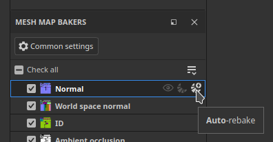
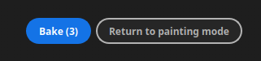

# Versión 12.1

<b>Substance 3D Painter 12.1</b> ofrece un flujo de trabajo de horneado mejorado con pintura de corrección de sesgo y rehorneado automático, compatibilidad con la definición de materiales de OpenPBR y un nuevo modo de superficie dura para el desenvolver UV automático.

Fecha de publicación: <b>22 de junio de 2026</b>

>[!NOTE]
>
> Esta versión aumenta la versión mínima compatible de macOS a 13.0 (Ventura). Para obtener más información, consulta nuestra [página de requisitos del sistema](../getting-started/system-requirements.md).

## Funciones principales

### Flujo de trabajo de panadería mejorado con pintura sesgada

El flujo de trabajo de banqueo se ha rediseñado para admitir la rebanada continua, la pintura de corrección de sesgo en malla, la protección de bordes y una lista de mapas de malla rediseñada.

* <b>Reprocesamiento automático</b>

  Un mapa de malla se puede volver a hornear continuamente a medida que se ajustan sus parámetros de horneado, lo que elimina la necesidad de activar manualmente un horneado después de cada cambio. La reconversión automática se activa por mapa y se aplica a un solo mapa cada vez. Esto resulta especialmente adecuado para el flujo de trabajo de pintura de sesgado, pero también al ajustar la configuración general de horneado.

  

* <b>Pintura de corrección de sesgo</b>

  Cuando la jaula está establecida en el modo <b>Basado en distancia</b>, las correcciones de sesgo se pueden pintar directamente en la malla de baja densidad para controlar la dirección de proyección utilizada durante la hace un bake. Las herramientas de pincel, borrador y relleno de polígono están disponibles, con un selector compacto de valores de escala de grises, simetría y los controles de pincel habituales (<b>Ctrl + clic con el botón derecho</b> para cambiar el tamaño del pincel, <b>X</b> para invertir el valor pintado). Las acciones de pintura de sesgo se pueden deshacer.

  

* <b>Protección de bordes</b>

  Cuando se pinta la corrección de sesgo, una nueva opción de protección de bordes conserva la suavidad de alta densidad proyectada en los bordes duros. Su resultado se controla mediante los parámetros <b>Distancia de borde</b> y <b>Contraste de borde</b>.

  

* <b>Lista de mapas de malla rediseñada</b>

  La lista de mapas de malla proporciona controles por mapa: cambiar un mapa por la ventana gráfica <b>preview</b>, <b>quick haga un bake</b> un solo mapa, cambiar su <b>reprocesamiento automático</b> y <b>sincronizar</b> su configuración entre los conjuntos de texturas (disponible cuando el proyecto tiene varios conjuntos de texturas). Cada control tiene información sobre herramientas al pasar el cursor.

  

* <b>Botón hacer un bake simplificado</b>

  El botón hacer un bake de ventanilla se ha reemplazado por un solo botón <b>Hacer un bake</b> que muestra el número de asignaciones que se van a hacer un bake (conjuntos de texturas x Mosaicos de UV x mapas de malla seleccionados).

  

>[!NOTE]
>
> Para obtener más información sobre cómo hacer un bake, consulte la [página de documentación dedicada](../baking/baking.md).

### Compatibilidad con OpenPBR

El modelo de sombreado de OpenPBR ahora es compatible con Painter y se utiliza como flujo de trabajo predeterminado, lo que proporciona una definición de material estandarizada que se puede llevar a todas las aplicaciones.

* <b>Nuevo sombreador de OpenPBR y flujo de trabajo predeterminado</b>

  Un sombreador que implemente la especificación OpenPBR 1.1 está disponible y se utiliza de forma predeterminada. Un nuevo proyecto creado sin una plantilla utiliza el sombreador de OpenPBR, y la primera entrada de la ventana del nuevo proyecto ahora se denomina <b>OpenPBR</b> en lugar de <b>ASM</b>. Se incluyen nuevas plantillas de proyecto para el OpenPBR y los proyectos de ejemplo se han actualizado para utilizarlas.

  

* <b>Sombreador seleccionado de la plantilla de proyecto al importar</b>

  Al importar un archivo USD o GLTF, el sombreador se establece ahora a partir de la plantilla del proyecto en lugar de adivinarse a partir del contenido del archivo. Se notifica un mensaje en el registro cuando un material y una plantilla utilizan flujos de trabajo que no coinciden.

  

* <b>Convención de nombres de OpenPBR al exportar</b>

  La ventana <b>Exportar Texturas</b> tiene un nuevo menú desplegable para elegir la convención de nomenclatura. Se establece de forma predeterminada en OpenPBR cuando al menos un sombreador del proyecto lo utiliza y el esquema seleccionado se refleja en la lista de mapas de cada conjunto de texturas.

  

* <b>Compatibilidad con USD y MDL</b>

  Los materiales de OpenPBR se admiten a través del formato USD. También se ha añadido un nuevo MDL para permitir el procesamiento de materiales de OpenPBR en Iray, lo que proporciona representaciones de materiales más precisas.

>[!NOTE]
>
> Es posible que haya que actualizar los sombreadores personalizados. El API del sombreador se ha cambiado para admitir al OpenPBR; consulte el registro de cambios disponible en el menú Ayuda de la aplicación para obtener más información.

### Nuevo desenvolvimiento automático de la superficie dura

Se ha añadido un nuevo modo de desenvolvimiento automático adaptado a los activos de superficie dura.

* <b>Modo de desajuste de superficies duras</b>

  La opción <b>Superficie dura</b> está disponible en la configuración de desajuste automático. Minimiza la distorsión UV y produce diseños UV alineados ortográficamente, lo que lo hace más adecuado para mallas mecánicas y de superficie dura.

  

>[!NOTE]
>
> Para obtener más información sobre el desempaquetado automático, consulte la [página de documentación dedicada](../features/automatic-uv-unwrapping.md).

### Miscelánea

Se han añadido funciones y mejoras adicionales en esta versión:

* <b>Agregar o quitar varios canales a la vez</b>

  Tras la presentación de OpenPBR, una nueva ventana a la que se puede acceder desde la configuración de <b>Conjunto de texturas</b> permite seleccionar varios canales a la vez, lo que resulta conveniente al configurar la lista de canales grandes que utiliza el flujo de trabajo de OpenPBR.

  * Se puede acceder a la nueva ventana en la configuración del conjunto de texturas mediante el botón <b>Agregar o quitar canales</b>.

    

  * La ventana ofrece una descripción general de todos los canales que se pueden utilizar en Painter.

    

  * El botón <b>Aplicar a todos los conjuntos de texturas</b> se puede utilizar para editar la configuración de canal de todos los conjuntos de texturas a la vez.

    

* <b>Acoplar todas las instancias en conjuntos de texturas</b>

  Hay disponible una nueva opción <b>Acoplar todas las instancias</b> en capas y grupos con instancias. Genera un resultado acoplado en todos los conjuntos de texturas en los que aparece la instancia, bajando por todo el árbol de instancias y se graba como un único paso de deshacer.

  

* <b>Historial de deshacer unificado</b>

  Los modos de hacer un bake y pintar ahora comparten el mismo historial de deshacer. El cambio entre el modo de Hacer un bake y el modo de Pintura se registra como un paso que se puede deshacer, de modo que las acciones solo se pueden deshacer en el modo en el que ocurrieron.

## Tutoriales

Echa un vistazo a nuestro último tutorial en Youtube:

## Notas de la versión

### 12.1.5

Fecha de publicación: **2026/09/15**

Resumen: **Versión secundaria**

**Corregido:**

* La exportación de imágenes de un estante a una red ya no funciona
* [Generator] Al establecer &quot;usar textura&quot; en false, no se deshabilita el uso de la entrada de textura
* Bloqueo de la ventana gráfica al guardar mientras se edita la proyección 3d
* La resolución de capas de material es demasiado baja

### 12.1.4

Fecha de publicación: **2026/09/04**

Resumen: **Versión secundaria**

**Corregido:**

* bloqueo [Bloqueo] al importar o exportar archivos cuyo nombre de archivo contiene caracteres que no son ASCII

### 12.1.3

Fecha de publicación: **2026/08/25**

Resumen: **Versión secundaria**

**Agregado:**

* Actualizar el motor de Substance a la versión 9.4.6v

**Corregido:**

* El selector [Escala de grises] permanece abierto después de cambiar la herramienta
* [Procesamiento de sesgo]: se producen saltos de corrección de sesgo al pintar y deshacer
* La herramienta de proyección [Projection Tool] bloquea la interacción de la ventana gráfica
* [Trazo dinámico]: faltan parámetros de trazo dinámico en las propiedades del pincel
* La exportación a una red ya no funciona

### 12.1.2

Fecha de publicación: **2026/08/03**

Resumen: **Versión secundaria**

**Corregido:**

* \[Bloqueo\] Algunos Substance pueden producir un bloqueo al procesarse
* \[Bloqueo\] Volver a importar la malla en el modo de procesamiento
* \[Bloqueo\] Si no se inicializa la visualización de gráficos, se puede producir un bloqueo
* \[Bloqueo\] La exportación de texturas puede bloquearse en algunos casos al actualizar el registro
* \[Crash\] Bloqueo en el modo de procesamiento en algunos casos al cargar o actualizar el mapa de entorno
* \[Horneado\] Si se vuelve a iniciar el horneado después de modificar el archivo de alta densidad, se puede producir un bloqueo
* \[Enviar a Photoshop\] No se puede exportar la máscara de capa
* \[Motor\] El resultado del punto de ancla no se procesa entre una máscara y un canal de color

### 12.1.1

Fecha de publicación: <b>2026/07/09</b>

Resumen: Versión secundaria

Añadido:

* [Horneado de sesgo] Exponer modo normal de base de sesgo: malla o por triángulo
* [Propiedades] Hacer que los colores uniformes siempre se restablezcan al valor predeterminado de su canal
* [OpenPBR] reagrupa los canales por categorías en la ventana Exportar texturas para crear plantillas de salida
* Actualizar el motor de Substance a la versión 9.4.5

Corregido:

* [Proyecto] Abrir y guardar algunos proyectos puede tardar más de lo habitual
* [Bloqueo] La recarga de varias mallas puede provocar un bloqueo
* [Bloqueo] Al eliminar un canal en el modo de vista de máscara, se produce un bloqueo
* [Bloqueo] Algunos Substance pueden producir un bloqueo al procesarse
* [Sesgar pintura] La herramienta seleccionada en el sesgo de pintura permanece seleccionada después de cambiar al modo de pintura
* [Configuración común de horneado] La configuración de la distancia de la jaula no actualiza la visualización de la malla metálica de la jaula y del sombreador
* El modo &quot;Vecino del espacio 3D&quot; del relleno UV [Engine] no funciona bien en triángulos finos
* El resultado del punto de anclaje [Engine] no se procesa entre una máscara y un canal de color

### 12.1.0

Fecha de publicación: <b>2026/06/23</b>

Resumen: <b>Esta actualización es una versión importante, contiene mejoras en los panaderos con el nuevo estado predeterminado de la interfaz de usuario para panificación, mapa de sesgo de pintura, reprocesamiento automático, nueva opción para el desempaquetado UV automático para mallas de superficie dura y OpenPBRs. Para obtener más detalles, vea las notas de la versión completas.</b>

<b>Agregado</b>:

* [Skew baking] Herramientas de pintura de sesgo
* [Skew Baking] Añada sombreador de previsualización de sesgo y elementos visuales de dirección de sesgo al pintar el mapa de sesgo
* [Skew Baking] Añadir protección de bordes, opción
* [Sesgar la cocción] Auto rehacer
* [Skew Baking] Interfaz de usuario de lista de mapas de malla de reprocesamiento
* [Sesgar horneado] Dividir mapa de malla / Configuración común de horneado + Mover ajustes comunes de la lista de mapas de malla solo en color o máscara
* [Sesgar horneado] Cambiar botones de la barra de herramientas de la ventana gráfica
* [Sesgar horneado] Mostrar alternancia de simetría para el pincel en la barra de herramientas superior
* [Skew Baking] Cambiar nombre de opciones en el menú de sincronización de lista de mapa de malla
* [Skew Baking] Cuadro de diálogo Actualizar sincronización y estado marcado
* [Sesgar horneado] Crear variante del selector de color de escala de grises
* [Sesgar horneado] Icono Actualizar modo de horneado
* [Auto Unwrap] opción Integrar superficie dura
* [OpenPBR] Añadir apoyo para el OpenPBR 1.1
* [OpenPBR] Hacer que OpenPBR sea el flujo de trabajo y el sombreado predeterminados
* [OpenPBR] Importar materiales y texturas de OpenPBR a través de USD
* [OpenPBR] Exportar materiales y texturas de OpenPBR a través de USD
* [OpenPBR] Actualice la ventana Exportar texturas para mostrar la convención de nomenclatura del OpenPBR
* [OpenPBR] Añadir documentación sobre los cambios en el OpenPBR de asistencia
* [OpenPBR] [Israel] Añádase un nuevo MDL para prestar apoyo al OpenPBR 1.1 de Israel
* Varias mejoras menores de las exportaciones en dólares
* [UI] Añada una advertencia en la ventana gráfica al intentar pintar en otro conjunto de texturas
* [Aplanar] Permite acoplar todas las capas con instancias en los conjuntos de texturas
* [Ajustes del conjunto de texturas] Permite seleccionar varios canales a la vez mediante una nueva ventana
* [Historial] Actualizar &quot;valor&quot; Deshacer texto de entrada para reflejar el nombre del parámetro
* [Pila de capas] Hacer que los efectos de relleno de las máscaras se vean en blanco de forma predeterminada (1.0)
* [Substance] Añadir nueva entrada de mapa del motor &quot;mesh_hard_edges_triangle&quot;
* [Substance] Añadir nueva entrada de mapa del motor &quot;mesh_hard_edges&quot;
* [Shader] Evita que las instancias de sombreado compartan los mismos nombres
* [Shader] Utilice el sombreado de la plantilla de proyecto al importar un archivo USD o GLTF
* Actualizar Adobe Color Engine a la versión 7.0
* Actualizar la versión mínima de MacOSX a 13.0 (Ventura)
* [Contenido] Nuevas plantillas de proyecto para el OpenPBR
* [Contenido] Actualizar proyectos de muestra para utilizar el nuevo sombreador de OpenPBR
* [Python] Amplía la API de máscara de geometría para permitir modos de inclusión y exclusión como en la interfaz de usuario

<b>Corregido</b>:

* [Bloqueo] [Configuración de mapas de malla] Aplicación de ajustes a otros conjuntos de texturas
* [Bloqueo] Al hornear la curvatura desde el mapa sin el espacio normal del mundo
* [Bloqueo] [Horneado] Horneado con la jaula personalizada activada, pero sin seleccionar ningún archivo se bloquea
* [Bloqueo] Cancelación del procesamiento de archivos AO
* [Auto-Cage] Carga infinita cuando la ruta del archivo de poli alto no es válida
* [Linux] [Windows] En ocasiones, el selector de color puede ser completamente negro o no aparecer
* [Herramienta Relleno poligonal] La herramienta no funciona con PBR
* &lbrack;[Paint] Al eliminar el canal de color base no se elimina el color pintado anteriormente
* [USD] No se detectan correctamente todas las instancias de sombreado
* [Substance] Solo se tiene en cuenta el primer uso de un nodo de entrada/salida
* [Sombreado] La Oclusión ambiental se aplica dos veces con conjuntos de texturas mediante diferentes métodos de mezcla
* [Motor] Las texturas normales con un canal azul vacío (negro) pueden producir resultados de mezclas incorrectos
* [Importación GLTF] La fusión alfa está activada en todos los conjuntos de texturas
* [GLTF Export] La fusión de Alpha siempre está activada al exportar
* [Exportar] La geometría de doble cara siempre está desactivada al importar un archivo GLTF
* [Javascript] La modificación de la configuración de los sombreadores no contribuye al historial de deshacer
* [Muestras] La dispersión subsuperficial no está activada en Configuración de visualización para Meet Mat
