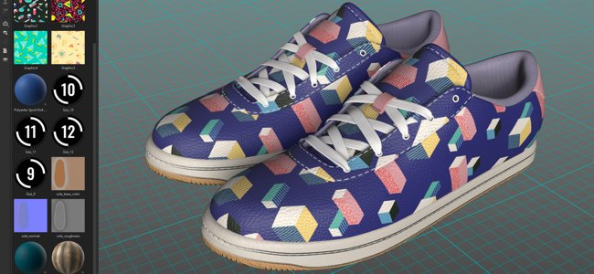
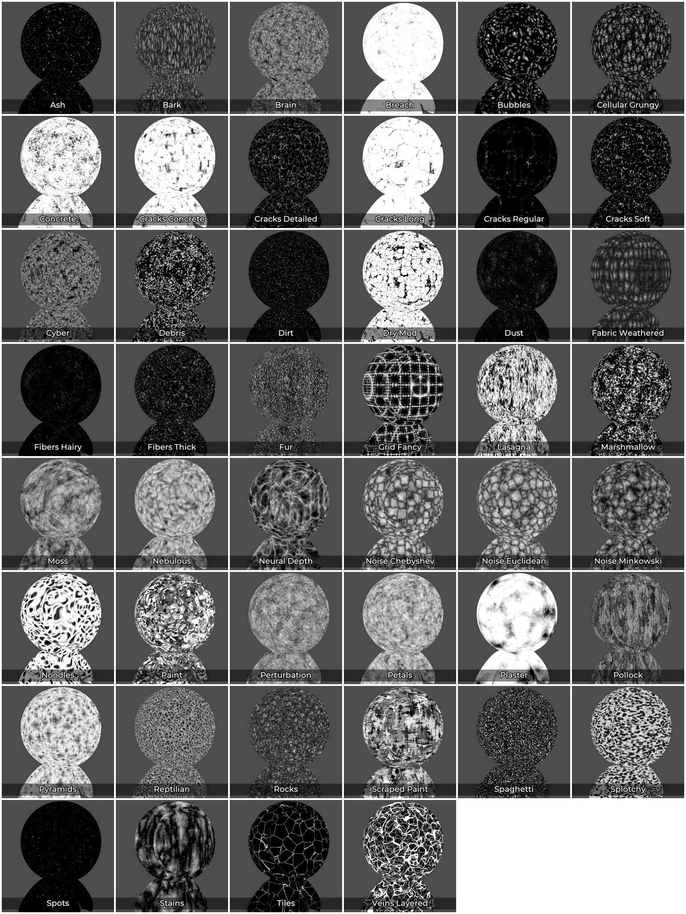

# Versión 8.1

**Substance 3D Painter 8.1** integra el Adobe Color Engine (ACE) con soporte para perfiles ICC, nuevos bakeres, nuevos sonidos 3D y 20 mapas de suciedades, y un cuentagotas mejorado.

Fecha de publicación: *7 de junio de 2022*

## Funciones principales

### Nueva gestión de color con Adobe Color Engine (compatibilidad con ICC)

En esta nueva versión, el sistema de gestión de color se ha ampliado con la ayuda del Adobe Color Engine (ACE) que desbloquea el uso de perfiles ICC. Este nuevo sistema permite hacer coincidir los colores en una amplia gama de aplicaciones, incluida Photoshop.

* **Nueva configuración de proyecto**\
  Al crear un nuevo proyecto, ahora es posible especificar el motor de administración de color con el **Adobe Color Engine** (ACE) recién agregado.

  {width="400px"}

  ACE incluye el siguiente espacio de color de trabajo:

  * **sRGB lineal**
  * **ACEScg**
  * **Adobe RGB lineal**
* **Supervisar la compatibilidad con el perfil ICC**\
  Puede utilizar su perfil ICC para ajustar el aspecto de la ventana gráfica y hacer que los colores coincidan con su monitor.

  {width="400px"}

* **Importar y exportar imágenes con perfiles ICC incrustados**\
  Al importar mapas de bits, el perfil ICC se puede extraer automáticamente. También es posible anular ese perfil en las propiedades de capa.\
  Al exportar, es posible especificar el perfil ICC previsto que se incrustará en los archivos de textura.

  {width="400px"}

* **Nueva configuración de plantilla json** Para compartir y reutilizar la configuración entre proyectos, es posible especificar un archivo de ajuste preestablecido. Para obtener más información sobre las especificaciones de los ajustes preestablecidos, consulte la [documentación dedicada](../features/color-management/color-management-with-adobe-ace-icc.md).

>[!NOTE]
>
> Para obtener más información, consulte la documentación de [administración de color](../features/color-management/color-management.md).

### Nueva compatibilidad de tamaño físico para materiales Substance

El tamaño dentro de los materiales de Substance ahora se puede utilizar para aumentar su escala y el mosaico dentro de las proyecciones de la capa de relleno. Esta es una herramienta útil para hacer coincidir adecuadamente los materiales en las superficies de acuerdo con su tamaño real sin la necesidad de adivinar.

* **Nuevos parámetros de capa de relleno**\
  Una capa de relleno (o efecto) tiene nuevos parámetros para controlar el mosaico/repetición de un material si tiene definido un tamaño físico. Estos nuevos parámetros solo están disponibles con proyecciones 3D.

  {width="400px"}

* **Nueva cuadrícula de ventanilla**\
  Para que el tamaño físico sea más fácil de entender y visualizar, ahora es posible activar una cuadrícula en la ventana gráfica 3D a través de la ventana [Configuración de pantalla](../interface/display-settings/display-settings.md).\
  Una vez activada, la cuadrícula se subdividirá automáticamente en función del nivel de zoom. La unidad de cuadrícula se indica en la parte inferior izquierda de la ventana gráfica.

  {width="400px"}

  {width="400px"}

>[!NOTE]
>
> Para obtener más información, consulte la [documentación dedicada](../features/physical-size.md).

### Nuevos bakeres

Estas tres nuevas incorporaciones acortan la distancia entre Designer y Painter para ampliar las posibilidades de texturizado y renderizado.

Se han añadido a la lista de panaderos, pero están desactivados de forma predeterminada:

Los nuevos bakeres son:

* **baker de Normales dobladas** El baker de Normales dobladas permite hacer un bake una dirección de oclusión (como un vector, similar a los mapas de normales). Esta textura se puede usar para mejorar el sombreado en la ventana gráfica habilitando la configuración **Bent Normal** en la ventana [configuración de Sombreador](../interface/shader-settings/shader-settings.md). Las normales dobladas mejoran enormemente la precisión del sombreado de la ventana gráfica en tiempo real.\
  Para el **sombreado difuso**, proporciona una oclusión más precisa e incluso puede parecer una iluminación global aproximada (el primer ejemplo a continuación).\
  Para los **reflejos de specular**, permite simular el sombreado automático y reducir la cantidad de fuga de luz, lo que hace que el objeto se sienta mucho más conectado a tierra, especialmente con superficies metálicas (segundo ejemplo a continuación).

  {width="350px"}

  {width="400px"}

* **panadero de Heightes**\
  El baker de Height permite hacer un bake la diferencia entre la malla baja y alta en polo como una textura en escala de grises que podría utilizarse para producir desplazamiento en mallas teseladas. Por ejemplo, al hacer un bake información de exploración en un plano.

  {width="400px"}

* **Panadero de opacidad**\
  El baker Opacidad produce un mapa en blanco y negro que muestra los agujeros de una malla de alta densidad. Por ejemplo, se puede utilizar para hacer un bake vallas o incluso agujeros dentro de una superficie de tela.

### Nuevo contenido

En esta versión se ha añadido una variedad de contenido nuevo, entre los que se incluyen:

* **Ruidos 3D nuevos y mejorados con más de 100 ajustes preestablecidos**\
  Los ruidos 3D existentes se han rediseñado y se han añadido tres nuevos. Cada uno de ellos incluye ahora ajustes predefinidos que aportan un total de 105 ajustes preestablecidos en 7 ruidos. Estos ajustes preestablecidos se pueden utilizar como punto de partida para jugar con sus parámetros y obtener un aspecto específico. Como siempre sucede con los ruidos 3D, son perfectos y se pueden repetir muy fácilmente sin un patrón apreciable.

  Para encontrar los ruidos 3D, simplemente vaya a la sección de procedimientos del panel Activos:

  {width="400px"}

  Los ruidos ofrecen una amplia gama de posibilidades, aquí están por ejemplo los ajustes preestablecidos disponibles con el **3D voronoi fractal**:

  {width="300px"}

* **20 nuevos mapas de bits de suciedad y 2 patrones de tela**\
  Se ha añadido un nuevo conjunto de grunges con el contenido predeterminado para ampliar la gama existente de patrones. Se encuentran en **Procedurals > Grunges Bitmap**.\
  También hay disponibles dos patrones de tela en **Procedurals > Fabric**.

  {width="400px"}

>[!NOTE]
>
> Algunos de los ruidos 3D pueden tardar unos segundos en calcularse durante su primer uso.

### Cuentagotas y selector de materiales mejorados

Se han realizado varias mejoras en el cuentagotas para facilitar la extracción y administración de los colores.

* **Nuevo modo de picking**\
  Al seleccionar colores, ya no es necesario presionar y mantener pulsado el clic del ratón mientras lo mueve. Ahora es posible hacer un solo clic en el cuentagotas, mover el ratón a la ubicación deseada y hacer clic de nuevo para capturar un color.

* **Nuevos botones de cuentagotas**\
  Junto a los botones de color hay un nuevo icono de cuentagotas que se puede utilizar para capturar colores sin tener que abrir primero el selector de color.

  {width="400px"}

* **Nuevo método abreviado de cuentagotas**\
  Cuando la ventana del selector de color esté abierta, también puedes presionar **I** para entrar en el modo de cuentagotas sin necesidad de hacer clic en el icono dedicado, lo que facilita la iteración rápida entre el picking y la pintura.

* **Nueva vista previa al colocar los ojos**\
  Al utilizar el cuentagotas para seleccionar un color, no se ve una nueva previsualización junto al ratón. Esta previsualización también tiene gestión de color.

  

* **Nueva selección directamente en un canal**\
  Con el nuevo comportamiento del cuentagotas, ahora es posible seleccionar directamente en un canal de la malla. Para ello, simplemente pulse y mantenga pulsada la tecla MAYÚS para seleccionar un color directamente del canal. El canal se determina desde donde se ha iniciado el cuentagotas. Este método omite cualquier transformación de color que sea importante en la gestión de color para recuperar colores precisos. Aparecerá información sobre herramientas para indicar desde qué canal se captura el color.

  

* **Nueva configuración de espacio de color al capturar un color**\
  Cuando la gestión de color está activada, hay disponible un nuevo ajuste en el selector de color para especificar el espacio de color utilizado al capturar colores. Esta configuración es global para la sesión de Painter y se aplicará también al botón de cuentagotas situado junto a los botones de color en la ventana de propiedades.

  

* **Comportamiento mejorado del selector de materiales**\
  El selector de materiales de la barra de herramientas Herramientas (método abreviado del teclado P) ahora respeta la selección de canales dentro de la ventana de propiedades. Ya no se activará por los canales en sí.

  {width="400px"}

### Desempaquetado automático mejorado

El proceso de desenvolvimiento automático de UV ahora proporciona una segmentación más natural.

Ahora las mallas se cortan en Islas de UV separadas usando un método se acerca a lo que se puede hacer a mano, especialmente en mallas orgánicas.

## Notas de la versión

### 8.1.0

*(Publicado El 7 De Junio De 2022)*

**Agregado:**

* [Gestión de color] Añadir compatibilidad con perfiles ICC mediante Adobe Color Engine (ACE)
* [Gestión de color] Añada compatibilidad con &quot;RGB de Adobe 98&quot; como espacio de color de trabajo para ICC
* [Gestión de color] Permitir la configuración de ACE/ICC mediante un archivo de configuración
* [Gestión de color] Permitir la entrada de valores de color lineal en el Selector de color con el modo Heredado
* [Gestión de color] Permite especificar el perfil de color utilizado para seleccionar el color fuera de la interfaz de usuario
* [Gestión de color] Recordar el último valor de visualización elegido en la ventana gráfica
* [Gestión de color] [Substance] Hacer que los generadores/filtros funcionen correctamente con la gestión de color
* [Gestión de color]&#x200B;[Substance] Añadir nuevas palabras clave de anulación de espacio de color $working y $standardsrgb
* [Tamaño físico] [Motor] Extraer información de tamaño físico de la malla
* [Tamaño físico] [Motor] Cálculo del Tamaño físico
* [Tamaño físico] Opciones de exposición para utilizar tamaño físico en la interfaz de usuario
* [Tamaño físico] Añadir ayudantes visuales en la ventana gráfica
* [Horneando] Añadir panadero de Height
* [Horneado] Añadir el panadero de normales dobladas
* [Horneado] Añadir el panadero de opacidad
* [Cuentagotas] Nueva previsualización del selector de color
* [Cuentagotas] El panel del selector de color vuelve a aparecer en su última posición cuando se vuelve a abrir
* [Cuentagotas] Un nuevo icono para el Selector de material
* [Cuentagotas] Color para administrar la vista previa del canal del selector de color
* [Cuentagotas] Añada la funcionalidad de hacer clic para seleccionar al cuentagotas
* [Cuentagotas] El selector de material ya no activa los canales no activos
* [Cuentagotas] Permitir el uso del cuentagotas con un método abreviado
* [Cuentagotas] El cuentagotas selecciona el canal correspondiente, cuando corresponde
* [Cuentagotas] Al entrar en el modo del selector de color se desactivan todos los métodos abreviados
* [Cuentagotas] Eliminación de la selección automática del campo hexadecimal
* [Cuentagotas] No cerrar el panel al utilizar el selector de material
* [Cuentagotas] Nuevo estado deshabilitado cuando el canal no está disponible para seleccionar
* [Export] Añadir atributo de tangente a la exportación glTF
* Actualizar Substance Engine a v8.4
* Actualizar Auto Unwrap a 0.9.0
* Actualizar a Qt 5.15.8
* Actualizar a Python 3.9
* [Sombreador] Añadir compatibilidad con el sombreado de Normales dobladas
* [MacOS] Compatibilidad con SpaceMouse de conexión 3D
* [Python] Documentar la versión de Python utilizada en la API
* [Contenido] Añade 6 nuevos sonidos 3D con 105 ajustes preestablecidos
* [Contenido] 20 nuevos mapas de suciedad y 2 patrones de pliegues de tela
* [Contenido] Actualizar el ajuste preestablecido &quot;Mapas de malla&quot; para utilizar nuevos bakeres
* [Contenido] La Pendiente de desenfoque y el filtro de deformación dependen de la resolución del conjunto de texturas
* [Contenido] Actualizar proyectos de muestra para utilizar los 3 nuevos bakeres

**Corregido:**

* [glTF] No se puede abrir glTF con un carácter especial
* [Motor] Artefactos con anisotropía y SVT desactivados
* [MacOS]&#x200B;[M1] Los Materiales inteligentes no se muestran correctamente
* [Procesamiento de malla] No se pueden importar mallas desde Modeler
* [UI] Barra de desplazamiento horizontal en la ventana de nuevo proyecto con la gestión de color habilitada
* [Gestión de color] Falta el valor del espacio de trabajo en el selector de color con algunas configuraciones de OCIO
* [Gestión de color] La previsualización del pincel en la ventana gráfica no tiene gestión de color
* [SpaceMouse] La tabla dinámica no se actualiza inmediatamente con el cambio de enfoque y, a veces, se sale del modelo
* [Exportar] [USD] Los archivos de USD exportados tienen una estructura incorrecta
* [USD] Problema de Oclusión ambiental al exportar
* [Contenido] Actualice la malla de la miniatura para que coincida con el proyecto de ejemplo Previsualizar esfera

**Problemas conocidos:**

* La exportación de texturas mediante relleno de difusión produce mapas negros
* La mezcla normal o de Oclusión ambiental no funciona
* [MacOS] Bloqueo al lanzar Iray en algunos casos raros
* [Vista previa en miniatura] Las miniaturas simplificadas no se actualizan cuando se utiliza un delimitador
* [Gestión de color] HDR. las conversiones de espacio de color con ACE en Linux producen colores con sujeción
