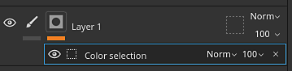
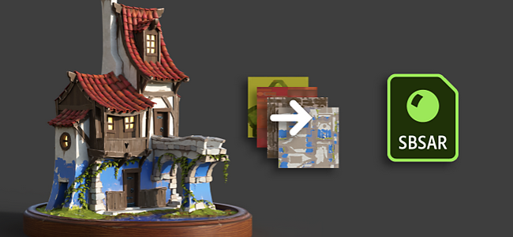
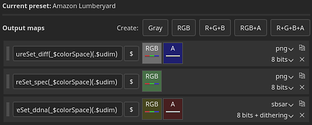
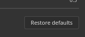
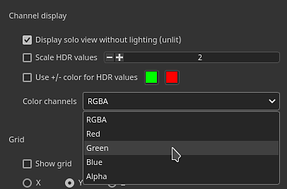
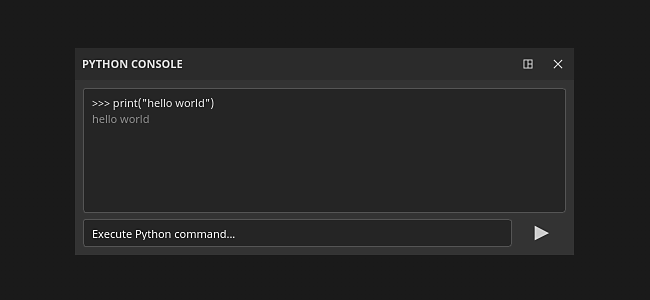

# Versión 8.2

**Substance 3D Painter 8.2** se centra en muchas mejoras de la calidad de vida con funciones dedicadas en varias áreas de la aplicación.

Fecha de publicación: *6 de octubre de 2022*

## Funciones principales

### Nuevas opciones para aplicar modos de fusión y opacidad

Se han añadido varios métodos abreviados y acciones para que sea rápido y fácil copiar y aplicar modos de fusión y la opacidad en varios canales en la pila de capas.

* **Haga clic con el botón derecho en un modo de fusión o control de opacidad**\
  Al hacer clic con el botón derecho en un modo de fusión o en una opacidad, seleccione la acción **Aplicar a todos los canales** para utilizar este modo de fusión en todos los demás canales de la capa. Esta acción también está disponible en los efectos que tienen controles de modo de fusión y opacidad.

  

* **Haga clic con el botón derecho en una capa y elija Opciones de fusión**\
  También es posible hacer clic con el botón derecho en una capa (o efecto) y elegir una de las siguientes acciones:

  * **Aplicar fusión a todos los canales**: aplique el modo de fusión de canal actual a todos los demás canales de la capa o efecto actual.
  * **Aplicar opacidad a todos los canales**: aplique la opacidad del canal actual a todos los demás canales de la capa o efecto actual.
  * **Aplicar ambos canales**: aplique el modo de fusión de canal actual y la opacidad a todos los demás canales de la capa o efecto actual.
  * **Copiar configuración de fusión de canales**: Copie todos los modos de fusión y los valores de opacidad de la capa o efecto actual en el portapapeles.
  * **Pegar configuración de fusión de canales**: Aplique los modos de fusión y los valores de opacidad que hay actualmente en el portapapeles a la capa o efecto de destino.

  

### Nuevo modo de fusión y opacidad en los efectos de filtro y selección de color

Los efectos de filtro y selección de color ahora tienen la posibilidad de utilizar modos de fusión y controles de opacidad.

* **Modo de fusión y opacidad en los filtros**\
  Los filtros ahora pueden utilizar modos de fusión y valores de opacidad. De forma predeterminada, se establece **Replace** para conservar el mismo comportamiento que antes y evitar que se duplique la información del componente alfa. Los modos de fusión en los filtros permiten calcular efectos y combinar sus resultados directamente en las capas, evitando la necesidad de utilizar puntos de ancla y efectos de relleno para lograr el mismo resultado. Esto también evita la necesidad de implementar manualmente modos de fusión dentro del propio filtro.

  

* **Modo de fusión y opacidad en la selección de color**\
  El efecto de selección de color se ha modificado para admitir los modos de fusión y los controles de opacidad. Anteriormente, este efecto generaba un resultado alfa y, para que los modos de fusión funcionen como se esperaba, se ha añadido un nuevo ajuste para especificar el color de fondo que se genera. Se establece en negro en lugar de transparente (que es el comportamiento heredado).

  

  

* **Pila de efectos simplificada**\
  Anteriormente, cuando era necesario combinar los efectos de ciertas formas (con la ayuda de los modos de fusión, por ejemplo), el uso de puntos de ancla y efectos de relleno era necesario. Ahora, con los modos de fusión directamente en los filtros, ya no es necesariamente lo que puede reducir significativamente la complejidad de la pila de efectos.

  {width="400px"}

### Nuevos efectos en carpetas

El contenido de la carpeta (la parte de color de una capa) ahora puede recibir efectos de cualquier tipo. Antes era necesario crear configuraciones de capa complejas (como capas de paso a través o puntos de anclaje) para lograr el mismo resultado.

### Exportación del nuevo archivo de Substance (SBSAR)

El formato de archivo de almacenamiento de Substance (SBSAR) ahora está disponible al exportar texturas. Un SBSAR es un contenedor que se puede abrir en muchas aplicaciones con integración Substance, lo que puede hacer que sea más rápido y fácil &quot;conectar y reproducir&quot; texturas personalizadas.

* **Exportando un archivo de Substance (SBSAR)**\
  Ahora es posible especificar el formato de archivo SBSAR de la lista de formatos de archivo en la ventana **Exportar texturas**. Esto exportará un único archivo SBSAR que contenga todas las texturas especificadas. La denominación de los nodos de salida y sus usos se define a partir del ajuste preestablecido de exportación seleccionado y sus tipos de canal.

  

* **Ajustes preestablecidos de exportación híbridos con formatos de archivo PSD y SBSAR**\
  Los ajustes preestablecidos de exportación ahora pueden especificar mapas de salida como PSD o SBSAR, además de todos los demás formatos de imagen. Los formatos PSD y SBSAR se consideran &quot;contenedores&quot;, lo que significa que se pueden almacenar varias texturas en su interior. Cuando un ajuste preestablecido de exportación especifica formatos de contenedor y formatos de imagen independientes, todos los resultados de la plantilla que tengan como destino un archivo SBSAR se agruparán mientras que los demás resultados se exportarán como archivos individuales.

  

### Nueva opción de entorno para iluminarse bajo modelos 3D

Un nuevo ajuste dentro de [Configuración de la pantalla](../interface/display-settings/environment-settings.md) permite alinear el mapa del entorno con la cámara, lo que permite ajustar el ángulo de iluminación y iluminar partes debajo del modelo 3D.

Para usar esta nueva configuración, ve a [Configuración de pantalla](../interface/display-settings/environment-settings.md) y cambia la configuración de **Alineación del entorno**:

* **Mundo**: el mapa de entorno se alinea con la escena.
* **Local**: el mapa de entorno se alinea con la cámara.

Las sombras se ajustarán automáticamente en función de la configuración de esta opción.

### Nuevos favoritos y eliminar/volver a cargar en la ventana Activos

Se han agregado nuevas acciones a la ventana [Activos](../interface/assets/assets.md) para que la administración de recursos sea más cómoda.

* **Recursos favoritos para encontrarlos rápidamente**\
  Haga clic con el botón derecho en cualquier recurso de la ventana Activos para marcarlo como favorito (o no favorito). Los recursos favoritos siempre aparecen en primer lugar en la línea de las consultas de búsqueda con una pequeña etiqueta de estrella en la esquina, lo que hace que destaquen y sean accesibles. También se ha añadido una consulta de búsqueda dedicada, lo que facilita la visualización de todos sus recursos favoritos.

  {width="350px"}

* **Eliminar y volver a cargar recursos en el disco**\
  Los recursos ubicados en las bibliotecas de usuario ahora se pueden eliminar, volver a cargar o cambiar de nombre (excepto los recursos que forman parte de un paquete, como los gráficos de Substance o los pinceles ABR).

### Funciones y mejoras diversas

Se han añadido muchas pequeñas mejoras y funciones adicionales en esta nueva versión:

* **Nueva ventana de bienvenida y novedades**\
  Para estar al tanto de las nuevas funciones añadidas a la aplicación, presentamos una nueva ventana Bienvenido y Novedades al iniciar la aplicación. Esa ventana se puede cerrar fácilmente y no volverá a aparecer en los próximos inicios. Siempre es posible volver a abrirlas a través del menú **Ayuda**.

  {width="400px"}

  {width="400px"}

* **Nueva acción para volver a importar rápidamente un modelo 3D**\
  Se ha agregado un nuevo método abreviado de teclado (**CTRL+MAYÚS+R** de forma predeterminada) que permite volver a importar rápidamente el modelo 3D del proyecto actual. Esto hace que la iteración en un activo sea más fácil y rápida. Si no se encuentra el archivo de origen, se generará un mensaje de error en el registro. También se ha agregado una acción al menú **Editar**.

  

* **Compatibilidad mejorada con HDPI**\
  Se han realizado varias correcciones con respecto a las pantallas HDPI y la escala del sistema. Ahora se admiten valores de escala intermedios (p. ej. 125%), lo que debería evitar que la interfaz sea demasiado grande o demasiado pequeña en ciertas pantallas. Las ventanas que se mueven entre pantallas HDPI con diferentes valores de escala también deben comportarse correctamente.

* **Restablecer los parámetros del gráfico del Substance a los predeterminados**\
  En todas partes se utiliza un gráfico Substance (como alfa, materiales, filtro, etc.) ahora es posible restablecer sus parámetros por defecto.

  * **Restablecer todos los parámetros**: Utilice el botón restaurar valores predeterminados situado debajo de la lista de parámetros para restablecer todo el recurso de Substance.
  * **Clic con el botón derecho**: Haga clic con el botón derecho en un parámetro específico para abrir un menú con una acción de restablecimiento específica para este parámetro.

   

* **Ver componentes RGBA individuales en ventanas gráficas**\
  Al ver un canal en las ventanas gráficas, hay una nueva configuración denominada **Canales de color** en **Configuración de pantalla > Visualización de canal** que permite ver los componentes RGBA individualmente. Esto puede resultar útil para analizar texturas o aislar componentes específicos dentro de los canales de usuario.

  

  {width="450px"}

* **Capas y efectos de relleno de mosaico posteriores a 128**\
  El parámetro de segmentación de las capas y efectos de relleno se ha modificado para que tenga un rango suave. Esto permite ahora escribir el valor de mosaico que desee. El rango predeterminado del regulador también se ha reducido de [-128,128] a [-32,32] para facilitar el arrastre.

  

* **Nueva configuración de exportación de texturas EXR 16f y 32f**\
  Anteriormente, la exportación de texturas EXR se forzaba a 32f bit en la interfaz, pero dentro del archivo real resultaba en datos de 16f bit (flotante medio). Ahora se ha solucionado y existe la posibilidad explícita de elegir entre bits de 16f y 32f. Los proyectos antiguos y los ajustes preestablecidos de exportación que utilizan EXR como formato de archivo se establecerán de forma predeterminada en bits de 16f para respetar el antiguo comportamiento (principalmente para evitar que se generen archivos más pesados que antes).

  

* **Exportar y volver a cargar diseños de interfaz de usuario**\
  Las nuevas acciones para guardar y volver a cargar el diseño de la interfaz de usuario se encuentran en el menú **Windows**. Esto hace que sea más cómodo cambiar entre diferentes diseños o guardar y reutilizar una interfaz de usuario en los equipos. Los dos modos actuales de Painter, Procesamiento y Pintura, tienen sus propios diseños. Algunas funciones también están disponibles en Python para permitir guardar y volver a importar el diseño de la interfaz de usuario (ver a continuación).

  

* **Menú Archivo reorganizado**\
  Hemos eliminado el menú de archivos agrupando varias funciones avanzadas de guardado. También se ha cambiado el nombre de algunas de estas acciones para aclarar su comportamiento.

  

* **Se ha mejorado el mensaje de error al abrir proyectos que son demasiado recientes.**\
  Ahora se muestra un mensaje más útil al abrir proyectos realizados con una versión más reciente de la aplicación. El mensaje ahora incluye tanto las versiones del proyecto como de la aplicación, lo que permite estar mejor informado sobre la versión requerida.

  {width="400px"}

### Scripts de Python mejorados

Se han añadido varias funcionalidades nuevas a la API de Python. Para obtener más información, consulte la documentación disponible en el menú Ayuda de la aplicación.

* **substance\_painter.resource**\
  **substance\_painter.resource.Type** ahora permite identificar más tipos de recursos, en particular paquetes de pinceles de Substance y Photoshop.\
  Los objetos de recursos ahora pueden enumerar sus elementos principales y secundarios, lo que permite navegar entre paquetes de Substance y gráficos de Substance, por ejemplo.

* **substance\_painter.textureset**\
  Se han añadido dos nuevas funciones (y una enumeración) para obtener y establecer mapas de malla en los ajustes de Conjunto de texturas: **get\_mesh\_map\_resource()** y **set\_mesh\_map\_resource()**

* **substance\_painter.ui**\
  Se han añadido varias funciones para guardar y volver a cargar el diseño de la interfaz de usuario. Tenga en cuenta que el diseño también depende del modo de aplicación actual (Pintar o Procesar).

* **substance\_painter.event**\
  Se ha agregado un nuevo **TextureStateEvent** para ayudar a realizar el seguimiento de las modificaciones en la pila de capas de conjuntos de texturas, así como de otros cambios en los parámetros. Este evento se activa al realizar trazos de pintura o al añadir o quitar canales.

## Notas de la versión

### 8.2.0

*(Lanzado: 6 de octubre de 2022)*\
Resumen: **Versión principal con nuevos paneles de incorporación (nuevo panel de bienvenida y nuevo panel), exportación a SBSAR, efectos para carpetas, varias mejoras para la calidad de vida y correcciones de errores.**

**Agregado:**

* [Onboarding] Panel de incorporación para dar la bienvenida a nuevos usuarios

  Se ha añadido una nueva pantalla de bienvenida cuando los nuevos usuarios de CC abren Painter por primera vez.
* [Incorporación] Panel Novedades para mejorar la detección de nuevas funciones

  Se ha añadido una nueva pantalla Novedades que muestra las principales funciones nuevas. Se muestra automáticamente la primera vez que se abre Painter después de una actualización importante, y se puede volver a acceder a él a través de Ayuda > Novedades.
* [Onboarding] Cambiar el nombre de la versión antigua Bienvenido a la &quot;pantalla de inicio&quot;

  Se ha cambiado el nombre de la pantalla de bienvenida para evitar confusiones con la nueva pantalla de bienvenida.
* [UI] Resolver problemas de escalado de pantallas de alta resolución

  Se ha mejorado la adaptación de la interfaz de usuario de Painter en pantallas de alta definición con escala de visualización personalizada.
* [UI] Evite los mensajes de error persistentes en la IU

  Los mensajes de error de proyectos anteriores ahora se eliminan de la barra de estado inferior.
* [UI] Menú para guardar repeticiones

  Las opciones de guardado adicionales ahora se agrupan en un submenú y se cambia el nombre de algunas de ellas por coherencia.
* [IU] Guardar y exportar/compartir diseños de IU

  En el menú Ventana hay nuevas acciones para guardar el diseño de interfaz de usuario en archivos y volver a cargarlos. Los diseños de pintura y procesamiento se guardan por separado.\
  Se han añadido varias funciones a &quot;substance\_painter.ui&quot; para guardar, restablecer y cargar diseños de interfaz de usuario también.
* Añadir acciones de copiar/pegar para los modos de fusión/opacidad de una capa

  Se ha añadido una nueva entrada &quot;Opciones de fusión&quot; en el menú contextual de las capas. Permite copiar y pegar el modo de fusión y la opacidad de todos los canales de una capa a otra.
* Aplicar el modo de fusión/opacidad a todos los canales de una capa

  Se ha añadido una funcionalidad de clic con el botón derecho al modo de fusión y la opacidad de las capas, lo que permite aplicar la configuración en la que se ha hecho clic a todos los canales.
* Volver a cargar la malla con un método abreviado de teclado (CTRL+MAYÚS+R)

  Se ha añadido un método abreviado editable para volver a cargar el archivo de malla con los últimos ajustes disponibles. También se puede acceder a través de Editar > Reimportar malla.
* Restablecer los parámetros del Substance a sus valores predeterminados

  Se ha añadido un nuevo botón en Propiedades en la parte inferior de los recursos .sbsar que permite restablecer el recurso a los valores predeterminados.
* Restablecer el pincel a sus valores predeterminados

  Se ha añadido un nuevo menú a la sección Pincel en Propiedades que permite restablecer el pincel básico predeterminado.
* Haga clic con el botón derecho para restablecer los parámetros individuales del Substance a sus valores predeterminados

  Se ha añadido la posibilidad de restablecer parámetros individuales dentro de un recurso .sbsar haciendo clic con el botón derecho.
* [Panel de activos] &quot;Fijar&quot; los activos favoritos para que aparezcan en la parte superior del panel de activos

  Se ha añadido una nueva opción de clic con el botón derecho en los activos de la biblioteca que permite fijarlos como favoritos en la parte superior del panel. También puede ver todos sus activos favoritos a través de Búsquedas guardadas.
* [Panel Activos] Eliminar, volver a cargar y cambiar el nombre de los activos

  Se han añadido opciones de menú contextual para eliminar, volver a cargar y cambiar el nombre de los activos en la biblioteca del usuario. Se eliminan directamente de la ubicación de su biblioteca en el disco y se vuelven a cargar desde la ubicación original. Los activos que forman parte de un paquete como .abr o .sbsar no se pueden editar individualmente.
* [Selección de color] Añadir modos de fusión al efecto Selección de color
* [Pila de capas] Añadir modo de fusión y opacidad en los filtros
* [Pila de capas] Permitir valores de mosaico mayores que 128 para capas/efectos de relleno
* [Pila de capas] Tapones de cilindro para proyección cilíndrica en capa de relleno/efecto

  La proyección cilíndrica en Propiedades de capa de relleno ahora tiene la opción de eliminar tapas de cilindro.
* [Log] Mostrar un mensaje de error si las partes de la malla están en espacio negativo al intentar crear un proyecto de UV Tile

  Se ha añadido un mensaje de error más claro al no crear un proyecto de mosaico UV porque las partes UV se encuentran en espacios negativos.
* [Project] Indica la versión en el mensaje de error &quot;Datos demasiado recientes&quot; al abrir un proyecto

  Al abrir un proyecto que es demasiado reciente para la aplicación, el mensaje de error indicará ahora la versión del proyecto para que sea más fácil identificar la versión correcta de la aplicación.
* [Ventana gráfica] Permite iluminar la malla desde abajo

  Se ha añadido un nuevo parámetro Alineación del entorno en Configuración de la pantalla > Cámara > Configuración del entorno para alinear la iluminación del mapa de entorno con la cámara cuando se establece en &quot;Local&quot;.
* [Ventana gráfica] Ver R, G, B y Alpha en la ventana gráfica (modo de visualización individual)

  En Configuración de visualización > Configuración de ventana gráfica > Visualización de canal , hay un nuevo ajuste de Canales de color que solo permite mostrar el componente R, G, B o Alpha de un canal en el modo de visualización única.
* [Shader] Permite definir canales de usuario como RGBA en sombreadores de capas de material

  Al definir la configuración del conjunto de texturas para los canales dentro de un sombreado para la capa de material, ahora es posible especificar el formato del canal para que se desvíe del valor predeterminado. Esto permite en particular solicitar canales de usuario de color en lugar de solo en escala de grises.
* [Exportar] Permitir la exportación de texturas como SBSAR

  Al exportar texturas a través de la ventana Archivo > Exportar texturas, se puede elegir el formato de archivo SBSAR (Archivo de Substance) para reagruparlas. El contenido de la SBSAR depende de la plantilla de salida utilizada.\
  El formato de archivo SBSAR también se puede establecer en los ajustes preestablecidos de exportación. Cuando se utiliza una configuración híbrida (SBSAR + otro formato), las texturas que tienen como destino un SBSAR se agrupan mientras que el resto se exporta junto a él.
* [Exportar] Opción de exposición de 16 bits para el formato de archivo EXR

  Al exportar archivos de texturas EXR, ahora es posible elegir 16f bit (Half-Float) o 32f bit (Float) en la ventana Exportar texturas (tanto para ajustes de exportación como para ajustes preestablecidos de exportación). Los proyectos antiguos y los ajustes preestablecidos de exportación antiguos se establecerán de forma predeterminada en 16f bit para reflejar el comportamiento antiguo.
* [Python] Añadir evento para saber cuándo se modifican los conjuntos de texturas

  El nuevo &quot;substance\_painter.event.TextureStateEvent&quot; permite saber cuándo se ha modificado un conjunto de texturas debido a un trazo de pintura, un nuevo canal añadido o un canal eliminado.
* [Python] Permitir obtener y establecer recursos de mapa de malla en los ajustes de Conjunto de texturas

  Se han añadido nuevas funciones en el módulo &quot;substance\_painter.project&quot; para obtener y definir recursos de mapas de malla. Estas funciones se pueden utilizar para actualizar los mapas de malla a los que hace referencia la configuración de Conjunto de texturas.
* [Plugins] Opción Eliminar para obtener otros plugins de JS

  Se ha eliminado la opción para obtener los complementos de JavaScript, ya que se alojaban en el sitio web obsoleto Compartir .
* [Contenido] Añadir nueva plantilla Roblox y exportar ajuste preestablecido

  Se han añadido una nueva plantilla de proyecto &quot;Material Variant&quot; y &quot;Surface Appearance&quot; de Roblox y un ajuste preestablecido de exportación para facilitar la exportación de texturas PBR a Roblox. Se puede acceder a la plantilla desde la ventana Archivo > Nuevo proyecto.
* Actualizar Substance Engine a la última versión (8.6.3)
* [Steam] Compilación optimizada para chipset Apple Silicon (Apple M1 / M2)

**Corregido:**

* Bloqueo al utilizar 16k exr
* [Bloqueo] Ctrl Z Después de eliminar una instancia de sombreado
* [Iray] El valor de IoR está bloqueado en 1 para algunos sombreadores
* [Win] [Horneado] No se puede cargar un poli alto
* [Gestión de color] Nombre de espacio de color incorrecto en la IU con filtros
* [Python] Los objetos de recursos devueltos por la función de importación no tienen un tipo

  Al importar el paquete de Substance en Python, la función devolvía el paquete en lugar de sus gráficos. El módulo de recursos ahora proporciona funciones y parámetros para recuperar los gráficos de un paquete de Substance.

**Problemas conocidos:**

* [Gestión de color] Las conversiones de espacio de color HDR con ACE en Linux producen colores con sujeción
* [Pila de capas] El origen de entrada no se guarda por capa
* [Pintura] El suavizado temporal provoca defectos al pintar en algunos casos
* [Exportar] 2DView exporta un mapa aleatoriamente uniforme
