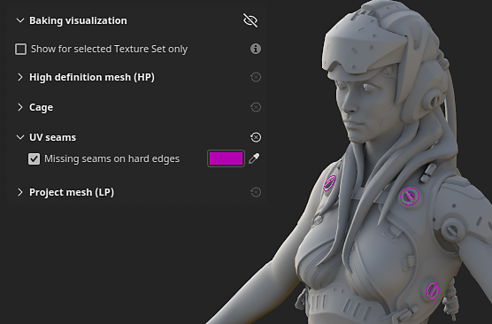
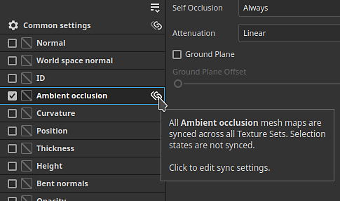
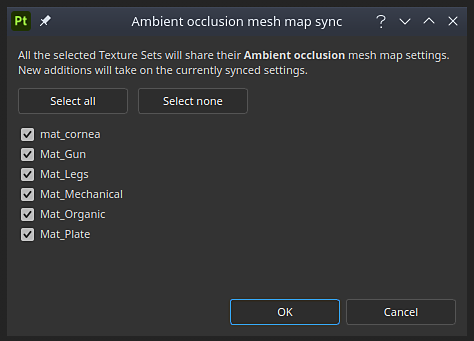

# Versión 8.3

**Substance 3D Painter 8.3** presenta un nuevo modo de procesamiento, importación de archivos en USD y compatibilidad con el tamaño físico en modo de Proyección de UV.

Fecha de publicación: *10 de enero de 2023*

## Función principal

### Nuevo modo de cocción

La antigua ventana para hornear se ha sustituido por un modo específico con varias funciones nuevas, en particular con visualización de ventanilla, como la visualización de la jaula y los errores de coincidencia.

* **Acceso y cambio entre modos**\
  El horneado es ahora un modo nuevo e independiente, además de los modos de pintura y representación ya existentes en la aplicación. Para llegar al modo de panadería, solo tiene que usar el icono del pequeño croissant en la barra de herramientas contextual. El cambio entre los modos también se puede hacer de otra manera: mediante el menú modo o los métodos abreviados de teclado. Para volver a otro modo, simplemente usa el icono dedicado del modo (además, el botón **Mapas de malla de cocción** dentro de la [configuración del conjunto de texturas](../interface/texture-set/texture-set-settings.md) se puede seguir usando para entrar en el nuevo modo).

  

  

* **Nueva interfaz de modo**\
  La tradicional ventana de panadería se ha transformado en un modo con muelles dedicados, en particular:

  * **La lista de conjuntos de texturas** se puede usar para definir las partes del proyecto que se van a hornear.
  * **Panaderos de mapa de malla** permite seleccionar entre la configuración de panadería común y la configuración de panadería. También es donde se puede especificar qué proceso de panadería se iniciará.
  * **Ajustes de mapa de malla** es donde se encuentran todos los ajustes comunes y de panadería y se pueden modificar, dependiendo de lo que se haya seleccionado en las dos ventanas anteriores.
  * **Registro de panificación** reagrupa información diferente sobre el proceso de panificación, en particular mensajes de error.
  * **Visualización de horneado**: este panel se encuentra en la ventana gráfica y controla varias opciones relacionadas con la visualización de las mallas de poli altas y bajas.

  {width="500px"}

* **Iniciar y cancelar el proceso de pandeo directamente desde la ventana gráfica**\
  El botón para iniciar o cancelar el proceso de procesamiento ahora se encuentra en la parte inferior de la ventana gráfica. También se puede utilizar una pequeña flecha para especificar el modo de cocción: en función de la selección de lista Conjunto de texturas o mediante el conjunto de texturas activo actualmente.

  

  

* **Mostrar malla de alta densidad en la ventana gráfica**\
  Cuando se especifica una malla de alta densidad en la configuración de horneado, ahora también se cargará en la ventana gráfica (a menos que se desactive la configuración de visualización dedicada). Esto permite comprobar si la geometría de malla de poli alta y baja coincide bien.

  {width="400px"}

* **Mostrar malla de la jaula en la ventana gráfica con áreas perdidas como error**\
  La malla de la jaula también se puede mostrar en la ventana gráfica. Si no se utiliza un fichero de malla dedicado, se mostrará una jaula implícita y reaccionará al parámetro Distancia frontal máxima. Al ajustar el tamaño de la jaula, cualquier parte de la malla de alta densidad que esté fuera de la jaula se mostrará de color rojo por defecto, lo que permite encontrar fácilmente la parte de la malla que se perderá por el proceso de cocción.

  

* **Echar un vistazo alrededor de la malla al cargar y hornear**\
  La carga de mallas y la cocción ya no congelan la aplicación, lo que significa que es posible interactuar con la ventanilla durante esas operaciones. Esto puede resultar útil para investigar el proceso de cocción, identificar los problemas con antelación y cancelar la cocción, lo que permite ahorrar tiempo al final. Del mismo modo, el conjunto de texturas más visible en la ventana gráfica ahora se horneará primero, lo que ayudará a comprobar los resultados en áreas específicas de antemano.

  

* **Configuración de la ventana gráfica y del material neutro**\
  Para ayudar a centrarse en los resultados de cocción y buscar problemas si los hay, el modo de cocción no muestra texturas pintadas, sino que utiliza un material neutro. Los ajustes de este material neutro se pueden ajustar en el panel de visualización Horneado dentro de la ventana gráfica.

  

* **Mostrar bordes duros con costuras UV que faltan**\
  Una fuente de defectos al hornear es la presencia de bordes duros que no tienen costuras UV. Esto puede dar lugar a líneas visibles y romper el smoothness de sombreado. Para ello, se ha añadido una configuración de visualización para resaltarlas tanto en la vista 3D como en la 2D, ya que de lo contrario son muy fáciles de perder.

  {width="450px"}

  {width="300px"}

* **Sincronizar y dessincronizar parámetros**\
  La nueva acción de sincronización permite especificar qué parte de la configuración de horneado se sincronizará en los conjuntos de texturas. De lo contrario, sería tedioso configurar varias veces de la misma manera. A veces es útil tener conjuntos de texturas con configuraciones dedicadas y es preferible mantenerlos sin sincronizar. Por ejemplo, mantener separados los ajustes comunes ahora permite utilizar una distancia frontal máxima, una resolución o una lista de mallas de alto contenido de poli que serían diferentes según el conjunto de texturas.

  {width="400px"}

  {width="400px"}

* **Comprobador de coincidencia por nombre**\
  La pestaña **Coincidencia por nombre** en el **Registro de cocción** puede ayudar a encontrar errores en el proceso de coincidencia antes de hornear, lo que facilita notar mallas que no coinciden. Las mallas que coinciden se agrupan juntas, mientras que las demás se aíslan y se muestran en rojo.

  {width="450px"}

>[!NOTE]
>
> Hay muchos más ajustes nuevos en este nuevo modo. Para obtener más información, consulte la [página de documentación dedicada](../baking/baking.md).

### Nueva importación y exportación de archivos USD

Esta nueva versión agrega la compatibilidad con el formato de archivo [Universal Scene Description (USD)](https://graphics.pixar.com/usd/release/intro.html). Ahora es posible iniciar un proyecto de Painter, exportando mallas y texturas con un formato USD, lo que hace que el flujo de trabajo sea más coherente entre las aplicaciones.

* **Importar archivo USD con variantes, aspectos y en un marco específico**\
  Se puede utilizar un formato de archivo USD al crear un proyecto o volver a importar una malla dentro de un proyecto. Los archivos USD pueden ser a menudo escenas complejas, por lo tanto, también hay disponibles un selector de ámbito y variante para importar solo un subconjunto del archivo.

  {width="400px"}

  {width="400px"}

* **Exporte el USD como un archivo nuevo o vinculado al USD original utilizado en el proyecto**\
  Cuando el texturizado esté listo, puedes usar la ventana **Archivo > Exportar texturas** para exportar tu archivo USD junto con tus archivos de textura. Simplemente habilite la configuración **Exportar recurso USD** para hacerlo. Esto generará varios archivos USD que se pueden integrar fácilmente en una canalización posteriormente. Si ha utilizado un fichero que no es USD o un fichero USD sin UV, se exportará un nuevo fichero de geometría USD además de los mapas de textura y el fichero de material USD.\
  Además, también es posible utilizar **Archivo > Exportar malla** para exportar la geometría del proyecto como un archivo USD.

  

  {width="400px"}

### Compatibilidad mejorada con el tamaño físico en modo UV

El soporte de materiales Substance con tamaños físicos incrustados se ha extendido a las proyecciones basadas en UV.

* **Tamaño físico en modo UV**\
  Ahora es posible establecer el modo Escala en Tamaño físico en lugar de Mosaico en la capa de relleno y efectos de relleno mediante el modo Proyección de UV. El tamaño del UV se calcula automáticamente en función del tamaño medio de los triángulos del desenvolvimiento UV.

  {width="400px"}

* **Cambiar automáticamente al tamaño físico** Se ha agregado una nueva configuración de proyecto para establecer automáticamente la configuración de escala en tamaño físico al crear un material (al arrastrar y soltar un recurso para la ventana Activo, por ejemplo). Esto permite utilizar un tamaño coherente en todo el proyecto sin tener que cambiar la configuración manualmente cada vez que se crea una nueva capa de relleno. Para habilitarla en un proyecto existente, ve a **Editar > Configuración del proyecto** y habilita **Cambiar escala de capa de relleno a Tamaño físico al asignar materiales**. Esta configuración también se puede habilitar al crear un nuevo proyecto.

  

## Información de soporte de plataforma

Con esta versión, hemos aumentado la versión mínima compatible de Painter en Steam a Ubuntu 20.04.

## Tutoriales

Para descubrir y aprender sobre el nuevo modo de cocción, echa un vistazo a nuestro último tutorial:

## Notas de la versión

*(Lanzado: 10 de enero de 2023)*\
Resumen: **Versión principal con nuevo modo de procesamiento, nueva importación y exportación de archivos en USD y compatibilidad de tamaño físico para la Proyección de UV**

**Agregado:**

* [Modo de cocción] Nuevo modo de cocción dedicado al proceso de cocción
* [Modo de cocción] Defina el método abreviado para cambiar al modo de cocción a F8
* [Modo de cocción] Botón Añadir inicio y Cancelar cocción en la ventana gráfica
* [Modo de cocción] Añadir selección de cocción en la lista Conjunto de texturas
* [Modo de cocción] Añadir nueva ventana Mesh Map Bakers para seleccionar panaderos
* [Modo de cocción] Añadir nueva ventana Ajustes de mapa de malla para editar los ajustes de horneado
* [Modo de cocción] Añadir nueva ventana de registro de cocción para seguir el proceso de cocción
* [Modo de procesamiento] Añadir parámetros de procesamiento y acciones de deshacer a la ventana de historial
* [Modo de cocción] Añadir rutas de navegación en Ajustes de mapa de malla
* [Modo de panificación] Añadir miniaturas de mapas de malla en la ventana Panificadores de mapas de malla
* [Modo de cocción] Añadir menú de ajustes de visualización contraíbles en la ventana gráfica 3D
* [Modo de cocción] Añada un ajuste de visualización para mostrar/ocultar la malla de alta densidad
* [Modo de cocción] Añadir ajuste de visualización para mostrar/ocultar la malla de la jaula y la malla metálica
* [Modo de cocción] Añada un ajuste de visualización para mostrar/ocultar la malla de baja densidad
* [Modo de cocción] Añada un ajuste de visualización para mostrar los bordes duros sin costuras UV como errores
* [Modo de cocción] Informar en la ventanilla sobre errores de malla y horneado si el registro de cocción no está visible
* [Modo de cocción] Añadir acción para sincronizar la configuración de panadero en todos los conjuntos de texturas

  En la ventana Mesh Map Bakers, cada panadero (así como los ajustes comunes) se pueden sincronizar en los conjuntos de texturas haciendo clic en el icono de enlace junto a su nombre. Esta acción abrirá una ventana que permite seleccionar qué conjuntos de texturas compartirán los mismos parámetros.
* [Modo de cocción] Añadir acciones para copiar y pegar ajustes de panadero

  En la ventana Mesh Map Bakers hay disponibles acciones para copiar y pegar cada configuración de panadero en los conjuntos de texturas, ya sea a través del menú dedicado en la parte superior de la ventana o el menú contextual del botón derecho.
* [Modo de cocción] Botón Añadir en el registro de cocción para saltar del error a la configuración correcta

  Cuando un panadero falla o una malla no se carga correctamente, aparece un mensaje de error en el registro de panadería. Un botón junto al mensaje permite cambiar los marcadores de mapa de malla y la ventana Ajustes de mapa de malla para mostrar los ajustes relacionados. Esto ayuda a aislar con mayor facilidad el origen de un problema para poder solucionarlo.
* [Modo de cocción] Añadir menús para gestionar conjuntos de texturas y selecciones de panadero

  En las ventanas &quot;Texture Set list&quot; y &quot;Mesh Map Bakers&quot; se ha añadido un pequeño menú de acción para ayudar a copiar e invertir las selecciones.
* [Modo de cocción] Dividir la lista de selección de panadero por conjunto de texturas
* [Modo de cocción] Dividir ajustes comunes por conjunto de texturas
* [Modo de cocción] Cargar mallas de alta polietileno y jaula sin congelar la interfaz
* [Modo de cocción] Utilice la barra de progreso de la ventanilla para mostrar la carga de la malla
* [Modo de cocción] Añadir estado de carga de malla en el registro de cocción
* [Modo de cocción] Permitir girar la malla en la ventanilla durante la cocción
* [Modo de cocción] Establecer el orden de cocción en función de la visibilidad actual de la ventana gráfica de la malla
* [Modo de cocción] Visualización de la jaula de cocción implícita en la ventana gráfica

  Si no se utiliza un fichero de malla de jaula personalizado, se generará una malla de jaula automática y se mostrará en la ventana gráfica. Su tamaño se basará en el parámetro Distancia frontal máxima de los ajustes comunes de horneado. La malla de la jaula se utiliza para indicar hasta dónde llegará la coincidencia entre el poli bajo y alto.
* [Modo de cocción] Mostrar la lista de nombres de malla coincidentes por nombre en el registro de cocción
* [Modo de cocción] Utilice material neutro para mostrar el modelo 3D en la ventana gráfica
* [Modo de cocción] Desactivar el cálculo del motor en modo de cocción
* [Modo de cocción] Mostrar una advertencia al salir de la aplicación mientras hay una cocción en curso
* [Bakers] Actualizar etiquetas de configuración de suavizado

  Los valores del ajuste de suavizado se han cambiado de nombre a &quot;Supersampling&quot; (Supermuestreo) y con un número multiplicador explícito para aclarar su comportamiento.
* [Bakers] Actualice Bakers a la versión 2.5.7.
* [USD] Archivos de Universales Scene Description de importación y exportación (USD)
* [USD] Añada opciones de USD a la ventana Nuevo proyecto al seleccionar un archivo USD
* [USD] Añadir nueva ventana de selección Ámbito y Variantes

  Al importar un fichero USD, pulsando en el botón de cambio de la ventana Nuevo Proyecto o Configuración del Proyecto podrá seleccionar qué parte y variantes de un fichero USD desea importar.
* [USD] Opción Añadir niveles de subdivisión

  Al crear un nuevo proyecto con un archivo de malla USD que contiene subdivisiones, es posible seleccionar el nivel de subdivisiones mediante un regulador. El proyecto se creará con la malla subdividida. El nivel se puede modificar mediante la configuración del proyecto.
* [USD] Importar mallas de piel USD en un marco específico

  Al crear un nuevo proyecto con un archivo de malla USD que contiene animación, es posible seleccionar el fotograma mediante un regulador que refleje la secuencia de cronología incrustada. El marco se puede modificar mediante la configuración del proyecto.
* [USD][Exportar] Añadir una opción para exportar archivos USD

  Se ha añadido la nueva casilla de verificación Exportar USD a la ventana Exportar texturas. Cuando está activada, permite exportar archivos USD, así como mapas de textura, utilizando cualquier plantilla.
* [USD][Exportar] Añadir el formato de archivo USD a la malla de exportación
* [USD] Cambie el nombre del ajuste preestablecido de exportación existente &quot;Rugosidad del metal PBR en USD&quot; para que sea más explícito

  Se puede acceder a la plantilla de exportación en USD denominada anteriormente &quot;Rugosidad del metal PBR en USD&quot; a través de Exportar texturas > Plantilla de salida > USDz (Apple AR).
* [Auto Unwrap] Añadir orientación de bloqueo para el empaquetado

  Nueva opción para la configuración de desajuste automático que permite conservar la orientación de las Islas de UV existentes al utilizar la función de empaquetado. Se puede acceder a él desde Nuevo proyecto > Opciones de desajuste automático > Orientación de la Isla de UV.
* [Tamaño físico] Añada una configuración para utilizar automáticamente el Tamaño físico en el efecto de relleno/capa

  Se ha añadido una nueva opción para cambiar automáticamente a la escala de tamaño físico al utilizar un material con tamaño físico incorporado. Se puede activar por proyecto a través de Nuevo proyecto o a través de Editar > Configuración del proyecto > Tamaño físico > Cambiar la escala de la capa de relleno a Tamaño físico al asignar materiales.
* [Tamaño físico] Exponer tamaño físico para Proyección de UV

  La escala de tamaño físico ahora está disponible para las Proyecciones de UV: permite el cambio de tamaño automático para un material en función del tamaño físico de una malla. Se puede seleccionar a través de Escala > Tamaño físico en la ventana Propiedades de la capa de relleno o del efecto.
* [Scripting] [Python] Permitir consultar la versión de la aplicación
* [Scripting] [JavaScript] Actualización de la API para que coincida con los nuevos parámetros de procesamiento
* [Scripting] [Python] Módulo de horneado: editar parámetros de procesamiento
* [Scripting] [Python] Módulo de horneado: iniciar/cancelar el procesamiento
* [Scripting] [Python] Módulo de horneado: seleccionar método de curvatura
* [Scripting] [Python] Módulo de horneado: selección de panaderos/baldosas ultravioletas
* [Scripting] [Python] Módulo de horneado: sincronizar la configuración de panadero en todos los conjuntos de texturas
* [SVT] Habilitar la compatibilidad de hardware disperso en las GPU AMD

  La aceleración de hardware para el sistema de texturas virtuales dispersas ahora se puede activar con las GPU AMD. Este ajuste se activa automáticamente en las preferencias generales.
* [Proyección] Cambiar nombre de parámetros de proyección cilíndrica

  El parámetro &quot;Cylinder Cap Culling&quot; ha pasado a denominarse &quot;Backface Culling&quot; para representar mejor su acción. La información sobre herramientas asociada se ha ajustado en consecuencia.
* [Project] Guarde la versión de la aplicación en el proyecto y recuperarla mediante scripts

  Desde la versión 8.2, la versión de la aplicación se almacena ahora dentro del archivo spp al guardar.\
  Este número de versión se puede recuperar con la función last\_saved\_substance\_painter\_version() en el módulo de proyecto de la API de Python.\
  Para un proyecto realizado antes de la versión 8.2, el valor devuelto será nulo.
* [Importar] Mejora el tiempo de importación general de modelos 3D

  Mejoramos el tiempo general de importación de mallas. Por ejemplo, reducir el tiempo de espera al cargar mallas de alto contenido de polietileno para hornear. Esta optimización se aplica en particular a la carga de archivos OBJ.

**Corregido:**

* [Bloqueo] Cambio de canales en el filtro con una pila específica
* [Mac][M1] Bloqueo al crear una capa de relleno y salir de la pila de capas

  Este problema se puede solucionar actualizando a Mac OS 13 (Ventura).
* [Scripting][Python] Bloqueo al utilizar ui.add\_dock\_widget() con un tipo incorrecto
* [Horneado] Mensaje de error incompleto en el registro cuando se produce un error en el horneado
* [Horneado] La memoria no se libera cuando finaliza el horneado
* [Motor] La caché de texturas no se actualiza al cambiar la visibilidad del efecto
* [Exportar] 2DView exporta un mapa aleatoriamente uniforme
* [Proyecto] Error de asignación de memoria al guardar el proyecto con malla grande
* [Ventana gráfica] El TAA provoca defectos al pintar en algunos casos

**Problemas conocidos:**

* [Gestión de color] Las conversiones de espacio de color HDR con ACE en Linux producen colores con sujeción
* [Pila de capas] El origen de entrada no se guarda por capa
* [Exportar] La vista 2D exporta un mapa aleatoriamente uniforme
