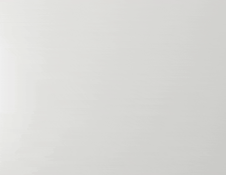
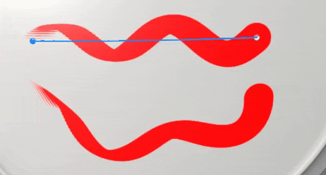

# Versión 9.0

<b>Substance 3D Painter 9.0</b> presenta una nueva forma de pintura de trazos con una ruta reeditable en la ventana gráfica 3D, así como contenido predeterminado actualizado.

Fecha de publicación: *20 de junio de 2023*

## Funciones principales

### Nueva pintura a lo largo del trazado en la ventana gráfica 3D

La herramienta <b>Pintura a lo largo de la ruta</b> es una nueva forma de pintura de trazos en la ventana gráfica 3D. De forma similar a otras aplicaciones, puede crear curvas basadas en Bézier gobernadas por puntos en la superficie del objeto 3D para dibujar patrones. Combinada con materiales Substance, esta nueva herramienta puede abrir muchas posibilidades nuevas.

* <b>Nueva herramienta para crear trazos de pintura gobernados por una ruta con puntos</b>\
  En la barra de herramientas de la herramienta hay un nuevo icono dedicado a la herramienta Trazado. Esta nueva herramienta permite dibujar curvas en la superficie del modelo 3D para crear trazos de pintura. Estos trazos siempre se pueden volver a editar. Cuando la herramienta esté activa, simplemente haga clic en la superficie de la malla para añadir un punto. Haga clic en un punto existente y pulse Supr para quitarlo.

  

  
* <b>Arrastrar y mover puntos en la superficie de la malla</b>\
  Para editar la forma de un trazado, basta con hacer clic y arrastrar un punto para moverlo por la superficie del modelo 3D.

  
* <b>Cerrar ruta para crear patrones perfectos</b>\
  El trazado también se puede cerrar para crear bucles, lo que puede resultar útil tanto para crear patrones repetidos alrededor de áreas específicas, por ejemplo.

  

  
* <b>Volver a editar rutas (y sus propiedades) con el panel Ruta</b>\
  Cuando se selecciona la herramienta Trazado, el trazado realizado en la capa de pintura actual se muestra en el panel Trazado dedicado en la parte superior de la ventana gráfica 3D. Este panel permite seleccionar, eliminar o cambiar el nombre de un trazado a

  

  
* <b>Compatible con otras características de pintura como simetría, máscara de geometría, trazos dinámicos, etc.</b>\
  Con la herramienta de trazado se pueden utilizar muchos ajustes de trazos de pintura normales:

  * La activación de la simetría permite dibujar un trazado varias veces mientras se gestiona solo uno.
  * Los trazados que se encuentran en una capa con una máscara de geometría activada pueden realizar una pintura en geometría oculta

  
* <b>Pintura con otras herramientas como Borrador o difuminado</b>\
  La herramienta Trazado también es compatible con las herramientas Borrador y Difuminado, lo que permite descubrir formas más avanzadas de pintar y combinar trazos con la forma fácil y reeditable de manipular los puntos de trazado.

  

* <b>Guardar y reutilizar propiedades de ruta de acceso con ajustes preestablecidos</b>\
  Al utilizar la herramienta Trazado, también puede guardar las propiedades del pincel como ajustes preestablecidos. Esto permite guardar ajustes preestablecidos de herramientas que cambiarán automáticamente a la herramienta Trazado cuando se seleccione en la ventana Activos.

>[!NOTE]
>
> Para obtener más información, consulte la [documentación dedicada](../painting/tool-list/path.md).

### Nuevo contenido para usar con la función pintura a lo largo del trazado

En esta versión se han incluido algunos ajustes preestablecidos de herramientas nuevas para aprovechar la nueva función de pintura a lo largo del trazado:

* Pipe Rack Sci-Fi
* Vómito
* Costura
* Topstiching
* Soldadura de metal
* Cinta con cremallera

### Trazos dinámicos mejorados para la pintura a lo largo de la función de trazado

Aprovechamos la nueva herramienta de trazado para añadir nuevas propiedades al sistema de trazo dinámico. Estas nuevas propiedades desbloquean nuevos tipos de trazos que no eran posibles antes, como la flecha en la imagen de arriba que presenta un visual de inicio y fin diferente.

* <b>Nueva propiedad Inicio/Centro/Fin</b>\
  Se puede definir una nueva propiedad para especificar el gráfico del Substance si un sello dentro de un trazo es el primero, el último o cualquiera que esté en el centro. Esto permite crear puntos de inicio y fin, que pueden ser muy útiles, por ejemplo, para crear cremalleras. (<b>Nota</b>: el estado final solo está disponible con la herramienta trazado.)
* <b>Nueva propiedad de tamaño y espaciado</b>\
  La propiedad size y spacing permite ajustar la salida de un gráfico de Substance en función del estado de sello actual.
* <b>Nuevas propiedades de longitud de trazo</b>\
  Disponer de la distancia a lo largo del trazado y de la distancia máxima de un trazado permite controlar mejor cuándo se repiten algunos efectos, en lugar de proporcionar directamente un valor normalizado.\
  Permite crear un trazo creciente, por ejemplo, pero también un trazo con un patrón repetitivo basado en la distancia dibujada (y no en el número total de sellos dibujados).

>[!NOTE]
>
> Para obtener más información, consulte la [documentación dedicada](../painting/dynamic-strokes/creating-custom-dynamic-strokes.md).

### Materiales predeterminados actualizados

Con esta versión, hemos decidido realizar una limpieza en nuestra biblioteca y, por lo tanto, hemos cambiado nuestros materiales base predeterminados para que sean más útiles para todos. Estos materiales han sido diseñados por el mismo equipo que distribuye contenido en [Substance 3D Assets](https://substance3d.adobe.com/assets).

>[!NOTE]
>
> El contenido que se quitó está disponible en [Substance 3D Community Assets](https://substance3d.adobe.com/community-assets?q=painter23update&u=painter23update).

## Tutoriales

Para descubrir y aprender sobre la nueva herramienta de trazado, echa un vistazo a nuestro último tutorial:

## Notas de la versión

### 9.0.0

Fecha de publicación: <b>2023/06/20</b>\
Resumen: <b>Versión principal con Pintura a lo largo de la ruta que permite curvas 3D, nuevos materiales base y la limpieza de materiales heredados y nuevos ajustes preestablecidos para curvas 3D</b>

<b>Agregado:</b>

* [Path] Herramienta Agregar nueva pintura a lo largo del trazado
* [Path] Agregar un método abreviado vacío para la herramienta de trazado
* [Path] Permite añadir nuevos puntos a un trazado existente
* [Path] Añadir acceso directo para salir de la creación de la ruta actual
* [Path] Permitir la edición de las propiedades de pincel de trazados
* [Trazado] Ajuste automático de tangentes al colocar un punto
* [Trazado] Calcular tangentes al mover un punto
* [Trazado] Ajuste los puntos recién creados a la superficie de una malla
* [Trazado] Permitir editar la presión por vértice
* [Trazado] Ajuste la presión del punto recién creado desde los puntos vecinos
* [Trazado] Permite convertir puntos en suavizado/esquina (salto de tangente)
* [Ruta] Permite mover un punto recién añadido inmediatamente
* [Path] Permite quitar puntos de un trazado existente
* [Path] Permite invertir la dirección de un trazado
* [Ruta] Permite seleccionar una ruta en la ventana gráfica
* [Trazado] Permitir la selección de puntos de trazado con selección de recuadro
* [Trazado] Introduzca métodos abreviados de CTRL-A para seleccionar todos los puntos de un trazado
* [Ruta] Permitir cerrar ruta
* [Path] Permite especificar el eje ascendente de la ruta en Propiedades
* [Path] Agregar un menú de control de vértices a la barra de herramientas contextual
* [Trazado] Introducción de los modos de pintar/borrar/difuminar en la herramienta Trazado
* [Path] Creación de comentarios visuales para rutas en la ventana gráfica
* [Ruta] Agregar un indicador visual de la dirección de la ruta
* [Ruta] Agregar thickness de línea a la configuración de visualización de ruta
* [Path] Permitir ocultar la interfaz de usuario de rutas
* [Path] Panel Añadir trazado para ver los trazados de la capa seleccionada actualmente
* [Path] Añadir comentarios visuales al pasar el puntero sobre un trazado en el panel Trazado
* [Path] Muestra el panel de trazado siempre que se selecciona la herramienta Trazado
* [Trazado] Permita cambiar el nombre, eliminar, copiar, cortar o duplicar el trazado en el panel Trazado
* [Path] Aparece un mensaje al intentar interactuar en la ventana gráfica 2D con la herramienta Ruta
* [Biblioteca] Integrar nuevo contenido (herramientas de ruta y materiales base)
* [Trazos dinámicos] Agregar propiedad de distancia para trazos dinámicos
* [Trazos dinámicos] Añadir propiedades de tamaño y espaciado a los trazos dinámicos
* [Trazos dinámicos] Agregar propiedad de inicio/centro/fin para trazos dinámicos
* [Python][USD] Exponer los parámetros de configuración del proyecto para el formato USD
* [Python][USD] Exponer parámetros de creación de proyectos para el formato USD
* [Export][USD] Añadir información de la ruta del proyecto dentro del archivo USD exportado
* [GLTF] Actualización de texturas en la biblioteca al volver a cargar un archivo GLTF
* [Sombreado] Reducir los defectos de costura de las Islas de UV con diferentes orientaciones
* [Motor] Actualice a la versión 9.0 del motor de Substance

<b>Corregido:</b>

* [Importar] Algunos GLB con texturas no obtienen texturas en Painter
* [AMD] Artefactos en los bordes para todos los rellenos de proyección 3D
* [Motor] Las texturas se rompen al alternar la visibilidad de la capa
* [Motor] Las texturas están vacías en algunos lugares al cambiar el modo de fusión
* [Motor] La textura/proyección está en modo de deformación vacío en algunos casos
* [Iray] La iteración se restablece en 0 al guardar el procesamiento
* [Log] Mensaje de error de USD al hacer Archivo > Nuevo

<b>Problemas conocidos:</b>

* [Gestión de color] Las conversiones de espacio de color HDR con ACE en Linux producen colores con sujeción
* [Pila de capas] El origen de entrada no se guarda por capa
