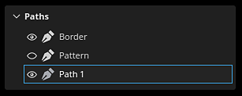

# Versión 9.1

<b>Substance 3D Painter 9.1</b> agrega control de tangente para la herramienta Ruta, compatibilidad con el formato de archivo de SVG, la capacidad de importar y aplicar recursos mediante arrastrar y soltar, y compatibilidad con la translucidez en la ventana gráfica.

Fecha de publicación: *7 de noviembre de 2023*

## Funciones principales

### Nuevos controles de tangente y mejoras para la herramienta de trazado

En esta nueva versión continuamos el desarrollo de la herramienta Path (introducida en la versión 9.0) para añadir los bits que faltan y las funciones solicitadas por la comunidad.

* <b>Controlar las tangentes de puntos de ruta manualmente</b>

  Ahora es posible definir manualmente las tangentes de un punto específico en un trazado. Esto permite anular el comportamiento automático para crear nuevas formas.

  
* <b>Editar puntos de ruta mediante manipuladores</b>

  A veces, no basta con desplazar los puntos de la superficie del objeto. Los manipuladores permiten mover puntos más allá de la superficie. Esto puede resultar muy útil para mover varios puntos a la vez, por ejemplo, en caso de que estuvieran demasiado lejos de una superficie después de volver a importar una malla.

  
* <b>Alternar la visibilidad de las rutas de acceso individualmente</b>

  La visibilidad de los trazados ahora se puede cambiar por trazado mediante el panel de ventanilla dedicado. Al deshabilitar un trazado, se eliminarán sus aportaciones de las texturas finales sin tener que eliminarlo.

  
* <b>Copiar y pegar posiciones y propiedades de ruta de acceso</b>

  La función de copiar y pegar trazados se ha ampliado para poder copiar únicamente posiciones de puntos de trazado o sus propiedades. Ahora es posible sincronizar trazados de diferentes maneras, lo que facilita la creación de efectos complejos (a través de las posiciones) o el uso compartido de un aspecto específico en diferentes ubicaciones (a través de las propiedades).

  

  

>[!NOTE]
>
> Para obtener más información sobre la herramienta Ruta de acceso, [consulte la documentación dedicada](../painting/tool-list/path.md).

### Nueva compatibilidad con la translucidez, la transparencia y la absorción en la ventana gráfica

El sombreador <b>Adobe Standard Material</b> (ASM), que es el valor predeterminado al crear un nuevo proyecto, se ha actualizado para admitir las propiedades <b>Translucency</b>, <b>Transparency</b> y <b>Absorción</b>. Esto significa que ahora es posible ver el resultado de esos comportamientos de procesamiento en el puerto de visualización en tiempo real (así como dentro del procesador de Iray).

Así que ahora es posible crear materiales como <b>vidrio</b>, <b>follaje</b> o <b>plástico</b> con una fina absorción de luz y se pueden ver directamente en el área de visualización. La exportación a otras aplicaciones de Substance 3D también dará como resultado un aspecto coincidente gracias a la definición de ASM.

* <b>Nueva configuración de sombreador de ASM</b>

  El sombreador de ASM se ha actualizado para admitir nuevas funcionalidades, que se pueden modificar a través de la ventana [configuración de Sombreador](../interface/shader-settings/shader-settings.md):

  * <b>Transparencia</b> (opacidad): ¿Ya no es necesario cambiar a otro sombreador para obtener superficies transparentes, como el follaje. En su lugar, habilite el parámetro <b>alpha test</b> o <b>alpha blending</b> en el grupo <b>Geometría > Opacidad</b>. También están disponibles los ajustes habituales, como el tramado.
  * <b>Transparencia</b>: esta nueva propiedad permite crear superficies como el cristal, haciendo que las formas sean transparentes y manteniendo los reflejos del specular. Para usarlo, agregue un canal de Translucidez en su proyecto y habilite el parámetro <b>Translucidez</b> en el grupo <b>Interior</b>.
  * <b>Absorción</b>: esta nueva propiedad permite simular la luz que pasa a través de un objeto y que se absorbe, lo que puede ser útil para simular plástico o líquidos de una mejor manera que utilizando la dispersión subsuperficial. Para usarlo, habilite la configuración de <b>Absorción</b> en el grupo <b>Interior</b>.
* <b>Información sobre herramientas e interfaz de usuario de configuración de sombreado mejorada</b>

  Con el retrabajo del sombreador aprovechamos la oportunidad para mejorar la interfaz de usuario de los parámetros, así como añadir muchas nuevas sugerencias de herramientas para descubrir más fácilmente cómo activarlos.

  El orden de los parámetros también debe coincidir mejor con el resto del software de Substance 3D, lo que facilita las operaciones de ida y vuelta al probar la configuración.

  
* <b>Nuevo proyecto de muestra para probar el Adobe Standard Material</b>

  La manipulación de las nuevas propiedades de ASM puede resultar difícil al principio, por lo que se ha añadido un nuevo proyecto de muestra que muestra varias funciones del sombreador para que sea más fácil aprenderlas.

  Este proyecto se llama <b>French Restaurant Table</b> y se puede encontrar en el menú <b>Archivo > Abrir muestra</b>. También utiliza muchos trucos pequeños, por lo que puede ser un gran recurso de aprendizaje para descubrir nuevas formas de texturizado.

  
* <b>El canal de Translucidez ahora tiene como valor predeterminado un color negro</b>

  Para facilitar el uso de las nuevas propiedades de sombreador y evitar resultados inesperados en la ventana gráfica, el color predeterminado de la Translucidez del canal se ha cambiado a negro (en lugar de blanco).

  Si este canal ya estaba en uso en el proyecto, puede obtener el comportamiento anterior simplemente añadiendo una capa de relleno en la parte inferior de la pila de capas y estableciendo el valor del canal en blanco. Es posible que desee habilitar el ajuste <b>Usar translucidez como máscara de dispersión</b> en el parámetro sombreador, así como volver a aplicar el aporte del canal al resultado de dispersión subsuperficial.

### Nueva compatibilidad con archivos de gráfico vectorial (SVG)

Esta versión incorpora la compatibilidad de los archivos de SVG como recursos que se pueden utilizar en capas, herramientas de pintura, etc.

Los archivos de SVG son muy prácticos para representar logotipos o formas con precisión, al tiempo que son muy ligeros. En Painter, se pueden procesar con la resolución que se desee y actualizarse fácilmente, por lo que resultan perfectos para el flujo de trabajo no destructivo.

* <b>Importar archivos de SVG</b>\
  Los archivos de SVG se pueden importar como cualquier otro recurso, en proyectos, bibliotecas, etc. Se puede importar el SVG <b> hasta la versión 1.1</b>; las características de las versiones más recientes no son compatibles.

  También se ha facilitado la importación en esta versión (véase a continuación) para que el uso de archivos de SVG se pueda realizar simplemente arrastrando y soltando recursos de fuera de Painter directamente en la malla o la pila de capas.
* <b>Configuración de SVG dedicada</b>\
  Cuando se utiliza un recurso de SVG, se dispone de algunas opciones para controlar su aspecto:

  * <b>Resolución</b>: para utilizar uno automático, uno definido dentro del archivo o uno personalizado.
  * <b>Área de recorte</b>: para definir la región específica del lienzo del SVG que se va a utilizar.
  * <b>Ámbito</b>: para seleccionar todo el contenido del SVG o solo algunos elementos.

  
* <b>Nuevos materiales adaptados para el SVG</b>

  Se han añadido 3 recursos nuevos para ayudar a usar los archivos de SVG al aplicar texturas:

  * <b>Pintura de pulverización personalizada</b>: permite simular una pegatina pintada en una pared a partir de una sola imagen de entrada.
  * <b>Etiqueta personalizada</b>: para crear una pegatina de plástico en una superficie. Cuenta con varios ajustes para simular daños y plegamiento.
  * <b>Gráfico a material</b>: permite crear varias propiedades de material a partir de una sola entrada de imagen. Este recurso se inserta automáticamente al arrastrar y soltar un archivo de SVG en la ventana gráfica. Este recurso ofrece una manera fácil de compartir la transparencia de su entrada a través de múltiples canales, lo que lo hace perfecto para pegatinas simples.

  

  Demostración de 

>[!NOTE]
>
> Para obtener más información sobre el formato y la configuración del SVG, [consulte la documentación dedicada](../painting/vector-graphic-svg.md).

### Nueva importación de recursos mediante arrastrar y soltar

Esta versión permite arrastrar y soltar un archivo externo en diferentes contextos de la aplicación para importar automáticamente un recurso y utilizarlo. Este nuevo proceso permite omitir los tediosos pasos relacionados con la importación de archivos.

* <b>Importar mediante arrastrar y soltar en la ventana gráfica</b>

  Arrastre un archivo externo al área de visualización para poder colocarlo directamente en la malla. Esta acción creará automáticamente una nueva capa. Dependiendo de la naturaleza del recurso (imagen, material del Substance, filtro del Substance, etc.) el resultado se adaptará en consecuencia.
* <b>Importar mediante arrastrar y soltar en la pila de capas</b>\
  De la misma manera es posible soltar archivos de recursos externos en la ventana gráfica, soltar archivos en la pila de capas permite crear directamente capas o efectos con el recurso en ella.
* <b>Importar mediante arrastrar y soltar en una ranura de recurso</b>

  También es posible importar un recurso directamente en una capa o herramienta. Si ya existe una capa de relleno o un efecto con la configuración correcta, simplemente suelte un archivo externo en una de las ranuras de canal de la ventana Propiedades para importarlo y aplicarlo.

>[!NOTE]
>
> Para obtener más información sobre la importación de recursos, [consulte la documentación dedicada](../content/importing-assets/import-drag-and-drop.md).

### Nuevos comportamientos de arrastrar y soltar de recursos

Las mejoras de arrastrar y soltar no se limitan a importar recursos. Arrastrar y soltar un recurso desde la ventana Activos ahora se puede utilizar para crear nuevas capas, efectos e incluso máscaras sobre la marcha.

* <b>Arrastra y suelta muchos tipos de recursos</b>

  Ahora es posible arrastrar y soltar tipos de recursos directamente en la ventana gráfica o la pila de capas. El siguiente tipo de recursos ahora se puede arrastrar y soltar (casi) en cualquier lugar:

  * Alfas
  * Texturas
  * Procedimentales
  * Materiales
  * Materiales inteligentes
  * Máscaras inteligentes
  * Generadores
  * Filtros
  * Mapas de entorno
* <b>Eliminar recursos como nueva capa o efecto</b>

  Al elegir dónde se suelta un recurso, Painter creará automáticamente una nueva capa o un nuevo efecto:

  
* <b>Elegir entre la pila de efectos de contenido o máscara al arrastrar\
  </b>

  Al arrastrar un recurso sobre una miniatura, Painter cambiará automáticamente a las pilas de efectos asociadas. Después de eso se vuelve muy fácil simplemente soltar el recurso en una ubicación precisa dentro de esa pila. Esto evita la necesidad de cambiar a la pila correcta de antemano.

  
* <b>Crea una nueva máscara negra sobre la marcha</b>

  Aparece un nuevo icono en cualquier capa sin máscara al arrastrar un recurso. Cuando se suelta un recurso en esta máscara fantasma, se creará automáticamente una nueva máscara y se añadirá el nuevo recurso. Es una forma rápida de configurar una nueva máscara y evitar cancelar la acción de arrastrar y soltar para añadirla manualmente.

  
* <b>Colocar en la ventana gráfica para crear nuevas capas</b>

  Los recursos de arrastrar y soltar también se pueden hacer en la ventana gráfica para crear nuevas capas. Según el tipo de recurso, el resultado puede cambiar. Un filtro creará una capa de pintura en modo de paso a través, mientras que una máscara inteligente creará una capa de relleno con una nueva máscara.

  

  
* <b>Usar modificadores de teclado para comportamientos avanzados</b>

  Al colocar un recurso, mantener el modificador de teclado CTRL o ALT puede activar comportamientos adicionales:

  * <b>CTRL</b> al colocar en la <b>pila de capas</b>: cree una nueva capa con el recurso en una máscara negra. Por ejemplo, puede resultar útil forzar la colocación de un material en una máscara. O para omitir el menú desplegable con una alfa.
  * <b>ALT</b> al colocar en la <b>pila de capas</b>: solo se aplica al soltar sobre una miniatura de capa. ALT eliminará todos los efectos anteriores. Esto puede utilizarse como una forma rápida de probar diferentes recursos, en particular máscaras inteligentes, sin tener que eliminarlos manualmente primero.
  * <b>CTRL</b> al colocar en la <b>ventanilla</b>: cree una nueva capa con el recurso en una máscara negra. El recurso se colocará bajo un efecto <b>Selección de ID de color</b> que se establecerá en función de la selección realizada en la ventana gráfica.
  * <b>ALT</b> al colocar en el <b>punto de visión</b>: igual que antes, forzará a un recurso a estar en modo de proyección de pegatinas.

### Mejoras diversas

En esta versión también se han añadido varias funciones y mejoras menores.

* <b>Compresión sin pérdida de imágenes de 16 bits</b>

  A partir de ahora, cualquier imagen contenida en un proyecto con una profundidad de bits de 16 se comprimirá con un algoritmo sin pérdidas, lo que permite reducir su tamaño sin perder calidad. Esto se suma al archivo de proyecto que ya comprime sus propios datos.

  Este cambio se dirige principalmente a <b>hacer un bake texturas</b>, que suelen ser la razón por la que los archivos de proyecto pueden ser muy pesados en el disco. En promedio, vimos proyectos <b>reducidos en un 30% a un 50% en tamaño en el disco</b>.

  Esta compresión se aplica automáticamente al guardar cualquier proyecto (antiguo o nuevo) en recursos que aún no están comprimidos. Esto significa que, en el caso de los proyectos antiguos, guardar por primera vez en esta nueva versión podría llevar un poco más de tiempo de lo habitual. El ahorro de tiempo debería volver a la normalidad una vez hecho esto.
* <b>Nuevo modo de proyección de relleno UV establecido en UV</b>

  Se ha agregado un nuevo modo de proyección para capas/efectos de relleno denominado <b>Proyección de conjunto UV establecida en Proyección de conjunto UV</b>. Se puede utilizar para proyectar una textura en función de los diferentes UV disponibles en la malla dentro del proyecto. Se puede utilizar para realizar una transferencia de texturas más avanzada sin necesidad de recurrir a herramientas externas.

  <b>UV set 0</b> es el UV predeterminado que usa Painter para pintar. Si hay más conjuntos UV disponibles, estarán disponibles en el menú desplegable de la configuración <b>Origen</b>:

  
* <b>Suavizado temporal está habilitado de forma predeterminada en cualquier proyecto nuevo</b>

  Al crear un nuevo proyecto, la configuración de <b>Suavizado temporal</b> disponible en la ventana Configuración de visualización ahora está habilitada de forma predeterminada para mejorar la calidad del procesamiento en la ventana gráfica.
* <b>Nuevas mejoras en la API de Python</b>

  La API de Python recibió algunas adiciones en esta versión:

  * Painter se puede cerrar o apagar mediante Python con la nueva función <b>substance\_painter.application.close() </b>.
  * La cámara de la ventanilla principal ahora se puede modificar a través de la API. Esto incluye su posición, rotación, pero también sus otras propiedades como Campo de visión, Apertura, etc. Para facilitar la posición de la cámara con respecto a la malla, la API ahora también muestra el cuadro delimitador de la escena.
  * Ahora es posible exportar la malla del proyecto, con triangulación o sin ella y desplazamiento o sin ella, a través del módulo de exportación.
  * La ruta de las texturas de exportación del proyecto ahora también se puede recuperar desde la API.
* <b>Nuevo envío a After Effects (beta)</b>

  Hay disponible una nueva acción Enviar a para exportar una malla y su textura a After Effects, lo que facilita la iteración en efectos visuales. Esta función requiere el acceso mínimo a la versión beta 24.1 de After Effects.

## Tutoriales

## Notas de la versión

### 9.1.0

(Publicado: 7 de noviembre de 2023)\
Resumen: <b>Versión principal con compatibilidad con SVG y transparencia, así como mejoras en la herramienta de arrastrar y soltar y ruta</b>

<b>Agregado:</b>

* [SVG] Permitir la importación de archivos vectoriales (SVG)
* [SVG]&#x200B;[IU] Añadir compatibilidad con propiedades específicas del SVG
* [SVG] Añada una opción para conservar fácilmente las proporciones originales de la imagen
* [SVG] Permitir el uso automático de alfa de SVG con transparencia
* [Interop] Permita el envío de una malla con textura a After Effects (Ae 24.1 beta).
* [Interop] Añadir configuración para Enviar a After Effects
* [QoL]&#x200B;[Assets]&#x200B;[UI] Activo de importación automática al arrastrar y soltar en la ranura de la IU
* [QoL] Permite arrastrar y soltar activos externos en la pila de capas
* [QoL] [Pila de capas] Arrastra y suelta texturas desde el panel de Recursos en la pila de capas
* [QoL] [Viewport] Permite arrastrar y soltar el generador, filtros en la malla
* [QoL]&#x200B;[Viewport] Permite soltar recursos externos en la malla
* [QoL]&#x200B;[Proyección] Añadir nuevo conjunto UV al modo de proyección Conjunto UV
* [QoL] Arrastrar y soltar máscaras inteligentes como nuevas capas en la ventana gráfica y la pila de capas
* [QoL] Añadir selector para generadores con varias salidas cuando se utiliza en la máscara
* [QoL] Permite arrastrar y soltar imágenes de un solo canal sobre un efecto de relleno
* [QoL] [Pila de capas] Utilice los modificadores CTRL/ALT con arrastrar y soltar para especificar dónde y cómo crear efectos o capas
* [Path] Cambiar la visibilidad de los trazados individualmente en el panel de trazados
* [Path] Permita el uso de manipuladores de transformación para puntos de trazado
* [Path] Permite controlar manualmente las tangentes por vértice
* [Path] Copiar y pegar propiedades de ruta
* [Path] Introducir un método abreviado vacío para el botón de tangente de rotura
* [Shader] Añadir compatibilidad con Opacidad y translucidez en sombreador de ASM
* [Shader] Añadir compatibilidad para canal de Color de absorción con sombreador de ASM
* [Shader] Mejora de la información sobre herramientas de parámetros de sombreado de ASM
* [Sombreado] Cambiar el color predeterminado del canal de translación a negro
* [Configuración de pantalla] Habilitar Suavizado temporal de forma predeterminada
* [Configuración de visualización] Activar configuración de dispersión subsuperficial de forma predeterminada
* [Substance] Se ha añadido compatibilidad con la propiedad ColorSpace desde la entrada/salida del gráfico.
* [Substance] Actualice el motor del Substance a la versión 9.0.3.
* [UI] Hacer accesible el botón de la barra de herramientas contextual incluso si la ventana de la aplicación es pequeña
* [Auto Unwrap] Control UV Azulejos número con Densidad de Texel
* [Banking] Desactivar Trazado de rayos de GPU en GPU AMD de forma predeterminada
* [Rendimiento] Aplique compresión sin pérdida en imágenes de 16 bits para reducir el espacio del proyecto
* [Python] Permita manipular la cámara predeterminada en la vista 3D
* [Python] Exponer la capacidad de exportar mallas mediante scripts
* [Contenido]&#x200B;[Muestras] Añadir nuevo proyecto de muestra &quot;French Restaurant Table&quot;
* [Contenido] Actualizar el logotipo de Substance alfa a una nueva versión
* [Contenido] Añade tres filtros de material enfocados en el SVG (pegatina personalizada, spray personalizado y gráfico en el material)

<b>Corregido:</b>

* [Bloqueo] Cambio del tamaño del manipulador cuando no se utiliza la herramienta de simetría
* [Bloqueo] [Pila de capas] Creación de capas cuando no hay nada seleccionado
* [Proyecto] Las asignaciones de malla se pueden dañar después de eliminar los recursos no utilizados
* [Proyecto] Daños en los recursos tras volver a importar o hacer un bake la imagen
* [Assets] Al volver a cargar un activo, se elimina de Favoritos
* [Importar] No se pueden importar recursos cuando &quot;No se encuentra ningún resultado&quot; en el panel de recursos
* [UI] La flecha de la barra de herramientas contextual no aparece en algunos casos
* [Substance] No se admite el botón en paralelo para valores booleanos
* [Nivel] Etiqueta de canal incorrecta cuando se utiliza en la máscara
* [Export]&#x200B;[glTF] Los archivos glTF/GLB exportados desde Painter no tienen una unidad de tamaño físico
* [Contenido] La intensidad del filtro de desenfoque se fija en 16
* [Contenido] La entrada de imagen del filtro &quot;color de destino&quot; no está visible

<b>Problemas conocidos:</b>

* [Gestión de color] Las conversiones de espacio de color HDR con ACE en Linux producen colores con sujeción
* [Crash]&#x200B;[Linux] con Linux Wayland en AMD al arrastrar y soltar el recurso en la pila de capas
* [Bloqueo] [Mac] Cambio del valor de filtrado anisotrópico en el sistema operativo Monterey
* [Bloqueo] Exr utilizado como entrada de imagen
* [Bloqueo] Uso del mapa de entorno de 16K
* [Auto Unwrap] Problema de interfaz de usuario para el control de densidad de texto
* [Regresión]&#x200B;[UI] El menú contextual es demasiado pequeño en la pantalla HD
* [Python] Bloqueo al exportar USD activado por TextureStateEvent
* [QoL] Arrastrar y soltar un recurso de Alpha en modo de pegatina crea Proyección de UV en la máscara
