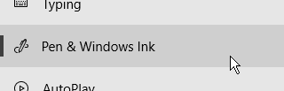
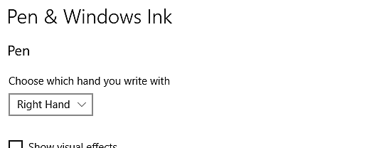

# Configuración de plumas y tabletas

En esta página se muestran varias recomendaciones para configurar un lápiz de Tablet PC gráfico en Windows con el fin de mejorar su compatibilidad con la aplicación.

## ¿Qué es Windows Ink?

Windows Ink es un software/servicio que gestiona plumas como lápices o plumas de tabletas gráficas. Ofrece varias aplicaciones, como Notas adhesivas y Bocetos, para interactuar con un lápiz del equipo.

Desde la versión 2019.3, la aplicación confía en ella para gestionar tabletas gráficas. Antes de esta versión, se utilizaba WinTab en su lugar (un servicio antiguo que no es compatible con todos los modelos de tabletas gráficas).

## Habilitar Windows Ink en la configuración del controlador de Tablet PC

Para asegurarse de que la presión del lápiz se reconoce correctamente, Windows Ink debe estar habilitado en la configuración del controlador de la tableta gráfica.

>[!NOTE]
>
> Windows Ink no se admite en máquinas virtuales, por lo que los eventos de tabletas gráficas no se reenviarán a la aplicación. Por lo tanto, esta configuración no admite la presión del lápiz.

### Activación de Windows Ink para tabletas Wacom

1. Abra el menú **Inicio**.
1. Escriba **Propiedades de la tableta Wacom** y haga clic en el primer resultado de búsqueda.
1. En la ventana **Propiedades de la tableta Wacom**, haz clic en el **lápiz** en la lista de herramientas.\
   
1. Haga clic en el botón más **&quot;+&quot;** para agregar un perfil de aplicación.\
   
1. Haga clic en el botón **Examinar** de la nueva ventana para localizar el ejecutable de Substance 3D Painter.\
   
1. Haga clic en **Aceptar** para validar y crear el perfil.\
   
1. Haga clic en la pestaña **Asignación**.\
   
1. En la parte inferior izquierda de la ventana, asegúrese de que **Usar Windows Ink** está habilitado.\
   

>[!NOTE]
>
> Después de habilitar Windows Ink, reinicie la aplicación para asegurarse de que los cambios se tienen en cuenta correctamente.

### Activación de Windows Ink para tabletas Huion

1. Abra el menú **Inicio**.
1. Escriba **Huion Tablet** y haga clic en el primer resultado de búsqueda
1. En la ventana **Huion Tablet**, haz clic en **Digital Pen** .\
   
1. En la parte inferior izquierda de la ventana, asegúrese de que **Habilitar Windows Ink** está habilitado.\
   

## Cómo tener acceso a la configuración de Windows Ink

Se puede tener acceso a la configuración de Windows Ink en la configuración general de Windows:

1. Abra el menú **Inicio**.
1. Haga clic en el icono **Configuración**.\
   
1. En la ventana Configuración, haga clic en **Dispositivos** .\
   
1. En la ventana **Dispositivos**, haz clic en **Lápiz y Windows Ink** (solo disponible si hay una tableta gráfica conectada).\
   

## Configuración de Windows Ink recomendada

A continuación se muestra la configuración de Windows Ink y la configuración recomendada para cada una de ellas.

>[!NOTE]
>
> Incluso después de seguir esta guía, algunos elementos visuales relacionados con Windows Ink seguirán visibles. Lamentablemente, Microsoft no ofrece opciones de configuración en Windows para deshabilitarlas.
> 
> Los elementos visuales restantes son:
> 
> * **Círculo** al hacer clic con el botón derecho.
> * **Información sobre herramienta** debajo del mouse al presionar un modificador de tecla (Ctrl, Alt o Mayús).

### Configuración del lápiz

| ***Configuración*** | ***Descripción*** |
| --- | --- |
| **Elige con qué mano escribir** | Recomendado:  **Mano derecha** Esta configuración controla cómo se reconoce la orientación del lápiz. Si establece esta configuración en Mano izquierda, se puede producir un bloqueo de la interfaz de usuario al ajustar los parámetros. |
| **Mostrar efectos visuales** | Recomendado:  **Deshabilitado** Esta configuración controla los efectos visuales que se muestran durante las distintas interacciones del lápiz. Al desactivarlo, puede ocultar el efecto de círculo de rizo al hacer clic en: 

 |
| **Mostrar cursores** | Recomendado:  **Deshabilitado** |
| **Déjame usar mi lápiz como mouse en algunas aplicaciones de escritorio** | Recomendado:  **Habilitado** Esta configuración permite al lápiz de Tablet PC gráfico enviar entradas regulares del mouse. Si está desactivada, esta configuración puede provocar algunos problemas de interacción con los parámetros de la interfaz de usuario. |

### Configuración de escritura a mano

| ***Configuración*** | ***Descripción*** |
| --- | --- |
| **Tamaño de fuente al escribir directamente en el campo de texto** | Recomendado:  **Medio (predeterminado)** |
| **Fuente al usar escritura a mano** | Recomendado:  **Segoe UI (predeterminado)** |
| **Cuando toque un campo de texto con el lápiz, utilice la escritura a mano para introducir texto** | Recomendado:  **Solo en modo de tableta** Esta configuración controla cómo y cuándo aparece la ventana de entrada de texto de escritura a mano. Si no se establece en &quot;solo en modo de tableta&quot;, la ventana aparecerá cada vez que se seleccione un campo de texto en la interfaz de usuario. Por ejemplo, al escribir un valor específico en un regulador. |
| **Déjame usar mi lápiz como mouse en algunas aplicaciones de escritorio** | Recomendado:  **Habilitado** Esta configuración permite al lápiz de Tablet PC gráfico enviar entradas regulares del mouse. Si está desactivada, esta configuración puede provocar algunos problemas de interacción con los parámetros de la interfaz de usuario. |
| **Escribe en el panel de escritura a mano con la yema del dedo** | Recomendado:  **Deshabilitado** |

### Configuración de métodos abreviados de lápiz

| ***Configuración*** | ***Descripción*** |
| --- | --- |
| **Hacer clic una vez** | Recomendado:  **Nada** |
| **Haga doble clic** | Recomendado:  **Nada** |
| **Mantener presionado (solo se admite en algunos punteros)** | Recomendado:  **Nada** |
| **Permitir que las aplicaciones anulen el comportamiento del botón de acceso directo** | Recomendado:  **Habilitado** |
| **Cuando esté disponible, mostrar el área de trabajo de tinta después de quitar el lápiz del almacenamiento** | Recomendado:  **Deshabilitado** |

## Cómo acceder a la configuración de Lápiz y entrada táctil

Se puede acceder a la configuración de Lápiz y entrada táctil en el Panel de control:

1. Abra el menú **Inicio**.
1. Escriba **Panel de control** y haga clic en el primer resultado de búsqueda.
1. Cambie el Panel de control **modo de presentación** a **icono pequeño** .\
   
1. Haz clic en la configuración de **Lápiz y entrada táctil**.\
   

## Configuración de lápiz y táctil recomendada

Se recomiendan los siguientes ajustes para mejorar el comportamiento de pintura y la manipulación de la cámara.

Para acceder a la configuración, haz clic en una de las **acciones de apertura** en la ventana y, a continuación, haz clic en el botón **configuración**.

| ***Configuración*** | ***Descripción*** |
| --- | --- |
| **Pulsación única** | Sin parámetros. |
| **Pulse dos veces** | Recomendado:  **Valores predeterminados.** |
| **Mantener presionado** | Recomendado:  **Deshabilitar la opción &quot;Habilitar el modo Mantener presionado al hacer clic con el botón secundario&quot;** Si deshabilita esta opción, podrá arrastrar cualquier elemento normalmente sin activar el círculo de arrastre de Windows: 

 |
| **Usar el botón del lápiz como equivalente de clic con el botón secundario** | Recomendado:  **Habilitado** |
| **Usar la parte superior del lápiz para borrar la tinta (si está disponible)** | Recomendado:  **Habilitado** |
