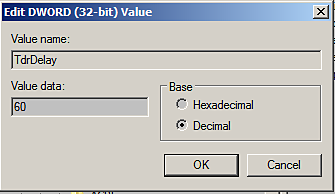

# BLOQUEO de controladores de GPU con cálculos largos (bloqueo TDR)

{zoomable="yes"}

En Windows, esta ventana aparecerá si Substance 3D Painter detecta que el valor de TDR actual está por debajo de un límite específico (10 segundos).

<table>
<tr style="border: 0;">
<td style="border: 0;" valign="top">

## ¿Por qué se bloqueo el controlador de la GPU?

</td>
<td style="border: 0;" valign="top">

### Cómo editar los valores de TDR

</td>
<td style="border: 0;" valign="top">

### Revertir valores TDR a valores predeterminados

</td>
</tr>
</table>

## ¿Por qué se bloqueo el controlador de la GPU?

Para evitar que el procesamiento o el cálculo de la GPU **bloqueen el sistema**, el sistema operativo Windows **elimina el controlador de la GPU** cada vez que el procesamiento tarda más de unos segundos. Cuando se mata al conductor, la aplicación que lo utiliza bloqueo automáticamente. No es posible saber cuánto tiempo puede tardar una tarea de procesamiento o un cálculo (depende de la GPU, los controladores, el sistema operativo, el tamaño de la malla, el tamaño de la textura, etc.), por lo tanto no es posible poner un límite a cuánto debe procesar el equipo y evitar el bloqueo desde el nivel de aplicación.

En Windows, hay una **clave** del **registro** que especifica cuánto tiempo debe esperar el sistema operativo antes de matar el controlador de la GPU. Las aplicaciones no están autorizadas a modificar esta configuración directamente, este procedimiento debe realizarse manualmente (véase a continuación).

Para más información consultar la documentación oficial: <https://docs.microsoft.com/en-us/windows-hardware/drivers/display/tdr-registry-keys>.

### Lista de claves que se deben cambiar

Para ajustar el TDR, simplemente aumente el retraso del TDR: cambie **TdrDelay** y **TdrDdiDelay** por un valor superior (como 60 segundos).

{zoomable="yes"}

>[!NOTE]
>
> Tenga en cuenta que las actualizaciones de Windows o las actualizaciones de los controladores de la GPU pueden restablecer estas claves a su valor predeterminado.

## Cómo editar los valores de TDR

Siga este procedimiento para cambiar el valor de TDR.

***Tenga en cuenta que se tendrán que crear o editar dos claves diferentes.***

>[!WARNING]
>
> Tenga en cuenta que la edición del registro puede tener consecuencias graves e inesperadas que pueden impedir que se inicie el sistema y puede que sea necesario volver a instalar todo el sistema operativo si no está seguro de cómo modificarlo. Sin embargo, las claves de registro mencionadas en esta página no deberían crear este tipo de problemas.
> 
> Adobe no se hace responsable de los daños causados a su sistema modificando el registro del sistema.

### 1 - Abra la ventana Ejecutar

Haz clic en **Inicio** y después en **Ejecutar** (o pulsa las teclas **Windows** y **R**). Abrirá la ventana **Ejecutar**.

{zoomable="yes"}

### 2 - Iniciar el editor del registro

Escriba **regedit** en el campo de texto y pulse **Aceptar**.

{zoomable="yes"}

### 3 - Acceda a la clave del registro GraphicsDrivers

Se abrirá la ventana del Registro.\
En el panel izquierdo, desplácese por el árbol hasta la clave **GraphicsDrivers** entrando en:

```
Computer\HKEY_LOCAL_MACHINE\SYSTEM\CurrentControlSet\Control\GraphicsDrivers
```


Asegúrate de **permanecer en** &quot;GraphicsDrivers&quot; y **no hacer clic en** las **claves del Registro que se encuentran debajo** antes de seguir con los siguientes pasos.

+++&#39;GraphicsDrivers&#39; en el árbol del Registro de Windows
{zoomable="yes"}


+++

### 4 - Agregar o editar el valor de TdrDelay

>[!NOTE]
>
> Si el valor <b>TdrDelay</b> <b>aún no existe</b>, haga clic con el botón derecho del ratón en el panel derecho y elija <b>Nuevo > Valor DWORD (32 bits)</b> . Asígnele el nombre &quot;TdrDelay</b>&quot;. <b>El caso es importante, asegúrese de seguirlo (y compruebe que no hay otros caracteres como un espacio al final).
> 
> 

En el **panel derecho**, haga doble clic en el valor **TdrDelay**. Cambie la configuración de **Base** a **Decimal** . Establezca el valor en un valor distinto del predeterminado **2** (se recomienda **60**).

Este valor indica en segundos el tiempo que esperará el sistema operativo antes de considerar que la GPU no responde durante un cálculo.

Valor DWORD {zoomable="yes"}

### 5 - Agregar o editar el valor TdrDdiDelay

>[!NOTE]
>
> Si el valor <b>TdrDdiDelay</b> <b>no existe</b>, haga clic con el botón derecho del ratón en el panel derecho y elija <b>Nuevo > Valor DWORD (32 bits)</b> . asígnele el nombre &quot;<b>TdrDdiDelay</b>&quot;. Si es importante, asegúrese de seguirla (y compruebe que no haya otros caracteres como espacios).
> 
> 

En el **panel derecho**, haga doble clic en el valor **TdrDdiDelay** . Cambie la configuración de **Base** a **Decimal** . Establezca el valor en un valor distinto del predeterminado **5** (se recomienda **60** ).

Este valor indica en segundos el tiempo que esperará el sistema operativo antes de considerar que un software tardó demasiado tiempo en abandonar los controladores de la GPU.

**Hexadecimal** es el valor predeterminado; solo tiene que cambiar a **decimal** para mostrar el valor correcto. Observe que **3C** (hexadecimal) es igual a **60** (decimal).

### 6 - Finalizar y reiniciar

El panel derecho ahora debería tener el siguiente aspecto:

{zoomable="yes"}

**Cierre** el Editor del Registro. **Reiniciar** el equipo usando **Iniciar** y luego **Reiniciar** .

El TdrValue sólo se observa cuando se inicia el equipo, por lo que para forzar una actualización es necesario reiniciar.

Si la aplicación sigue teniendo bloqueos al realizar un cálculo largo, pruebe a aumentar el retraso (en segundos) de 60 a 120, por ejemplo.

## Revertir valores TDR a valores predeterminados

Hay dos formas de revertir el TDR a sus valores predeterminados:

* Establezca **TdrDelay** en **2s** y **TdrDdiDelay** en **5s**, siguiendo los pasos descritos anteriormente.
* O **Quitar** las claves **TdrDelay** y **TdrDdiDelay** de la entrada del Registro.
