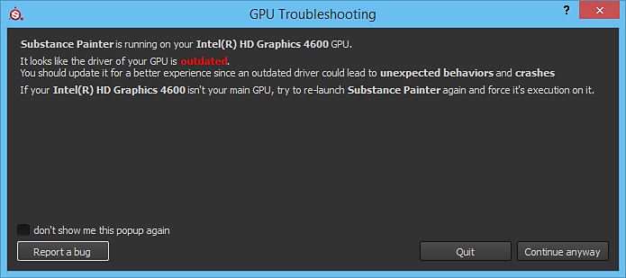

# La GPU tiene controladores obsoletos

{width="500px"}

Al iniciar Substance 3D Painter, puede aparecer una ventana emergente que indica que los controladores de la GPU no están actualizados. Este mensaje simplemente significa que el software requiere una versión mínima de los controladores de la GPU para instalarse. Se recomienda actualizar los controladores de la GPU a la última versión disponible cuando sea posible para obtener la mejor experiencia de trabajo.

| *Proveedor* | *Vínculo* |
| --- | --- |
| **NVIDIA** | [http://www.nvidia.com/Download/index.aspx](http://www.nvidia.com/Download/index.aspx?lang=en-us) <ul data-preserve-html="true"><li data-preserve-html="true"><strong> GeForce </strong> : Se recomienda la versión &quot;Studio Drivers&quot; (SD).</li><li data-preserve-html="true"><strong> Quadro </strong> : Se recomienda la versión &quot;Optimal Driver for Enterprise&quot; (ODE).</li></ul> |
| **AMD** | <http://support.amd.com/en-us/download> |
| **Intel** | <https://downloadcenter.intel.com/> |

>[!NOTE]
>
> Algunos equipos <b> pueden tener dos GPU</b>: uno integrado (como un chipset Intel) y uno dedicado (como una tarjeta gráfica Nvidia). <b>Ambos</b> deben estar <b>actualizados</b> para minimizar el riesgo de errores en Painter.
