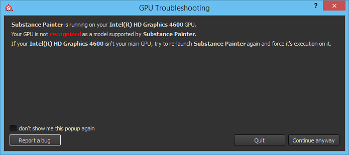

# La GPU no se reconoce

{width="500px"}

Algunos usuarios de **NVIDIA Optimus** pueden tener problemas para hacer que Substance 3D Painter se ejecute en la GPU correcta. Una solución alternativa es establecer las siguientes claves en el Registro de Windows en 0:

* HKEY\_LOCAL\_MACHINE\SOFTWARE\Microsoft\Windows NT\CurrentVersion\Windows\RequireSignedAppInit
* HKEY\_LOCAL\_MACHINE\SOFTWARE\Wow6432Node\Microsoft\Windows NT\CurrentVersion\Windows\RequireSignedAppInit
