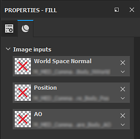

# Mensaje de error de textura dañada

Las texturas dañadas en un proyecto provocarán errores durante el proceso de guardado y pueden provocar que los proyectos se corrompan por completo y no se puedan recuperar. Sin embargo, esto se puede corregir manualmente.\
Un recurso dañado se manifiesta en el registro al abrir un proyecto con un mensaje de error similar al que aparece en la ventana de registro :

## Corrección de una referencia de recurso dañada

### 1 - Encontrar el recurso

El primer paso cuando aparece un error consiste en buscar e identificar el recurso problemático.\
En la mayoría de los casos, el culpable es de **Mapas de malla** (texturas horneadas). Una forma rápida de verificarlo es mirar los generadores de máscaras en la pila de capas.

Los recursos dañados tendrán este aspecto:

>[!NOTE]
>
> Esto también podría significar que simplemente falta el recurso.\
> Para asegurarse, trate de limpiar la ranura y volver a afectar manualmente el horno. Si la miniatura de la cruz roja sigue aquí, significa que el recurso está dañado.

### 2 - Sustitución del recurso

Para reemplazar un recurso dañado, primero deben quitarse todas las referencias a él. Si la corriente es relativamente pequeña, esto se puede hacer manualmente.\
Sin embargo, si el proyecto abarca varios conjuntos de texturas o muchas capas, [Resource Updater](../../../features/plugins/resources-updater.md) puede ser útil para localizar el recurso dañado y reemplazarlo temporalmente por otro.

>[!NOTE]
>
> * En el caso de las texturas horneadas, no olvide borrar también las ranuras de Mesh Maps en la ventana [Configuración del conjunto de texturas](../../../interface/texture-set/texture-set-settings.md).
> * Los pasteles que solo se utilizan en la configuración del conjunto de texturas, como el mapa normal, también podrían dañarse. Intente eliminarlas también si persisten los errores.

### 3 - Limpieza

Una vez que se hayan eliminado todas las referencias a los recursos dañados, realice una limpieza del proyecto desde el menú principal (**Archivo** > **Limpiar**).\
Esto debería eliminar del proyecto todos los recursos dañados que no se utilizan. Es posible comprobarlo yendo a la ficha Proyecto en el estante para asegurarse de que todos los recursos problemáticos han desaparecido.

### 4 - Guardar

Después de la limpieza, intente guardar el proyecto :

* Si se guarda sin errores, el proyecto ahora está libre de daños (los mapas de malla ahora se pueden volver a grabar y los recursos se pueden volver a importar).
* Si persisten los errores, significa que sigue habiendo una referencia a un recurso dañado en el proyecto.
