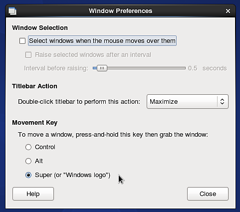

# Imposible utilizar el método abreviado de teclado ALT en Linux

Si está ejecutando una distribución de Linux (**Ubuntu** o **CentOS**) que usa **Gnome** como interfaz de usuario, es posible que desee deshabilitar el comportamiento predeterminado de la clave **ALT** para poder navegar por la ventana gráfica.

## CentOS

1 - Ir a **Sistema > Windows**

{width="250px"}

2 - Cambie la configuración de &quot;tecla de movimiento&quot; a algo más que &quot;**Alt**&quot;. Por ejemplo, use &quot;**Super**&quot; (para elegir la tecla &quot;Windows&quot; del teclado).

{width="350px"}

## Ubuntu

1 - Abra un terminal y ejecute el siguiente comando:

```
sudo apt-get install dconf-tools
```


Esto instalará una herramienta de configuración avanzada, es posible que tenga que permitir que se instalen dependencias adicionales para poder ejecutarla.

2 - Abra el menú de inicio y busque &quot;**Dconf-tools**&quot;. Ponlo en marcha.

3 - Expanda el menú de árbol a la izquierda siguiendo la siguiente ruta :  **organización > gnome > desktop > wm > preferences**

4 - Editar el &quot;mouse-button-modifier&quot; y cambiar su valor. Configúrelo o en su lugar, pero *no lo deje vacío* . Super es un equivalente a la tecla &quot;Windows&quot;.

{width="500px"}
