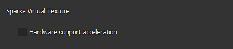

# Aparecen artefactos de bloque en las texturas de la ventana gráfica

A partir de la versión 2018.3.0, pueden aparecer en la ventana gráfica los siguientes tipos de artefactos:

{width="400px"}

Estos artefactos están relacionados con problemas con los controladores de la GPU de Nvidia.\
Para evitar los artefactos, debe desactivarse la compatibilidad con hardware de texturas virtuales dispersas.

Los controladores GeForce **Drivers 440.97** han **solucionado este problema** . Recomendamos actualizar a estos controladores y mantener el SVT habilitado para obtener un buen rendimiento.

Los nuevos controladores están disponibles en el sitio web de Nvidia: <https://www.nvidia.com/Download/index.aspx>

## Desactivación de la aceleración de hardware de texturas virtuales dispersas

### 1 - Inicie Substance 3D Painter y abra la Configuración

Abra la configuración principal en Editar > Configuración.

### 2 - Busque la sección llamada &quot;Texturas virtuales dispersas&quot;

Dentro de la sección &quot;General&quot;, desplácese hacia abajo y busque la subsección denominada &quot;Texturas virtuales dispersas&quot;

### 3 - Desmarque la configuración

Desactive la configuración &quot;Aceleración de soporte de hardware&quot; desmarcándola.

### 4 - Validar y reiniciar Substance 3D Painter

Valide el cambio haciendo clic en el botón &quot;Aceptar&quot;.

Reinicie Substance 3D Painter haciendo clic en el botón &quot;Sí&quot; para aplicar el cambio.
