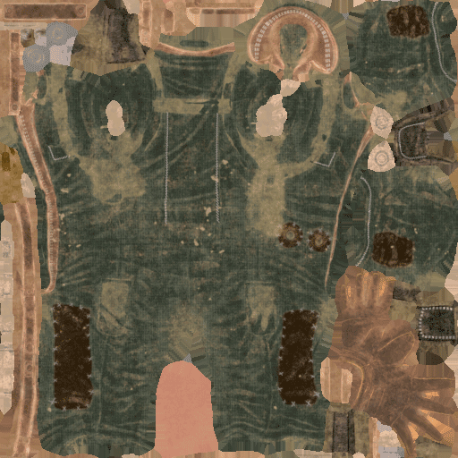

# Dilatación o relleno de texturas

**Relleno** (también llamado a veces **dilatación**) es un proceso que ocurre después de la generación de una textura. Su propósito es dilatar los bordes de las Islas de UV para llenar áreas vacías con píxeles similares.

Generar un relleno de buena calidad es importante para garantizar una buena generación de [mipmaps](../../../getting-started/glossary.md) más tarde mediante motores de juegos o procesadores sin conexión.\
Substance 3D Painter puede generar un relleno infinito: esto significa que un píxel se estirará hasta que alcance otra Isla de UV o los bordes de la textura.

## Generación de relleno infinito

A continuación se muestra un ejemplo de cómo funciona el relleno infinito :

<table>
<tr style="border: 0;">
<td style="border: 0;" valign="top">

{width="512px"}

</td>
<td style="border: 0;" valign="top">

</td>
</tr>
</table>

## MipMaps

En los gráficos 3D de equipos, **mipmaps** son secuencias de texturas optimizadas y precalculadas, cada una de las cuales es una representación de la misma imagen con una resolución cada vez menor. Su objetivo es aumentar la velocidad de procesamiento y reducir los artefactos de suavizado. Una imagen mipmap de alta resolución se utiliza para objetos cercanos a la cámara. Las imágenes de baja resolución se utilizan ya que el objeto aparece más lejos. Se trata de una forma eficaz de representar en lugar de leer todos los píxeles de la textura original. Los mipmaps (cada nivel) se incrustan dentro de la propia textura (cuando es compatible con el formato de archivo).

El relleno es muy importante para mipmaps, ya que evita que los colores incorrectos se desangren dentro de los UV de la malla cuando se van a resoluciones de textura más bajas.

<table>
<tr style="border: 0;">
<td style="border: 0;" valign="top">

{width="400px"}

</td>
<td style="border: 0;" valign="top">

{width="400px"}

</td>
</tr>
</table>

En el ejemplo anterior, el fondo gris se desvanece en los UV (imagen derecha), mientras que con el relleno se mantiene el color limpio (imagen izquierda).

Dentro de una aplicación 3D, este es el resultado:

## Controles de relleno

Substance 3D Painter permite cambiar el comportamiento de la generación de relleno (como desactivarlo) en diferentes lugares :

* **Al hornear** : consulte la [documentación bancaria](../../../baking/baking.md) para obtener más información.
* **Al generar texturas para un conjunto de texturas** : consulte la documentación de [Configuración de conjuntos de texturas](../../../interface/texture-set/texture-set-settings.md) para obtener más información.
* **Al exportar texturas** : consulte la sección &quot;Configuración de relleno&quot; de la documentación de [configuración de exportación](../../../export/export-window/export-window.md) para obtener más información.
